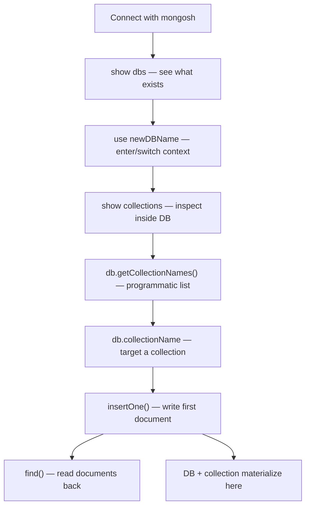

# How to Create a Database in MongoDB

> **One-line summary:** MongoDB does not use `CREATE DATABASE` like MySQL. It uses **lazy creation** — databases and collections are created automatically when you first store data. This is the #1 interview trap for CSE students.

---

## Table of Contents

1. [Prerequisites](#prerequisites)
2. [Big-Picture Analogy](#big-picture-analogy)
3. [Sequential Flow (Mental Model)](#sequential-flow-mental-model)
4. [Step-by-Step Commands](#step-by-step-commands)
   - [Step 1: `show dbs`](#step-1-show-dbs)
   - [Step 2: `use newDBName`](#step-2-use-newdbname)
   - [Step 3: `show collections`](#step-3-show-collections)
   - [Step 4: `db.getCollectionNames()`](#step-4-dbgetcollectionnames)
   - [Step 5: `db.collection_Name`](#step-5-dbcollection_name)
   - [Step 6: `insertOne()`](#step-6-insertone)
   - [Step 7: `find()`](#step-7-find)
5. [Complete End-to-End Script](#complete-end-to-end-script)
6. [Lazy Creation — Deep Dive](#lazy-creation--deep-dive)
7. [SQL vs MongoDB Quick Reference](#sql-vs-mongodb-quick-reference)
8. [Common Interview Questions](#common-interview-questions)
9. [Key Takeaways](#key-takeaways)

---

## Prerequisites

Before running any command below, you need a running MongoDB instance and the MongoDB Shell (`mongosh`).

**Local install:**

```bash
mongosh
```

**MongoDB Atlas (cloud):**

```bash
mongosh "mongodb+srv://your-cluster.mongodb.net/" --username yourUser
```

**How to confirm you are connected:**

- Your prompt will show something like `test>` or your cluster name
- Type `db` — it returns the current database name (default is `test`)

---

## Big-Picture Analogy

Think of MongoDB like a **university campus**. This analogy helps you explain MongoDB in interviews without memorizing jargon.

| MongoDB Concept | Real-World Analogy | SQL Equivalent |
|---|---|---|
| MongoDB Server | University campus | Database server |
| Database | Department (CSE, ECE, ME) | Database |
| Collection | Filing cabinet inside a department | Table |
| Document | Single student file (JSON-like record) | Row |
| `_id` / ObjectId | Roll number (unique identifier) | Primary key |

### The Key Analogy for `use`

When you run:

```javascript
use studentRecords
```

…it is like **walking into an empty department building**. You are "inside" that department mentally, but:

- The university directory (`show dbs`) will **not** list `studentRecords` yet
- There are no filing cabinets (`show collections` will be empty)
- Nothing is physically created until you put at least one student file into a cabinet (`insertOne`)

**Interview one-liner:** "`use` switches your working context; it does not create a database on disk."

---

## Sequential Flow (Mental Model)

Follow this order every time — each step depends on the previous one:



**Sequential thinking rule:** You cannot meaningfully list collections before selecting a database. You cannot find documents before inserting them. You cannot see your database in `show dbs` until it contains data.

---

## Step-by-Step Commands

Throughout this section we use consistent names:

- **Database:** `studentRecords`
- **Collection:** `students`

---

### Step 1: `show dbs`

#### What it does

Lists all databases on the current MongoDB server/connection string that **contain data**.

#### Analogy

Like opening the **university directory** and seeing which departments actually have student records on file — not just empty buildings.

#### Code

```javascript
show dbs
// alias: show databases
```

#### Expected output (fresh local install)

```
admin   40.00 KiB
config  12.00 KiB
local   40.00 KiB
```

These three are **system databases**:

| Database | Purpose |
|---|---|
| `admin` | Authentication, user management, admin commands |
| `config` | Sharding metadata (used in clustered setups) |
| `local` | Replication data (used in replica sets) |

Your custom database (`studentRecords`) will **not** appear here until you insert at least one document.

#### Interview tip

> **Q:** "I ran `use myDB` but `show dbs` doesn't show `myDB`. Why?"
>
> **A:** MongoDB uses lazy creation. A database only appears in `show dbs` after it stores data — typically after your first `insertOne`, `insertMany`, or `createIndex`.

---

### Step 2: `use newDBName`

#### What it does

Switches the shell's working context to the specified database. If the database does not exist, MongoDB **prepares** it in memory but does not persist it until data is written.

#### Analogy

Like **entering the CSE department building**. You are now "in CSE", but the university directory won't register CSE as an active department until someone files at least one student record.

#### Code

```javascript
use studentRecords
```

#### Expected output

```
switched to db studentRecords
```

#### Verify current database

```javascript
db
// Returns: studentRecords
```

#### Interview tip

> **Q:** "Does `use` create a database?"
>
> **A:** No. `use` only switches context (sets the `db` variable). The database is physically created when you first store data in it.

---

### Step 3: `show collections`

#### What it does

Prints the names of all collections in the **currently selected** database.

#### Analogy

Like looking at all the **filing cabinets** inside the CSE department. If no one has filed anything yet, the room is empty.

#### Code

```javascript
show collections
// alias: show tables
```

#### Expected output (before any insert)

```
(empty — nothing printed)
```

#### Expected output (after inserting into `students`)

```
students
```

#### Interview tip

> You must run `use studentRecords` **before** `show collections`. Collections are scoped to a database — just like tables belong to one database in SQL.

---

### Step 4: `db.getCollectionNames()`

#### What it does

Returns an **array** of collection names in the current database. Functionally equivalent to `show collections`, but designed for scripting.

#### Analogy

Same as `show collections`, but instead of printing names on screen, it hands you a **list you can loop over in code** — like getting a printed list of cabinet names vs. a spreadsheet you can process programmatically.

#### Code

```javascript
db.getCollectionNames()
```

#### Expected output (before insert)

```javascript
[]
```

#### Expected output (after insert into `students`)

```javascript
[ 'students' ]
```

#### Interview tip — the classic question

> **Q:** "What is the difference between `show collections` and `db.getCollectionNames()`?"
>
> **A:**
> - `show collections` → shell shortcut; prints names to the console (human-readable)
> - `db.getCollectionNames()` → returns a JavaScript array (programmatic, loopable, usable in scripts)

**Example — loop over collections in a script:**

```javascript
db.getCollectionNames().forEach(function(name) {
  print("Collection: " + name);
});
```

---

### Step 5: `db.collection_Name`

#### What it does

Using dot notation (`db.students`) gives you a **reference** (handle) to a collection. It does not create the collection or write any data by itself.

#### Analogy

Like pointing at an **empty filing cabinet** labeled "Students". You have identified where files will go, but the cabinet doesn't officially exist in the department until you put the first file in it.

#### Code

```javascript
db.students
// Returns: studentRecords.students (collection object reference)
```

#### When is the collection actually created?

The collection is **implicitly created** on the first write operation:

- `insertOne()` / `insertMany()`
- `createIndex()`

Or explicitly via:

```javascript
db.createCollection("students")
```

#### Naming rules (avoid errors)

- Cannot contain `$`
- Cannot contain `.` (null character also forbidden)
- Cannot start with `system.` (reserved for internal collections)
- Case-sensitive: `Students` and `students` are different collections

#### Interview tip

> **Q:** "Do I need to create a collection before inserting?"
>
> **A:** No. MongoDB creates the collection automatically on the first insert. Explicit creation (`createCollection`) is only needed when you want special options like schema validation, capped collections, or size limits.

---

### Step 6: `insertOne()`

#### What it does

Inserts a **single document** (record) into a collection. This is the command that makes everything real:

1. Creates the **collection** (if it doesn't exist)
2. Creates the **database** (if it doesn't exist)
3. Auto-generates a unique `_id` field as `ObjectId` (if you don't provide one)

#### Analogy

Like **filing the first student record** into the "Students" cabinet. The moment you do this:
- The cabinet officially exists
- The department officially exists in the university directory

#### Code

```javascript
db.students.insertOne({ name: "Rahul", rollNo: 101, branch: "CSE" })
```

Using the generic form from your syllabus:

```javascript
db.collection_Name_You_Want_To_Create.insertOne({ key: "Value", number: 12 })
```

#### Expected output

```javascript
{
  acknowledged: true,
  insertedId: ObjectId('674a1b2c3d4e5f6789012345')
}
```

| Field | Meaning |
|---|---|
| `acknowledged: true` | Write was successful (write concern acknowledged) |
| `insertedId` | The auto-generated `_id` of the new document |

#### What MongoDB stored (the actual document)

```javascript
{
  _id: ObjectId('674a1b2c3d4e5f6789012345'),
  name: "Rahul",
  rollNo: 101,
  branch: "CSE"
}
```

#### ObjectId — interview favorite topic

Every document **must** have an `_id` field. If you don't provide one, MongoDB generates an `ObjectId` — a 12-byte unique identifier:

| Bytes | Content |
|---|---|
| 0–3 (4 bytes) | Unix timestamp of creation (seconds) |
| 4–8 (5 bytes) | Random value unique to machine + process |
| 9–11 (3 bytes) | Incrementing counter (starts from random value) |

**Why interviewers ask about ObjectId:**

- It acts as a **primary key** (unique within the collection)
- It embeds **creation time** — sorting by `_id` ascending gives insertion order
- It is globally unique across a MongoDB deployment

```javascript
ObjectId("674a1b2c3d4e5f6789012345")
// First 8 hex chars encode the timestamp of creation
```

#### Insert with your own `_id` (optional)

```javascript
db.students.insertOne({ _id: "STU001", name: "Priya", rollNo: 102, branch: "ECE" })
```

Warning: `_id` must be **unique** within the collection. Duplicate `_id` throws an error.

#### Interview tip

> **Q:** "What does `insertOne` return?"
>
> **A:** An object with `acknowledged` (boolean) and `insertedId` (the `_id` of the inserted document). This is useful in application code to reference the new record.

---

### Step 7: `find()`

#### What it does

Retrieves documents from a collection. With no filter, it returns **all documents**. Returns a **cursor** (not an array directly in the shell — it iterates and displays results).

#### Analogy

Like **opening the filing cabinet and reading every student file** inside it. You can also ask for specific files: "only CSE branch students."

#### Code — find all documents

```javascript
db.students.find()
```

#### Prettier formatted output

```javascript
db.students.find().pretty()
```

#### Expected output

```javascript
[
  {
    _id: ObjectId('674a1b2c3d4e5f6789012345'),
    name: 'Rahul',
    rollNo: 101,
    branch: 'CSE'
  }
]
```

#### Code — find with a filter

```javascript
db.students.find({ branch: "CSE" })
```

#### Code — find one document

```javascript
db.students.findOne({ rollNo: 101 })
// Returns a single document object (not a cursor)
```

#### Code — find by ObjectId

```javascript
db.students.findOne({ _id: ObjectId("674a1b2c3d4e5f6789012345") })
```

#### `find()` vs `findOne()` — interview quick answer

| Method | Returns | Use when |
|---|---|---|
| `find()` | Cursor (0 or more documents) | You want all matching records |
| `findOne()` | Single document or `null` | You want exactly one record |

#### Interview tip

> **Q:** "What is the difference between `find()` and SQL `SELECT *`?"
>
> **A:** Conceptually the same — both read records. But `find()` returns a cursor (lazy, memory-efficient for large result sets) and uses JSON-like filter objects instead of SQL `WHERE` clauses.

---

## Complete End-to-End Script

Copy-paste this entire block into `mongosh` during a lab session or viva demo. It runs all 7 concepts in sequence:

```javascript
// ── STEP 0: Connect ──────────────────────────────────────────
// Run in terminal:  mongosh
// Or for Atlas:     mongosh "mongodb+srv://cluster.mongodb.net/" --username user

// ── STEP 1: See existing databases ─────────────────────────
show dbs
// You will see admin, config, local (system DBs)
// studentRecords will NOT appear yet

// ── STEP 2: Switch to (target) a new database ────────────────
use studentRecords
// Output: switched to db studentRecords

db   // verify → returns: studentRecords

// ── STEP 3: Check collections (empty at this point) ──────────
show collections
// Output: (nothing — no collections yet)

// ── STEP 4: Programmatic collection list ─────────────────────
db.getCollectionNames()
// Output: []

// ── STEP 5 & 6: Reference collection + insert first document ─
// This ONE command creates BOTH the database AND the collection
db.students.insertOne({ name: "Rahul", rollNo: 101, branch: "CSE" })
// Output: { acknowledged: true, insertedId: ObjectId('...') }

// Insert a second document to see multiple results in find()
db.students.insertOne({ name: "Priya", rollNo: 102, branch: "ECE" })

// ── STEP 7: Verify everything was created ────────────────────
show dbs
// studentRecords now appears in the list

show collections
// Output: students

db.getCollectionNames()
// Output: [ 'students' ]

db.students.find().pretty()
// Output: both documents with their _id fields

// Bonus: filtered find
db.students.find({ branch: "CSE" }).pretty()
// Output: only Rahul's document
```

---

## Lazy Creation — Deep Dive

This is the most important concept for interviews. MongoDB **never** creates empty databases or empty collections.

### Before vs After Table

| Action | Appears in `show dbs`? | Appears in `show collections`? | Persisted on disk? |
|---|---|---|---|
| `use myDB` only | No | No | No |
| `use myDB` + `db.createCollection("col")` | Yes | Yes | Yes |
| `use myDB` + `insertOne(...)` | Yes | Yes | Yes |
| `use myDB` + disconnect (no insert) | No | No | No |

### Why MongoDB works this way

In SQL you run `CREATE DATABASE` and `CREATE TABLE` explicitly. MongoDB skips that ceremony because:

1. **Developer speed** — no boilerplate before writing data
2. **Schema flexibility** — collections don't need a predefined structure
3. **Resource efficiency** — empty databases don't consume storage

### Interview answer template (memorize this)

> "In MongoDB, databases and collections are created **lazily**. The `use` command only switches the shell context to a database name — it does not write anything to disk. The database is actually created and becomes visible in `show dbs` only after you store data, typically via `insertOne`, `insertMany`, or `createIndex`. Similarly, a collection is created on the first write to that collection name."

### Common student mistake

```javascript
use myProject        // student thinks DB is created
show dbs             // myProject NOT listed → student panics
// Fix: insert at least one document
db.users.insertOne({ name: "test" })
show dbs             // myProject NOW appears
```

---

## SQL vs MongoDB Quick Reference

For students coming from MySQL, PostgreSQL, or Oracle labs:

| Task | SQL | MongoDB (`mongosh`) |
|---|---|---|
| Connect to server | `mysql -u user -p` | `mongosh` |
| List databases | `SHOW DATABASES;` | `show dbs` |
| Select / use database | `USE dbname;` | `use dbname` |
| List tables / collections | `SHOW TABLES;` | `show collections` |
| Create table / collection | `CREATE TABLE ...` | Automatic on first insert (or `db.createCollection()`) |
| Insert one row / document | `INSERT INTO t VALUES (...);` | `db.col.insertOne({...})` |
| Insert many rows | `INSERT INTO t VALUES (...), (...);` | `db.col.insertMany([{...}, {...}])` |
| Select all rows | `SELECT * FROM t;` | `db.col.find()` |
| Select with condition | `SELECT * FROM t WHERE col = 'val';` | `db.col.find({ col: "val" })` |
| Select one row | `SELECT * FROM t LIMIT 1;` | `db.col.findOne()` |
| Primary key | `id INT PRIMARY KEY` | `_id` (ObjectId, auto-generated) |
| Fixed schema | Required (columns defined upfront) | Not required (flexible schema) |

---

## Common Interview Questions

### Q1. What is lazy creation in MongoDB?

MongoDB does not create databases or collections until the first time data is stored in them. Running `use myDB` switches context but does not persist anything. The database appears in `show dbs` only after an insert or index creation.

---

### Q2. What is the difference between `show collections` and `db.getCollectionNames()`?

Both list collections in the current database. The difference is the return type:

- `show collections` — shell command; prints names to console
- `db.getCollectionNames()` — JavaScript method; returns an array usable in loops and scripts

---

### Q3. What is ObjectId and why is `_id` mandatory?

`ObjectId` is a 12-byte unique identifier MongoDB auto-generates for the `_id` field when you don't provide one. Every document must have `_id` because it serves as the primary key within a collection. ObjectId encodes a timestamp, so sorting by `_id` gives insertion order.

---

### Q4. Can two documents in the same collection have different fields?

Yes. MongoDB has a **flexible schema**. One document can have `{ name, age }` and another can have `{ name, age, email, address }` in the same collection. This is a major difference from SQL tables where every row must match the same column structure.

---

### Q5. What happens if you `use` a database, insert nothing, and disconnect?

The database is **never created**. It will not appear in `show dbs` the next time you connect. No disk space is used.

---

### Q6. How is a MongoDB document different from a JSON object?

Documents look like JSON but are stored internally as **BSON** (Binary JSON). BSON supports extra types JSON doesn't have: `Date`, `ObjectId`, `BinData`, `Decimal128`, and `Timestamp`. You read/write JSON; MongoDB converts to/from BSON automatically.

---

### Q7. What does `insertOne` return and why does it matter?

```javascript
{ acknowledged: true, insertedId: ObjectId('...') }
```

In application code (Node.js, Python), you use `insertedId` to reference, update, or link to the newly created document without running another query.

---

### Q8. What is the MongoDB data hierarchy?

```
MongoDB Server
  └── Database (e.g., studentRecords)
        └── Collection (e.g., students)
              └── Document (e.g., { name: "Rahul", rollNo: 101 })
                    └── Fields (e.g., name, rollNo, branch, _id)
```

---

## Key Takeaways

1. **Hierarchy:** Server → Database → Collection → Document. Know this chain for every MongoDB interview.

2. **`use` switches context; `insertOne` makes things real.** Never tell an interviewer that `use` creates a database — it does not.

3. **Every document gets a unique `_id`.** MongoDB auto-generates an `ObjectId` if you skip it. Never insert two documents with the same `_id`.

4. **`find()` reads with filters.** No filter = all documents. Pass a JSON object to filter: `find({ branch: "CSE" })`.

5. **`show collections` vs `getCollectionNames()`** — same data, different output format. Know when to use each.

6. **Lazy creation is the #1 trap.** If your database doesn't appear in `show dbs`, you haven't inserted data yet.

---

## Sources

- [MongoDB Manual — FAQ: How do I create a database and collection?](https://www.mongodb.com/docs/manual/faq/fundamentals/)
- [MongoDB Manual — Databases and Collections](https://www.mongodb.com/docs/manual/core/databases-and-collections/)
- [MongoDB Manual — `db.getCollectionNames()`](https://www.mongodb.com/docs/manual/reference/method/db.getcollectionnames/)
- [MongoDB Manual — `db.collection.insertOne()`](https://www.mongodb.com/docs/manual/reference/method/db.collection.insertone/)
- [MongoDB Shell — Help Reference (`show dbs`, `show collections`)](https://www.mongodb.com/docs/mongodb-shell/reference/access-mdb-shell-help)
