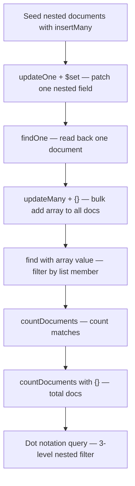

# Embedded Documents (Nested Documents) in MongoDB

> **One-line summary:** MongoDB stores related data **inside** a document as embedded sub-documents and arrays — you query and update them using **dot notation**, **`$set`**, and array matching. This is the #1 data-modeling topic for CSE interviews after basic CRUD.

---

## Table of Contents

1. [Prerequisites](#prerequisites)
2. [Big-Picture Analogy](#big-picture-analogy)
3. [Sequential Flow (Mental Model)](#sequential-flow-mental-model)
4. [Step-by-Step Commands](#step-by-step-commands)
   - [Step 1: `updateOne()` with `$set` and nested objects](#step-1-updateone-with-set-and-nested-objects)
   - [Step 2: `findOne()`](#step-2-findone)
   - [Step 3: `updateMany()` with empty filter `{}`](#step-3-updatemany-with-empty-filter-)
   - [Step 4: `find()` with array element match](#step-4-find-with-array-element-match)
   - [Step 5: Filtered count — `find(...).count()`](#step-5-filtered-count--findcount)
   - [Step 6: Total count — `find().count()`](#step-6-total-count--findcount)
   - [Step 7: Dot notation for 3-level nested query](#step-7-dot-notation-for-3-level-nested-query)
5. [Complete End-to-End Script](#complete-end-to-end-script)
6. [Embedded Documents — Deep Dive](#embedded-documents--deep-dive)
7. [`$set` — Dot Notation vs Whole Object](#set--dot-notation-vs-whole-object)
8. [SQL vs MongoDB Quick Reference](#sql-vs-mongodb-quick-reference)
9. [Common Interview Questions](#common-interview-questions)
10. [Key Takeaways](#key-takeaways)

---

## Prerequisites

Before running any command below, you need:

1. A running MongoDB instance and the MongoDB Shell (`mongosh`)
2. Basic familiarity with creating a database and collection — see [1. How to create database in MongoDb.md](./1.%20How%20to%20create%20database%20in%20MongoDb.md)

**Connect locally:**

```bash
mongosh
```

**Connect to MongoDB Atlas:**

```bash
mongosh "mongodb+srv://your-cluster.mongodb.net/" --username yourUser
```

**Select our working database:**

```javascript
use studentRecords
```

Throughout this note we use:

- **Database:** `studentRecords`
- **Collection:** `students`

---

## Big-Picture Analogy

In Note #1, we compared MongoDB to a **university campus** — databases are departments, collections are filing cabinets, documents are student files. This note adds one layer: **sub-folders and sticky notes inside each file**.

| MongoDB Concept | Real-World Analogy | SQL Equivalent |
|---|---|---|
| Embedded document | Sub-folder inside a student file (`profile` inside `students`) | JOINed table row stored inline |
| Nested keys (3 levels) | Drawer → section → label (`profile.contact.email`) | `profile_contact_email` column or JOIN chain |
| Array field | Sticky-note list on the file cover (`skills: ["Java", "MongoDB"]`) | Separate child table or array column |
| `updateOne()` | Edit **one** student's file | `UPDATE ... WHERE ... LIMIT 1` |
| `updateMany()` | Stamp the same label on **every** file in the cabinet | `UPDATE ...` (no WHERE) |
| `findOne()` | Pull **one** file from the cabinet | `SELECT ... LIMIT 1` |
| Dot notation in quotes | Full address path on the envelope (`"profile.contact.email"`) | Qualified column name |

### What is an embedded document?

An **embedded document** (also called a **nested document** or **sub-document**) is a JSON-like object stored **inside** another document — not in a separate collection.

```javascript
{
  name: "Rahul",
  profile: {                    // ← embedded document
    contact: {                  // ← nested 2 levels deep
      email: "rahul@college.edu" // ← nested 3 levels deep
    }
  },
  skills: ["Java", "MongoDB"]   // ← array field
}
```

**Interview one-liner:** "Embedded documents let MongoDB store related data in one document, avoiding JOINs and enabling atomic reads/updates."

---

## Sequential Flow (Mental Model)

Follow this order every time — each step depends on the previous one:



**Sequential thinking rule:** You must **insert nested data first**, then **update**, then **read**, then **count**. Skipping seed data makes every later command meaningless — just like you cannot `find()` documents you never inserted in Note #1.

### Seed data (run this before all steps)

```javascript
use studentRecords

db.students.insertMany([
  {
    name: "Rahul",
    rollNo: 101,
    branch: "CSE",
    profile: {
      contact: {
        email: "rahul@college.edu",
        verified: false
      },
      settings: { notifications: true }
    },
    skills: ["Java", "MongoDB"]
  },
  {
    name: "Priya",
    rollNo: 102,
    branch: "ECE",
    profile: {
      contact: {
        email: "priya@college.edu",
        verified: true
      }
    },
    skills: ["Python"]
  },
  {
    name: "Amit",
    rollNo: 103,
    branch: "CSE",
    profile: {
      contact: {
        email: "amit@college.edu",
        verified: false
      }
    },
    skills: ["Java", "C++"]
  }
])
```

---

## Step-by-Step Commands

---

### Step 1: `updateOne()` with `$set` and nested objects

#### What it does

Finds documents matching the **first argument (filter)**, then updates **at most one** of them using the **second argument (update operators)**. The `$set` operator adds or replaces specific fields without deleting the rest of the document.

#### Analogy

Like opening **one** student file in the cabinet, finding the student by roll number, and editing a section inside their sub-folder — without throwing away the entire file.

#### Code — generic syllabus form

```javascript
db.collection_Name_You_Want_To_Create.updateOne(
  { key: "value_you_want_to_find" },
  { $set: { newKey: { nestedNewKey1: false, nestedNewKey2: true } } }
)
```

**How to read this:**

| Part | Role |
|---|---|
| First `{ key: "value_you_want_to_find" }` | **Filter** — which document to find |
| `$set` | **Update operator** — set/replace the given fields |
| `{ newKey: { nestedNewKey1: false, nestedNewKey2: true } }` | **Nested object** to write into the document |

#### Code — concrete example

```javascript
db.students.updateOne(
  { rollNo: 101 },
  { $set: { profile: { contact: { verified: true }, settings: { darkMode: false, notifications: true } } } }
)
```

#### Expected output

```javascript
{
  acknowledged: true,
  insertedId: null,
  matchedCount: 1,
  modifiedCount: 1,
  upsertedCount: 0
}
```

| Field | Meaning |
|---|---|
| `matchedCount` | How many documents matched the filter |
| `modifiedCount` | How many documents were actually changed |
| `upsertedCount` | How many new documents were created (0 here — no upsert) |

#### What changed in the document

**Before:**

```javascript
{
  name: "Rahul",
  rollNo: 101,
  profile: {
    contact: { email: "rahul@college.edu", verified: false },
    settings: { notifications: true }
  },
  skills: ["Java", "MongoDB"]
}
```

**After `$set` with whole `profile` object:**

```javascript
{
  name: "Rahul",
  rollNo: 101,
  profile: {
    contact: { verified: true },           // email is GONE — whole profile was replaced
    settings: { darkMode: false, notifications: true }
  },
  skills: ["Java", "MongoDB"]              // untouched — $set only changes what you specify
}
```

> **Critical trap:** Passing a whole nested object to `$set` **replaces** that key entirely. To patch one leaf field and keep siblings, use dot notation — see [$set — Dot Notation vs Whole Object](#set--dot-notation-vs-whole-object).

#### Interview tip

> **Q:** "What does `updateOne({ key: 'value' }, { $set: { newKey: { a: false, b: true } } })` do?"
>
> **A:** It finds documents where `key` equals `'value'`, selects **one** of them, and uses `$set` to add or replace `newKey` with the nested object `{ a: false, b: true }`. Other top-level fields remain unchanged. If the filter matches multiple documents, only **one** is updated — and MongoDB does not guarantee which one unless you specify a `sort` option (MongoDB 8.0+).

> **Q:** "What if my filter matches 5 documents?"
>
> **A:** `updateOne` modifies **at most one**. Use `updateMany` if you need all 5 updated.

---

### Step 2: `findOne()`

#### What it does

Returns **a single document** from the collection that matches the filter. If no document matches, returns `null`.

#### Analogy

Like asking the filing clerk: "Give me **one** CSE student's file." You get exactly one folder back — not a stack of all matches.

#### Code — generic syllabus form

```javascript
db.collection_Name_You_Want_To_Create.findOne({ key: "value_you_want_to_find" })
```

#### Code — concrete example

```javascript
db.students.findOne({ rollNo: 101 })
```

#### Expected output

```javascript
{
  _id: ObjectId('...'),
  name: 'Rahul',
  rollNo: 101,
  branch: 'CSE',
  profile: {
    contact: { email: 'rahul@college.edu', verified: true },
    settings: { darkMode: false, notifications: true }
  },
  skills: [ 'Java', 'MongoDB' ]
}
```

#### What happens with duplicate matches?

If **multiple documents** share the same filter value, `findOne` returns **only one** of them.

```javascript
// Two students share branch "CSE" — Rahul (101) and Amit (103)
db.students.findOne({ branch: "CSE" })
// Returns ONE document — could be Rahul or Amit
```

> **Important correction for interviews:** MongoDB does **not** store documents in a guaranteed "natural order." When multiple documents match, `findOne` returns one of them in **undefined order** unless you explicitly sort. Do **not** tell an interviewer "it returns the first document in natural order" — say "an arbitrary matching document unless a sort is applied."

#### `findOne()` vs `find()` — quick comparison

| Method | Returns | When to use |
|---|---|---|
| `findOne({ filter })` | Single document object or `null` | You need exactly one record |
| `find({ filter })` | Cursor (0 or more documents) | You need all matching records |
| `find({ filter }).limit(1)` | Cursor with at most 1 doc | Similar to findOne but returns a cursor |

#### Interview tip

> **Q:** "If the collection contains multiple documents with the same `{ key: 'value' }`, what does `findOne` return?"
>
> **A:** It returns **one** matching document. MongoDB does not guarantee which one — there is no stable natural order. To get a predictable result, use `find().sort({ _id: 1 }).limit(1)` or add a unique field to your filter.

---

### Step 3: `updateMany()` with empty filter `{}`

#### What it does

Updates **all documents** in the collection that match the filter. An empty filter `{}` matches **every document**.

#### Analogy

Like the college admin stamping the label **"Internship 2025"** on **every** student file in the cabinet — no exceptions.

#### Code — generic syllabus form

```javascript
db.collection_Name_You_Want_To_Create.updateMany(
  {},
  { $set: { keyArray: ["arr1", "arr2"] } }
)
```

**How to read this:**

| Part | Role |
|---|---|
| `{}` | Empty filter — matches **all** documents |
| `$set` | Sets the field on every matched document |
| `{ keyArray: ["arr1", "arr2"] }` | Creates/replaces `keyArray` with this array on each doc |

#### Code — concrete example

```javascript
db.students.updateMany(
  {},
  { $set: { tags: ["placed", "intern"] } }
)
```

#### Expected output

```javascript
{
  acknowledged: true,
  insertedId: null,
  matchedCount: 3,
  modifiedCount: 3,
  upsertedCount: 0
}
```

All 3 student documents now have `tags: ["placed", "intern"]`.

#### `updateOne({}, ...)` vs `updateMany({}, ...)` — interview trap

| Command | Empty filter `{}` behavior |
|---|---|
| `updateOne({}, { $set: {...} })` | Updates **only 1** document (even though all match) |
| `updateMany({}, { $set: {...} })` | Updates **all** documents in the collection |

#### Interview tip

> **Q:** "What does `updateMany({}, { $set: { keyArray: ['arr1', 'arr2'] } })` do?"
>
> **A:** The empty `{}` filter matches every document in the collection. `$set` adds or replaces the `keyArray` field with `['arr1', 'arr2']` on **each** document. Top-level fields not mentioned in `$set` are left unchanged.

---

### Step 4: `find()` with array element match

#### What it does

Finds all documents where an array field contains **at least one element** equal to the specified value.

#### Analogy

Like asking: "Show me every student file whose skills list includes **MongoDB**." You don't care about the other skills on the list — just that MongoDB appears somewhere on it.

#### Code — generic syllabus form

```javascript
db.collection_Name_You_Want_To_Create.find({ keyArray: "arr1" })
```

#### Code — concrete examples

```javascript
// Find students who have "MongoDB" in their skills array
db.students.find({ skills: "MongoDB" })

// Find students who have "placed" in their tags array (after updateMany)
db.students.find({ tags: "placed" })
```

#### Expected output

```javascript
db.students.find({ skills: "MongoDB" }).pretty()
// Returns Rahul's document only

db.students.find({ skills: "Java" }).pretty()
// Returns Rahul AND Amit (both have "Java" in skills)
```

#### Array matching rules — know these for interviews

| Query | Meaning |
|---|---|
| `{ skills: "MongoDB" }` | Array contains **at least one** element equal to `"MongoDB"` |
| `{ skills: ["Java", "MongoDB"] }` | Array equals **exactly** this array, in this order |
| `{ skills: { $all: ["Java", "MongoDB"] } }` | Array contains **both** elements (any order) |

#### Bonus operators (interview edge cases)

When multiple conditions must apply to the **same array element**, use `$elemMatch`:

```javascript
// Find students who have BOTH "Java" AND "MongoDB" in skills
db.students.find({ skills: { $all: ["Java", "MongoDB"] } })

// When array elements are objects, $elemMatch ensures same-element match
db.students.find({
  addresses: { $elemMatch: { city: "Mumbai", pin: 400001 } }
})
```

#### Interview tip

> **Q:** "How does `find({ keyArray: 'arr1' })` work?"
>
> **A:** MongoDB checks whether the `keyArray` field contains at least one element equal to `'arr1'`. It does **not** require the array to contain only that element or to match the full array. This is equivalent to SQL's `WHERE 'arr1' = ANY(keyArray)` in PostgreSQL.

---

### Step 5: Filtered count — `find(...).count()`

#### What it does

Counts how many documents match a given filter — in this case, documents whose array field contains a specific value.

#### Analogy

Like asking the clerk: "How many student files have **MongoDB** listed in their skills?" — you get a number, not the actual files.

#### Code — generic syllabus form (syllabus syntax)

```javascript
db.collection_Name_You_Want_To_Create.find({ keyArray: "arr1" }).count()
```

#### Code — concrete example

```javascript
db.students.find({ skills: "MongoDB" }).count()
// Returns: 1

db.students.find({ skills: "Java" }).count()
// Returns: 2
```

#### Modern best practice (recommended)

```javascript
db.students.countDocuments({ skills: "MongoDB" })
// Returns: 1

db.students.countDocuments({ skills: "Java" })
// Returns: 2
```

> **Important (2024+):** `cursor.count()` (chaining `.count()` on a find cursor) is **deprecated** in MongoDB drivers and mongosh. Prefer `countDocuments(filter)` for accurate counts. Your syllabus may still show `.count()` — know both, but use `countDocuments()` in production code and interviews.

#### Why the deprecation matters

| Method | Status | Behavior |
|---|---|---|
| `find({ filter }).count()` | Deprecated | May give inaccurate counts; avoid in new code |
| `countDocuments({ filter })` | Recommended | Accurate count using aggregation engine |
| `estimatedDocumentCount()` | Fast alternative | Metadata-based; approximate; **no filter support** |

#### Interview tip

> **Q:** "What is the difference between `find().count()` and `countDocuments()`?"
>
> **A:** Both count matching documents, but `countDocuments()` is the modern, accurate method. `cursor.count()` is deprecated because it could return inaccurate results in sharded clusters. Use `countDocuments({ filter })` for filtered counts and `estimatedDocumentCount()` only when you need a fast, approximate total with no filter.

---

### Step 6: Total count — `find().count()`

#### What it does

Returns the **total number of documents** in the collection (no filter applied).

#### Analogy

Like asking: "How many student files are in the cabinet altogether?"

#### Code — generic syllabus form

```javascript
db.collection_Name_You_Want_To_Create.find().count()
```

#### Code — concrete example

```javascript
db.students.find().count()
// Returns: 3
```

#### Modern equivalent

```javascript
db.students.countDocuments({})
// Returns: 3 — accurate count of all documents

db.students.estimatedDocumentCount()
// Returns: 3 — fast metadata-based count (no filter allowed)
```

#### When to use which

| Need | Use |
|---|---|
| Exact total count | `countDocuments({})` |
| Fast approximate total (large collections) | `estimatedDocumentCount()` |
| Filtered count | `countDocuments({ filter })` |
| Syllabus / legacy syntax | `find().count()` (know it, don't prefer it) |

#### Interview tip

> **Q:** "How do you count all documents in a collection?"
>
> **A:** `countDocuments({})` with an empty filter counts every document accurately. `estimatedDocumentCount()` is faster but approximate and cannot take a filter. The older `find().count()` works in tutorials but is deprecated.

---

### Step 7: Dot notation for 3-level nested query

#### What it does

Queries (or updates) a field buried **three levels deep** inside embedded documents by chaining field names with dots.

#### Analogy

Like addressing a letter: **Department → Room → Desk → Person**. The full path `"profile.contact.email"` is the complete address to reach one specific field inside the nested structure.

#### Nested document tree

```
students (document)
 └── profile (embedded doc — level 1)
      └── contact (embedded doc — level 2)
           ├── email: "rahul@college.edu"    ← level 3
           └── verified: true                ← level 3
      └── settings (embedded doc — level 2)
           └── notifications: true
```

#### Code — generic syllabus form

```javascript
db.collection_Name_You_Want_To_Create.find({
  "firstNestKey.secondNestKey.thirdNestKey": "value"
})
```

> **Remember:** Enclosing the dotted path in **single quotes `' '`** is crucial. Without quotes, JavaScript treats the dots as object nesting syntax, not as a single field path string.

#### Code — concrete examples

```javascript
// 3-level deep: profile → contact → email
db.students.find({ "profile.contact.email": "rahul@college.edu" })

// 3-level deep: profile → contact → verified
db.students.find({ "profile.contact.verified": true })

// Pretty-print results
db.students.find({ "profile.contact.verified": true }).pretty()
// Returns Priya's document (verified: true)
```

#### Expected output

```javascript
db.students.find({ "profile.contact.email": "rahul@college.edu" }).pretty()
// Returns Rahul's document only
```

#### Why quotes are mandatory

```javascript
// CORRECT — dotted path as a single string key
db.students.find({ "profile.contact.email": "rahul@college.edu" })

// WRONG — JavaScript interprets this as nested object literal, not a MongoDB path
db.students.find({ profile.contact.email: "rahul@college.edu" })
// SyntaxError: Unexpected token
```

#### Dot notation works everywhere

| Operation | Example |
|---|---|
| Find | `find({ "profile.contact.email": "rahul@college.edu" })` |
| Update | `updateOne({ rollNo: 101 }, { $set: { "profile.contact.verified": true } })` |
| Index | `createIndex({ "profile.contact.email": 1 })` |

#### Interview tip

> **Q:** "How do you query a field nested 3 levels deep?"
>
> **A:** Use dot notation with the full path as a **quoted string**: `{ "firstNestKey.secondNestKey.thirdNestKey": "value" }`. Each dot drills one level deeper into the embedded document tree. Quotes are required because the path is a single field name, not nested JavaScript object syntax.

> **Q:** "Can I query nested fields without quotes?"
>
> **A:** Not with literal dotted paths in mongosh. The path must be a string key. Unquoted dot syntax is valid JavaScript object nesting, but that is **not** the same as a MongoDB field path.

---

## Complete End-to-End Script

Copy-paste this entire block into `mongosh` to run all operations in sequence:

```javascript
// ── SETUP ─────────────────────────────────────────────────────
use studentRecords

// Clear previous runs (optional — remove if you want to keep data)
db.students.drop()

// ── SEED: Insert nested documents ─────────────────────────────
db.students.insertMany([
  {
    name: "Rahul", rollNo: 101, branch: "CSE",
    profile: {
      contact: { email: "rahul@college.edu", verified: false },
      settings: { notifications: true }
    },
    skills: ["Java", "MongoDB"]
  },
  {
    name: "Priya", rollNo: 102, branch: "ECE",
    profile: {
      contact: { email: "priya@college.edu", verified: true }
    },
    skills: ["Python"]
  },
  {
    name: "Amit", rollNo: 103, branch: "CSE",
    profile: {
      contact: { email: "amit@college.edu", verified: false }
    },
    skills: ["Java", "C++"]
  }
])

// ── STEP 1: updateOne with $set and nested object ─────────────
db.students.updateOne(
  { rollNo: 101 },
  { $set: { "profile.contact.verified": true, "profile.settings.darkMode": false } }
)

// ── STEP 2: findOne ───────────────────────────────────────────
db.students.findOne({ rollNo: 101 })

// ── STEP 3: updateMany with empty filter ──────────────────────
db.students.updateMany({}, { $set: { tags: ["placed", "intern"] } })

// ── STEP 4: find with array element match ─────────────────────
db.students.find({ skills: "Java" }).pretty()
db.students.find({ tags: "placed" }).pretty()

// ── STEP 5: filtered count ────────────────────────────────────
db.students.countDocuments({ skills: "MongoDB" })   // 1
db.students.find({ skills: "Java" }).count()          // 2 (syllabus syntax)

// ── STEP 6: total count ───────────────────────────────────────
db.students.countDocuments({})                        // 3
db.students.find().count()                            // 3 (syllabus syntax)

// ── STEP 7: dot notation — 3-level nested query ───────────────
db.students.find({ "profile.contact.email": "rahul@college.edu" }).pretty()
db.students.find({ "profile.contact.verified": true }).pretty()
```

---

## Embedded Documents — Deep Dive

### Embed vs Reference — when to choose which

MongoDB gives you two ways to store related data:

| Approach | How it works | Analogy |
|---|---|---|
| **Embed** | Store related data inside the parent document | Student file contains address sub-folder |
| **Reference** | Store an `_id` pointing to another collection | Student file contains only a locker number; address is in a separate cabinet |

**Embed when:**

- Data is always read together (student + profile)
- Updates to parent and child happen together (atomic)
- The nested array is small and bounded (1–5 addresses, not 10,000 orders)

**Reference when:**

- Data is accessed independently (user profile vs user orders)
- The child collection grows unboundedly (millions of comments per post)
- Many-to-many relationships exist (students ↔ courses)

### Quick decision table

| Relationship | Example | Decision |
|---|---|---|
| 1:1 | User → Profile | **Embed** |
| 1:few | User → 2–3 addresses | **Embed array** |
| 1:many (bounded) | Order → 5–20 line items | **Embed array** |
| 1:many (unbounded) | Post → millions of comments | **Reference** |
| Many:many | Students ↔ Courses | **Reference both ways** |

### The 16 MB document limit

Every MongoDB document has a **hard 16 MB size limit**. If you embed unbounded arrays (e.g., every comment on a viral post), you will hit this ceiling. That is the main reason to reference instead of embed.

### Why embedded documents matter in interviews

1. **No JOINs needed** — one query reads parent + all nested data
2. **Atomic updates** — updating a nested field is a single write operation
3. **Schema flexibility** — different documents can have different nested shapes
4. **Trade-off** — duplication if the same embedded data appears in many documents

---

## `$set` — Dot Notation vs Whole Object

This is the most common mistake students make with nested updates. Study both forms side by side:

### Patch one leaf field (keeps siblings)

```javascript
db.students.updateOne(
  { rollNo: 101 },
  { $set: { "profile.contact.verified": true } }
)
// Only changes verified — email and settings remain untouched
```

### Replace entire nested object (removes siblings)

```javascript
db.students.updateOne(
  { rollNo: 101 },
  { $set: { profile: { contact: { verified: true } } } }
)
// Replaces entire profile — settings, email, and other contact fields are GONE
```

### Visual comparison

```
Before:  profile: { contact: { email: "...", verified: false }, settings: { notifications: true } }

Dot:     profile: { contact: { email: "...", verified: true  }, settings: { notifications: true } }
         ↑ only verified changed

Whole:   profile: { contact: { verified: true } }
         ↑ email gone, settings gone
```

**Interview one-liner:** "Use dot notation in `$set` to patch a leaf; pass a whole object to replace the entire sub-document."

---

## SQL vs MongoDB Quick Reference

For students coming from MySQL, PostgreSQL, or Oracle labs:

| Task | SQL | MongoDB (`mongosh`) |
|---|---|---|
| Update one row | `UPDATE t SET col = val WHERE id = 1 LIMIT 1` | `db.col.updateOne({ _id: 1 }, { $set: { col: val } })` |
| Update all rows | `UPDATE t SET col = val` | `db.col.updateMany({}, { $set: { col: val } })` |
| Read one row | `SELECT * FROM t WHERE id = 1 LIMIT 1` | `db.col.findOne({ _id: 1 })` |
| Read many rows | `SELECT * FROM t WHERE branch = 'CSE'` | `db.col.find({ branch: "CSE" })` |
| Nested column | `SELECT u.name, a.city FROM users u JOIN addresses a ...` | `db.users.find({ "address.city": "Mumbai" })` |
| Array contains value | `WHERE 'Java' = ANY(skills)` (PostgreSQL) | `db.col.find({ skills: "Java" })` |
| Count with filter | `SELECT COUNT(*) FROM t WHERE branch = 'CSE'` | `db.col.countDocuments({ branch: "CSE" })` |
| Count all rows | `SELECT COUNT(*) FROM t` | `db.col.countDocuments({})` |
| Set nested field | `UPDATE t SET profile = jsonb_set(...)` | `db.col.updateOne({}, { $set: { "profile.name": "Rahul" } })` |

---

## Common Interview Questions

### Q1. What is an embedded document in MongoDB?

An embedded document is a JSON-like object stored **inside** another document rather than in a separate collection. For example, a `profile` object nested inside a `students` document. It allows related data to be read and updated atomically without JOINs.

---

### Q2. What is the difference between `$set`, `$unset`, and `$push`?

| Operator | Purpose | Example |
|---|---|---|
| `$set` | Add or replace a field | `{ $set: { "profile.contact.verified": true } }` |
| `$unset` | Remove a field | `{ $unset: { "profile.settings": "" } }` |
| `$push` | Append to an array | `{ $push: { skills: "React" } }` |

---

### Q3. What is the difference between `updateOne`, `updateMany`, and `replaceOne`?

| Method | Documents modified | Behavior |
|---|---|---|
| `updateOne` | At most **1** | Applies update operators (`$set`, `$inc`, etc.) |
| `updateMany` | **All** matches | Applies update operators to every match |
| `replaceOne` | At most **1** | Replaces the **entire document** (except `_id`) with a new one |

---

### Q4. Why must dot-notation paths be quoted in queries?

Because `"profile.contact.email"` is a **single string key** representing a field path. Without quotes, JavaScript interprets `profile.contact.email` as nested object literal syntax — which is invalid in a query filter and causes a syntax error.

---

### Q5. How does MongoDB match array elements in a query?

When you write `find({ skills: "Java" })`, MongoDB returns documents where the `skills` array contains **at least one** element equal to `"Java"`. It does not require an exact full-array match. For exact array match, pass the full array: `find({ skills: ["Java", "MongoDB"] })`.

---

### Q6. Is `find().count()` still recommended?

No. `cursor.count()` is **deprecated**. Use `countDocuments(filter)` for accurate filtered counts and `estimatedDocumentCount()` for fast approximate totals. Know the syllabus syntax, but recommend the modern methods in interviews and production code.

---

### Q7. What happens if `updateOne` filter matches 5 documents?

Only **one** document is updated. MongoDB does not guarantee which one unless you provide a `sort` option (MongoDB 8.0+). If you need all 5 updated, use `updateMany`.

---

### Q8. When should you embed vs reference related data?

**Embed** when data is always accessed together, updates are atomic, and arrays are bounded (profile, addresses, order line items). **Reference** when data is accessed independently, grows unboundedly, or involves many-to-many relationships (posts → comments, students ↔ courses).

---

## Key Takeaways

1. **Embedded documents store related data inside a parent document** — no JOINs needed. Know the university filing-cabinet analogy for interviews.

2. **`updateOne` + `$set` finds one document and patches fields.** First argument = filter, second = update operators. `$set` with a whole nested object **replaces** that key; dot notation **patches one leaf**.

3. **`findOne` returns a single document or `null`.** If multiple documents match, order is **not guaranteed** — do not say "natural order" in an interview.

4. **`updateMany({}, { $set: {...} })` updates every document** in the collection. Empty `{}` = match all. Contrast with `updateOne({}, ...)` which only touches one.

5. **Array queries match if the array contains the value** — `{ skills: "Java" }` means "skills array includes Java", not "skills equals ['Java']".

6. **Use `countDocuments(filter)` instead of deprecated `find().count()`.** Know both for syllabus exams; prefer the modern method in production.

7. **Dot notation with quotes drills into nested fields** — `"profile.contact.email": "rahul@college.edu"` for 3-level queries. Quotes are mandatory.

8. **Embed vs reference is a schema design decision** driven by access patterns, not just relationships. Unbounded arrays should be referenced, not embedded (16 MB limit).

---

## Sources

- [MongoDB Manual — Embedded Documents](https://www.mongodb.com/docs/manual/core/document/#embedded-documents)
- [MongoDB Manual — Dot Notation](https://www.mongodb.com/docs/manual/core/document/#dot-notation)
- [MongoDB Manual — `$set` Update Operator](https://www.mongodb.com/docs/manual/reference/operator/update/set/)
- [MongoDB Manual — `db.collection.updateOne()`](https://www.mongodb.com/docs/manual/reference/method/db.collection.updateOne/)
- [MongoDB Manual — `db.collection.updateMany()`](https://www.mongodb.com/docs/manual/reference/method/db.collection.updateMany/)
- [MongoDB Manual — `db.collection.findOne()`](https://www.mongodb.com/docs/manual/reference/method/db.collection.findOne/)
- [MongoDB Manual — Query an Array](https://www.mongodb.com/docs/manual/tutorial/query-arrays/)
- [MongoDB Manual — `$elemMatch`](https://www.mongodb.com/docs/manual/reference/operator/query/elemMatch/)
- [MongoDB Manual — `db.collection.countDocuments()`](https://www.mongodb.com/docs/manual/reference/method/db.collection.countDocuments/)
- [MongoDB Manual — `db.collection.estimatedDocumentCount()`](https://www.mongodb.com/docs/manual/reference/method/db.collection.estimatedDocumentCount/)
