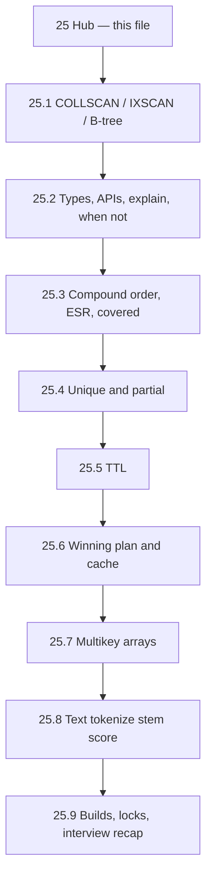

# Master MongoDB Indexing (Series Hub)

> **One-line summary:** An index is a **separate, always-sorted B-tree of `{ field value → RecordId }`** — not a field stored inside the document. This hub is the map; **depth lives in 25.1–25.9**. Read and **run the labs in order**.

---

## Table of Contents

1. [How to Use This Series](#how-to-use-this-series)
2. [You Are Here](#you-are-here)
3. [Prerequisites](#prerequisites)
4. [Big-Picture Analogy](#big-picture-analogy)
5. [Why This Order (Serialized Path)](#why-this-order-serialized-path)
6. [Series Map](#series-map)
7. [Shared Lab Setup](#shared-lab-setup)
8. [Requirements Checklist](#requirements-checklist)
9. [Name Traps to Unlearn Now](#name-traps-to-unlearn-now)
10. [How You Will Know You Learned It](#how-you-will-know-you-learned-it)
11. [Key Takeaways](#key-takeaways)
12. [Sources](#sources)

---

## How to Use This Series

This is **not** one giant note. Lesson 25 is a **serialized lab course**.

| Rule | Why |
|---|---|
| Read **one file**, then **run every `Lab`** in mongosh before opening the next | Indexing is muscle memory: `explain()` fields only stick if you have seen them change |
| Do **not** skip 25.1 | Every later file assumes you can recognize `COLLSCAN` vs `IXSCAN` |
| Each 25.N file has a **reset snippet** | You can re-run that lab alone if you closed the shell |
| Every lab is **Run → Watch → Learn / validate** | Watch means *exact fields* (`stage`, `totalDocsExamined`, error codes) — not "it got faster" |
| Interview recap is **last** (25.9) | Analogies are useless until you have run the planner, TTL, and text labs |

**Time box (honest):** if you type every command, budget **~15–25 minutes per file**, ~3 hours for the full series. TTL (25.5) needs a ~60 second wait.

---

## You Are Here

```
Notes 1–4  →  documents, CRUD, find()
                ↓
         25 Hub (this file)  →  map only
                ↓
         25.1 → 25.2 → 25.3 → 25.4 → 25.5 → 25.6 → 25.7 → 25.8 → 25.9
```

Notes [1](./1.%20How%20to%20create%20database%20in%20MongoDb.md)–[4](./4.%20find()%20vs%20findOne()%20in%20mongodb.md) taught you how to **put files in cabinets and read them**. This series teaches the **library card catalog** that makes those reads scale.

---

## Prerequisites

1. A running MongoDB instance and `mongosh`
2. Notes 1–4: lazy DB creation, nested documents, CRUD, `find()` vs `findOne()`
3. Comfort running JavaScript in the shell (loops, `explain()`, `printjson`)

**Connect locally:**

```bash
mongosh
```

**Connect to MongoDB Atlas:**

```bash
mongosh "mongodb+srv://your-cluster.mongodb.net/" --username yourUser
```

**Working database for the whole series:**

```javascript
use studentRecords
```

Dedicated collections (do not mix them — each lab owns one job):

| Collection | Used in | Job |
|---|---|---|
| `indexLab` | 25.1, 25.2, 25.6 | Bulk COLLSCAN vs IXSCAN, APIs, competing plans |
| `students` | optional continuity with notes 1–4 | Small nested docs you already know |
| `uniqLab` | 25.4 | Unique constraint |
| `partialLab` | 25.4 | Partial filter + incremental writes |
| `ttlLab` | 25.5 | Document expiry |
| `multiLab` | 25.7 | Array / multikey |
| `textLab` | 25.8 | Tokenize / stem / score |

---

## Big-Picture Analogy

In Notes #1–#4, MongoDB was a **university campus**: databases = departments, collections = filing cabinets, documents = student files.

This series adds the missing piece: **the library card catalog**.

| MongoDB concept | Campus analogy | SQL equivalent |
|---|---|---|
| Collection (data file) | Filing cabinet of student files | Table heap / clustered rows |
| Document | One student file | Row |
| **Index** | **Card catalog drawer** — sorted cards, each card has a **shelf location** | B-tree index |
| Indexed field value | What is printed on the catalog card (`branch: "CSE"`) | Indexed column value |
| **RecordId** | The **shelf + folder number** printed on the card | Row pointer / RID |
| **COLLSCAN** | Clerk opens **every file** in the cabinet | Sequential table scan |
| **IXSCAN** | Clerk walks the **catalog**, then only those shelves | Index range scan |
| **FETCH** | Clerk leaves the catalog, walks to the real file, opens it | Bookmark lookup / heap fetch |
| Query planner | Head librarian picking a strategy | Optimizer |
| Plan cache | Clipboard of “last winning strategy for this question shape” | Plan cache |
| `explain()` | Asking the librarian to **narrate** the strategy **without** writing it on the clipboard | `EXPLAIN` / `EXPLAIN ANALYZE` |

**Interview one-liner:** “An index is not the document. It is a second, sorted data structure of keys plus pointers. The pointer is the RecordId. FETCH uses that pointer to load the real document.”

### What an index is *not*

- It is **not** a boolean flag on the field.
- It is **not** stored inside each document (the document does not grow a hidden “index: true”).
- It is **not** free — every write that touches indexed fields must also update the catalog.

---

## Why This Order (Serialized Path)

You cannot interpret `explain()` before you have seen a **COLLSCAN**. You cannot debate compound **field order** before a single-field B-tree exists. You cannot trust the **plan cache** until you know `explain()` **bypasses** it. Multikey and text are **different physical layouts**, so they come after the classic B-tree is solid. Locks and the interview recap are last.



**Sequential thinking rule:** finish the previous file’s labs. Later files assume you already know the `explain` fields and the catalog analogy.

---

## Series Map

| File | What you will be able to *do* | Est. |
|---|---|---|
| **This hub** | Know the map, names, collections, traps | 10 min |
| [25.1 COLLSCAN vs IXSCAN and B-tree Internals](./25.1%20COLLSCAN%20vs%20IXSCAN%20and%20B-tree%20Internals.md) | Prove COLLSCAN vs IXSCAN on 5,000 docs; draw the B-tree; measure write/storage cost | 25 min |
| [25.2 Index Types, APIs, explain(), When Not to Index](./25.2%20Index%20Types%2C%20APIs%2C%20explain()%2C%20When%20Not%20to%20Index.md) | Use `createIndex` / `getIndexes` / `dropIndex`; read three `explain` verbosities; decide when **not** to index | 25 min |
| [25.3 Compound Indexes, Order, ESR, Covered Queries](./25.3%20Compound%20Indexes%2C%20Order%2C%20ESR%2C%20Covered%20Queries.md) | Prove why order matters (prefix miss); apply ESR; force a covered query | 25 min |
| [25.4 Unique and Partial Indexes](./25.4%20Unique%20and%20Partial%20Indexes.md) | See `E11000`; prove unique is a **constraint** not a speed-up; watch partial indexes grow on write with **no rebuild** | 20 min |
| [25.5 TTL Indexes](./25.5%20TTL%20Indexes.md) | Create TTL; wait for the monitor; prove **documents die, the index stays** | 20 min + wait |
| [25.6 Winning Plan, Plan Cache, allPlansExecution](./25.6%20Winning%20Plan%2C%20Plan%20Cache%2C%20allPlansExecution.md) | Race two indexes; populate cache with a **real** query; contrast `allPlansExecution` | 25 min |
| [25.7 Multikey Indexes on Arrays](./25.7%20Multikey%20Indexes%20on%20Arrays.md) | Auto-multikey; one leaf per distinct array value; compound array limit | 15 min |
| [25.8 Text Indexes, Tokenize, Stem, Score](./25.8%20Text%20Indexes%2C%20Tokenize%2C%20Stem%2C%20Score.md) | `$text` without an index fails; tokenize → stop words → stem → `textScore` | 20 min |
| [25.9 Index Builds, Locks, Interview Recap](./25.9%20Index%20Builds%2C%20Locks%2C%20Interview%20Recap.md) | Syllabus vs MongoDB 4.2+ hybrid builds; master analogies; Q-bank | 20 min |

---

## Shared Lab Setup

Run this once when you sit down. Individual files also include a **reset** so you can start mid-series.

```javascript
use studentRecords

// Confirm you are in the right department
db

// Optional: see leftover lab collections from a previous sitting
show collections
```

If a lab tells you to `drop()`, do it. These collections are **throwaway**. Do not drop `students` unless that file says so — it may still hold Note #2–#4 data.

---

## Requirements Checklist

Tick these as you finish the matching lab. This is the original topic list, serialized.

| Done | Original topic | File | Where |
|---|---|---|---|
| ☐ | Collection scan / “call scan” | 25.1 | Lab 2 `COLLSCAN` |
| ☐ | Index scan | 25.1 | Lab 3 `IXSCAN` |
| ☐ | Separate sorted structure + memory location + step-by-step find | 25.1 | Sequential flow + Lab 4 |
| ☐ | B-tree storage and how it works | 25.1 | Deep dive + Lab 4 |
| ☐ | Storage space and write performance | 25.1 | Labs 5–6 |
| ☐ | Types of indexes | 25.2 | Types catalog |
| ☐ | Single-field: how made, better/worse | 25.2 + 25.3 | Single-field lab; compound comparison |
| ☐ | Compound: how made, better/worse | 25.3 | Prefix + ESR labs |
| ☐ | Text: how made, better/worse | 25.8 | Full text lab |
| ☐ | `.explain()` where and why | 25.2 | Three verbosities |
| ☐ | `createIndex` / `dropIndex` / `getIndexes` (not `getIndex`) | 25.2 | API labs |
| ☐ | Simulate + what to watch in `explain` | 25.1–25.8 | Every lab has **Watch** |
| ☐ | When **not** to index (intuition) | 25.2 | When-not lab |
| ☐ | Compound order matters — why | 25.3 | Prefix-miss lab |
| ☐ | `unique: true` vs plain `createIndex()` | 25.4 | Unique lab |
| ☐ | Partial index; new values auto-included? | 25.4 | Incremental insert/update labs |
| ☐ | TTL create; expiry; is the index removed? | 25.5 | Docs die, index stays |
| ☐ | When to use TTL | 25.5 | Use-cases |
| ☐ | Covered query | 25.3 | Covering lab |
| ☐ | Winning plan, cache, update/delete | 25.6 | Cache state + flush labs |
| ☐ | `explain("allPlansExecution")` watch/learn | 25.6 | vs `$planCacheStats` |
| ☐ | Multikey on arrays internals | 25.7 | Distinct-value leaf lab |
| ☐ | Text without index vs with; tokenize; stem; score | 25.8 | Regex vs `$text` |
| ☐ | Index build locks; background vs foreground | 25.9 | Hybrid-build trap |
| ☐ | Interview analogies summary | Hub + 25.9 | Recap |

---

## Name Traps to Unlearn Now

Courses and blogs use sloppy names. This series uses **official** names and calls the trap in the lab.

| You may have heard | Official / accurate |
|---|---|
| “Call scan” | **`COLLSCAN`** — collection scan |
| `getIndex()` | **`getIndexes()`** — plural. There is no `getIndex()` helper |
| Index lives “on the field” | Index lives in a **separate B-tree**; the field stays in the document |
| TTL “removes the index” | TTL **deletes expired documents**. The TTL **index stays** until `dropIndex` |
| `unique: true` is a faster index | Unique is a **constraint**. Lookup speed is the same idea as a non-unique index on that field |
| `explain()` fills the plan cache | **`explain()` ignores and does not populate the plan cache.** Run the real query |
| `background: true` on modern MongoDB | **Ignored** since 4.2. Hybrid builds lock only at start and end |
| `$text` without creating a text index | **Error.** `$text` requires a text index. `$regex` is a different (usually slower) path |

---

## How You Will Know You Learned It

After 25.9 you should be able to stand at a whiteboard and:

1. Draw COLLSCAN vs IXSCAN + FETCH with RecordId.
2. Write `createIndex` / `getIndexes` / `dropIndex` without notes.
3. Read an `explain("executionStats")` and say whether the index helped (`totalDocsExamined` vs `nReturned`).
4. Explain why `{ cgpa: 1, branch: 1 }` is the **wrong** order for `find({ branch: "CSE" })`.
5. Say out loud: unique ≠ faster; partial updates on write; TTL deletes docs not the index; `explain` ≠ plan cache; `background: true` is history.

If any of those is fuzzy, re-run that file’s labs — do not only re-read.

---

## Key Takeaways

1. **This hub is a map.** Open [25.1](./25.1%20COLLSCAN%20vs%20IXSCAN%20and%20B-tree%20Internals.md) next and run Lab 1. Do not skim 25.2–25.9 first.

2. **An index is a card catalog** — sorted keys plus shelf locations (RecordIds) — stored **beside** the filing cabinet, not inside each file.

3. **Every extra catalog drawer costs writes and disk.** Indexes speed selected reads and slow every insert/update/delete that touches those keys.

4. **Query shape decides which index is “better.”** There is no globally best index type. 25.2 states the rule; 25.3–25.8 prove it.

5. **Always verify with `explain("executionStats")`.** Creating an index and assuming it is used is the #1 production mistake.

---

## Sources

- [MongoDB Manual — Indexes](https://www.mongodb.com/docs/manual/indexes/)
- [MongoDB Manual — Index Builds on Populated Collections](https://www.mongodb.com/docs/manual/core/index-creation/)
- [MongoDB Manual — Explain Results](https://www.mongodb.com/docs/manual/reference/explain-results/)
- [MongoDB Manual — Query Plans](https://www.mongodb.com/docs/manual/core/query-plans/)

**Next file:** [25.1 COLLSCAN vs IXSCAN and B-tree Internals](./25.1%20COLLSCAN%20vs%20IXSCAN%20and%20B-tree%20Internals.md)
