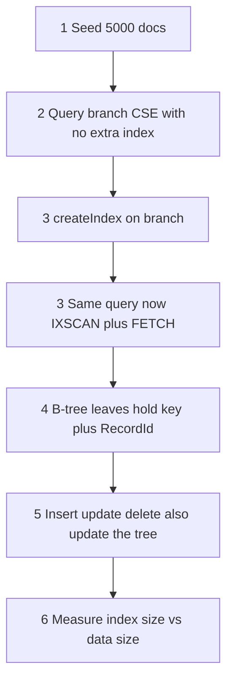

# 25.1 COLLSCAN vs IXSCAN and B-tree Internals

> **One-line summary:** Without an index MongoDB walks **every document** (`COLLSCAN`). After `createIndex`, it walks a **separate sorted B-tree** (`IXSCAN`), reads **RecordIds** (shelf locations), then **FETCHes** only those files. The index is **not** stored inside the document.

---

## Table of Contents

1. [You Are Here](#you-are-here)
2. [Prerequisites](#prerequisites)
3. [Lab Reset](#lab-reset)
4. [Big-Picture Analogy](#big-picture-analogy)
5. [Sequential Flow (Mental Model)](#sequential-flow-mental-model)
6. [Lab 1 — Seed 5,000 documents](#lab-1--seed-5000-documents)
7. [Lab 2 — COLLSCAN before any extra index](#lab-2--collscan-before-any-extra-index)
8. [Lab 3 — createIndex, then IXSCAN + FETCH](#lab-3--createindex-then-ixscan--fetch)
9. [Lab 4 — The B-tree and RecordId (step-by-step internals)](#lab-4--the-b-tree-and-recordid-step-by-step-internals)
10. [Lab 5 — Writes must maintain the tree](#lab-5--writes-must-maintain-the-tree)
11. [Lab 6 — Storage cost you can measure](#lab-6--storage-cost-you-can-measure)
12. [Deep Dive — How the B-tree actually works](#deep-dive--how-the-b-tree-actually-works)
13. [Deep Dive — Storage and write impact](#deep-dive--storage-and-write-impact)
14. [Interview Checkpoint](#interview-checkpoint)
15. [Key Takeaways](#key-takeaways)
16. [Sources](#sources)

---

## You Are Here

```
25 Hub  →  **25.1 (you are here)**  →  25.2 Types / APIs / explain
```

This file answers: *how does MongoDB find a document with and without an index, internally, step by step?*

**Next file after this:** [25.2 Index Types, APIs, explain(), When Not to Index](./25.2%20Index%20Types%2C%20APIs%2C%20explain()%2C%20When%20Not%20to%20Index.md)

---

## Prerequisites

- Finish the [25 Hub](./25.%20%20Master%20MongoDB%20Indexing.md) (map + name traps).
- Notes [1](./1.%20How%20to%20create%20database%20in%20MongoDb.md)–[4](./4.%20find()%20vs%20findOne()%20in%20mongodb.md).
- Running `mongosh`.

**Name trap:** some notes say “call scan”. The stage name is **`COLLSCAN`** (collection scan).

---

## Lab Reset

Safe to re-run. Drops only the throwaway bulk collection.

```javascript
use studentRecords
db.indexLab.drop()
```

---

## Big-Picture Analogy

The `indexLab` cabinet holds 5,000 student files in **disk order** (not sorted by branch). Asking “give me every CSE file” without a catalog means the clerk opens file 1, file 2, … file 5000.

After you print a **card catalog sorted by branch**, the clerk:

1. Flips the CSE section of the catalog (few cards, already grouped).
2. Reads the **shelf number** on each card (RecordId).
3. Walks only those shelves and opens those files (FETCH).

| MongoDB | Campus |
|---|---|
| Collection data (WiredTiger table keyed by RecordId) | The filing cabinet itself |
| Index B-tree | Card catalog drawer, always kept sorted |
| Index key | What is written on the card (`"CSE"`) |
| RecordId | Shelf location printed on the card |
| `COLLSCAN` | Open every file |
| `IXSCAN` | Walk matching catalog cards |
| `FETCH` | Leave the catalog, open the real file |

**Interview one-liner:** “The index does not contain the full document. It contains sorted keys and RecordIds. FETCH is the hop from catalog to file.”

---

## Sequential Flow (Mental Model)

Memorize this order. Lab numbers match it.



**What happens internally after you index a field (the interview sequence):**

1. You run `db.indexLab.createIndex({ branch: 1 })`.
2. MongoDB **scans existing documents**, extracts `branch`, and inserts `{ branchValue, RecordId }` into a **new WiredTiger B-tree**. That tree is a **separate file/structure** from the collection.
3. The tree is kept **sorted** by `branch` (and then by RecordId for ties).
4. You run `find({ branch: "CSE" })`.
5. The query planner picks **IXSCAN** on `branch_1` instead of COLLSCAN.
6. WiredTiger walks the B-tree (logarithmic hops, then a short sequential walk of equal keys).
7. Each matching leaf yields a **RecordId**.
8. **FETCH** loads the document from the collection table using that RecordId.
9. Matching documents are returned. Documents whose `branch` is not `"CSE"` were **never opened**.

If there is **no** index on `branch` (other than the default `_id_` index, which does not help this filter):

1. Planner picks **COLLSCAN**.
2. Every document is read from the collection.
3. The filter `branch: "CSE"` is applied in memory as each doc is examined.
4. `totalDocsExamined` ≈ entire collection.

---

## Lab 1 — Seed 5,000 documents

### What it does

Creates a collection large enough that COLLSCAN vs IXSCAN is **visible** in `explain` counts. Three documents cannot teach indexing.

### Run

```javascript
use studentRecords
db.indexLab.drop()

const branches = ["CSE", "ECE", "ME", "CE"]
const docs = []

for (let i = 1; i <= 5000; i++) {
  docs.push({
    rollNo: i,
    name: "Student" + i,
    branch: branches[i % 4],
    cgpa: 6 + (i % 40) / 10,
    city: i % 2 === 0 ? "Mumbai" : "Delhi",
    isActive: i % 5 !== 0
  })
}

db.indexLab.insertMany(docs)
db.indexLab.countDocuments()
```

### Watch

- `countDocuments()` returns **5000**.
- `getIndexes()` still shows **only** `_id_` — we have not created `branch_1` yet.

```javascript
db.indexLab.getIndexes()
```

### Learn / validate

- `_id_` exists on every collection and is unique. It does **not** help `find({ branch: "CSE" })`.
- About 1/4 of docs are CSE (because `i % 4`). Expect ~1250 CSE students later.

---

## Lab 2 — COLLSCAN before any extra index

### What it does

Proves the “call scan” / collection scan path with numbers.

### Run

```javascript
db.indexLab.find({ branch: "CSE" }).explain("executionStats")
```

Optional — feel the work (do not use this as proof; `explain` is the proof):

```javascript
db.indexLab.countDocuments({ branch: "CSE" })
```

### Watch

Walk this exact path in the output (classic engine; SBE may nest under `queryPlan` — same stage names):

```
executionStats.executionStages.stage          →  "COLLSCAN"
executionStats.nReturned                      →  ~1250
executionStats.totalDocsExamined              →  5000
executionStats.totalKeysExamined              →  0
queryPlanner.winningPlan.stage                →  "COLLSCAN"
```

You may also see `filter: { branch: { $eq: "CSE" } }` on the COLLSCAN stage — that is the in-memory predicate.

### Learn / validate

| Field | Meaning | What “bad” looks like |
|---|---|---|
| `stage: "COLLSCAN"` | Clerk opened the whole cabinet | Always this, until you add a useful index |
| `totalDocsExamined` | Files physically opened | **5000** — examined everyone to return ~1250 |
| `totalKeysExamined` | Catalog cards touched | **0** — there was no catalog for `branch` |
| `nReturned` | Files handed to you | ~1250 CSE docs |

**Ratio to remember:** `totalDocsExamined / nReturned ≈ 4` here. The clerk did 4× extra work. On 50 million docs this is the production outage.

**Common misread:** “The query returned fast on my laptop, so we do not need an index.” Five thousand docs fit in RAM. Indexes exist for **growth** and **selectivity**, not for tiny demos.

---

## Lab 3 — createIndex, then IXSCAN + FETCH

### What it does

Builds the catalog, then runs the **same query**. The only change is the existence of the B-tree.

### Run

```javascript
db.indexLab.createIndex({ branch: 1 })
```

`1` = ascending sort of keys. `-1` = descending. For a **single-field equality** query, direction barely matters. You will care about direction in [25.3](./25.3%20Compound%20Indexes%2C%20Order%2C%20ESR%2C%20Covered%20Queries.md) for sorts.

```javascript
db.indexLab.getIndexes()
db.indexLab.find({ branch: "CSE" }).explain("executionStats")
```

### Watch

`getIndexes()` now has two entries: `_id_` and something like:

```javascript
{ v: 2, key: { branch: 1 }, name: "branch_1" }
```

Default name = `field_direction` joined by underscores.

In `explain("executionStats")`:

```
winningPlan.stage                             →  "FETCH"
winningPlan.inputStage.stage                  →  "IXSCAN"
winningPlan.inputStage.indexName              →  "branch_1"
executionStats.nReturned                      →  ~1250
executionStats.totalKeysExamined              →  ~1250
executionStats.totalDocsExamined              →  ~1250
```

The tree of stages is **bottom-up**:

```
IXSCAN  (walk branch_1 keys that equal "CSE")
  → FETCH  (load documents by RecordId)
    → result
```

### Learn / validate

| Before (Lab 2) | After (Lab 3) | Proof |
|---|---|---|
| `COLLSCAN` | `IXSCAN` + `FETCH` | Planner used the catalog |
| `totalDocsExamined = 5000` | `totalDocsExamined ≈ 1250` | Only CSE files were opened |
| `totalKeysExamined = 0` | `totalKeysExamined ≈ 1250` | Catalog cards were touched |

**Why FETCH still exists:** the index leaf has `{ "CSE", RecordId }`, **not** the full `{ name, cgpa, city, ... }` document. MongoDB must hop to the collection to return the document.

**Covered queries** (skip FETCH entirely) are [25.3](./25.3%20Compound%20Indexes%2C%20Order%2C%20ESR%2C%20Covered%20Queries.md). Do not optimize that yet.

**Common misread:** `totalDocsExamined` still equals `nReturned`. That is **good** here — you examined only what you returned. Lab 2 examined 4× more.

---

## Lab 4 — The B-tree and RecordId (step-by-step internals)

You cannot dump the WiredTiger pages from mongosh in one pretty command. You **can** lock the mental model with a tiny collection and `explain`.

### Run

```javascript
// Tiny cabinet so you can picture every card
db.btreeDemo.drop()
db.btreeDemo.insertMany([
  { name: "Amit",  branch: "CSE" },
  { name: "Priya", branch: "ECE" },
  { name: "Rahul", branch: "CSE" },
  { name: "Sara",  branch: "ME"  },
  { name: "Vikram",branch: "CSE" }
])

db.btreeDemo.createIndex({ branch: 1 })

db.btreeDemo.find({ branch: "CSE" }).explain("executionStats")
```

### Watch

- `nReturned` = 3 (Amit, Rahul, Vikram).
- `totalKeysExamined` = 3.
- `totalDocsExamined` = 3.
- `inputStage.indexName` = `branch_1`.
- `inputStage.direction` is usually `"forward"` for `{ branch: 1 }`.

Picture the **sorted leaf** (not the cabinet order):

```
Catalog drawer branch_1 (sorted):

  ECE   →  RecordId of Priya
  CSE   →  RecordId of Amit
  CSE   →  RecordId of Rahul
  CSE   →  RecordId of Vikram
  ME    →  RecordId of Sara
```

(Actual on-disk order is sorted by `branch` then RecordId. All `CSE` cards sit **together**. That is why a range or equality is a short sequential walk, not a random hunt.)

Cabinet itself (collection) is **not** sorted by branch:

```
Shelf RecordId_1  Amit / CSE
Shelf RecordId_2  Priya / ECE
Shelf RecordId_3  Rahul / CSE
...
```

### Learn / validate — the hop

```
find({ branch: "CSE" })
        │
        ▼
   Walk B-tree  ──►  3 leaves with key "CSE"
        │
        ▼
   Collect 3 RecordIds
        │
        ▼
   FETCH 3 documents from the collection table
        │
        ▼
   Return Amit, Rahul, Vikram  (order is index order unless you sort() otherwise)
```

**Interview sentence:** “After indexing, MongoDB does not search the documents for that field. It searches the B-tree, then uses stored memory locations — RecordIds — to fetch documents.”

Clean up:

```javascript
db.btreeDemo.drop()
```

---

## Lab 5 — Writes must maintain the tree

### What it does

Proves the catalog is **live**. Inserts, updates, and deletes of `branch` pay extra I/O.

### Run

```javascript
const before = db.indexLab.find({ branch: "CSE" }).explain("executionStats")
print("CSE keys before insert:", before.executionStats.totalKeysExamined)

db.indexLab.insertOne({
  rollNo: 90001,
  name: "NewCSE",
  branch: "CSE",
  cgpa: 9.1,
  city: "Pune",
  isActive: true
})

const afterInsert = db.indexLab.find({ branch: "CSE" }).explain("executionStats")
print("CSE keys after insert:", afterInsert.executionStats.totalKeysExamined)

db.indexLab.updateOne({ rollNo: 90001 }, { $set: { branch: "ECE" } })

const afterUpdate = db.indexLab.find({ branch: "CSE" }).explain("executionStats")
print("CSE keys after moving that student to ECE:", afterUpdate.executionStats.totalKeysExamined)

db.indexLab.deleteOne({ rollNo: 90001 })
```

### Watch

- After insert: CSE `totalKeysExamined` **increases by 1**.
- After `$set branch: "ECE"`: CSE keys **drop back**. MongoDB **deleted** the CSE catalog card and **inserted** an ECE card — two index writes for one document update.
- You did **not** run `createIndex` again. The tree stayed sorted automatically.

### Learn / validate

| Write | Collection | Index B-tree |
|---|---|---|
| `insertOne` with `branch: "CSE"` | 1 new document | 1 new leaf `{ CSE, new RecordId }` |
| `$set` `branch` CSE → ECE | 1 document rewrite | delete CSE leaf + insert ECE leaf |
| `deleteOne` | 1 document gone | that RecordId’s leaf gone |
| `$set` a **non-indexed** field e.g. `city` | 1 document rewrite | **no** `branch_1` change |

**This is the write tax.** Ten indexes means ten trees to patch on a full-document insert.

---

## Lab 6 — Storage cost you can measure

### Run

```javascript
const s = db.indexLab.stats()
printjson({
  documents: s.count,
  dataSizeBytes: s.size,
  storageSizeBytes: s.storageSize,
  totalIndexSizeBytes: s.totalIndexSize,
  indexSizes: s.indexSizes,
  avgDocBytes: s.avgObjSize
})
```

### Watch

- `indexSizes._id_` — default unique index (every `_id`).
- `indexSizes.branch_1` — your catalog. Not zero. On 5,000 small docs it may be tens to hundreds of KB; on tens of millions of docs it becomes **gigabytes**.
- `totalIndexSize` = sum of all index trees. This RAM/disk is **in addition to** `size` (BSON data).

### Learn / validate

Indexes **duplicate** a slice of your data (the keyed fields + pointers) in a structure optimized for search. You pay:

1. **Disk** — extra WiredTiger tables.
2. **RAM** — hot index pages compete with documents in the WiredTiger cache.
3. **Write amplification** — Lab 5.

Rule of thumb you will reuse in 25.2: if a field is rarely queried, **do not** buy a catalog drawer for it.

---

## Deep Dive — How the B-tree actually works

MongoDB’s documentation: indexes use a **B-tree**. WiredTiger stores both collections and indexes as B-trees. For interviews, B-tree is the correct word (people also say B+ tree for “all payloads in leaves”; do not fight the interviewer — say “balanced B-tree, keys sorted, internal nodes are routers, leaves hold keys plus RecordIds”).

### Why not a binary tree or a hash map?

| Structure | Problem for MongoDB |
|---|---|
| Unbalanced binary tree | Degenerates to O(n) if you insert sorted roll numbers |
| Hash index only | Great for equality, **weak for ranges and sort** (`cgpa > 8`, `sort({ branch: 1 })`) |
| B-tree | High fanout (many keys per page) → few disk I/Os; **sorted** → equality, range, and sort |

### Anatomy

```
                    [ CSE | ME ]
                   /      |     \
            [ CE ]    [ CSE ]    [ ME ]
              |          |          |
           leaves:   many CSE    ME cards
                     cards in
                     key order
```

- **Internal nodes:** copies of separator keys. They only **route** (“CSE is to the left of ME”).
- **Leaves:** real index entries `{ indexed value, RecordId }` (and some metadata). Adjacent leaves are linked, so a range scan is a walk, not a new root-to-leaf search per document.
- **Balanced:** every path from root to leaf has the same length. After `createIndex` and after later inserts, WiredTiger splits pages to keep this true.

### Search for `{ branch: "CSE" }` (IXSCAN internals)

1. Read the **root** page of `branch_1`.
2. Binary-search the keys **inside that page**; pick the child pointer.
3. Repeat until a **leaf**.
4. Scan **forward** along leaves while `branch == "CSE"`.
5. For each leaf entry, emit the RecordId (IXSCAN).
6. FETCH uses RecordId to seek the collection B-tree (data table) and load BSON.

Complexity: **O(log n)** page hops to the first match, then **O(k)** for k matches — not O(n) over the collection.

### COLLSCAN internals (for contrast)

1. Walk the collection table in RecordId / disk order.
2. For each BSON document, evaluate `branch == "CSE"`.
3. Keep or skip. **No** logarithmic hop. **n** documents always.

### Ascending vs descending

`{ branch: 1 }` stores keys low-to-high. `{ branch: -1 }` high-to-low. A single-field index can usually be walked **either direction**. Compound **mixed** sort directions are a 25.3 problem.

---

## Deep Dive — Storage and write impact

### Read path (why we bother)

Selective query + matching index ⇒ `totalDocsExamined` ≈ `nReturned` ⇒ less I/O, less CPU, less time.

### Write path (the bill)

On `insertOne(doc)`:

1. Assign `_id` and RecordId; write the document to the collection table.
2. Insert `{ _id, RecordId }` into `_id_` (always).
3. For **each** additional index, extract keys and insert leaves.

On `update` of an indexed field: typically **delete old key + insert new key** in that index (Lab 5).

On `delete`: remove collection row + remove **all** index leaves for that RecordId.

### When the bill is too high

- Collection is **write-heavy** (click stream, logs) and queries are rare or always scan-shaped (`$ne`, unanchored regex — 25.2).
- You created **overlapping** indexes (`{ a: 1 }` and `{ a: 1, b: 1 }` without unique/sparse — prefix redundancy, 25.3).
- Soft production cap: think twice after ~10–20 indexes on one collection. MongoDB allows more; maintenance will hurt.

### Default `_id_` index

Created with the collection. Unique. **Cannot drop.** Sharded clusters still require unique `_id` values (your app must guarantee that if `_id` is not the shard key).

---

## Interview Checkpoint

### Q1. What is a collection scan?

MongoDB reads **every document** in the collection and applies the filter in memory. `explain` shows `stage: "COLLSCAN"`. `totalDocsExamined` equals (or is near) the collection size. Informal name “call scan” is **wrong** — say COLLSCAN.

### Q2. What is an index scan?

MongoDB walks a **B-tree** of indexed keys (`IXSCAN`), collects RecordIds, then usually **FETCHes** documents. `totalKeysExamined` is the number of catalog cards touched.

### Q3. Where is the index stored? Is it inside the document?

**No.** It is a **separate** WiredTiger B-tree. Each leaf stores the indexed value(s) plus the document’s **RecordId** (location), not a copy of the whole document (unless you designed a covering index — 25.3).

### Q4. Step by step, how is `find({ branch: "CSE" })` answered after `createIndex({ branch: 1 })`?

Build: extract `branch` from each existing doc → insert sorted `{ value, RecordId }` into the new tree. Query: planner chooses IXSCAN → B-tree search to `"CSE"` → walk equal keys → FETCH by RecordId → return docs. Later writes update the tree in place; you do not rebuild unless you drop and recreate.

### Q5. Why can an index make writes slower?

Every insert/update/delete that affects indexed fields must also insert/update/delete B-tree leaves. More indexes ⇒ more write amplification and more RAM/disk.

### Q6. Does `{ branch: 1 }` store documents sorted by branch in the collection?

**No.** The **index** is sorted. The collection stays in RecordId order. FETCH may jump around the data file (random I/O). That is still cheaper than opening every file when the predicate is selective.

---

## Key Takeaways

1. **COLLSCAN opens every file. IXSCAN walks a sorted catalog, then FETCH opens only those files.**

2. **The catalog is a B-tree of `{ key, RecordId }`.** RecordId is the memory/disk location. The full document lives in the collection table.

3. **`createIndex` does not modify documents.** It builds (and then incrementally maintains) a second structure.

4. **Proof is `explain("executionStats")`:** watch `stage`, `totalDocsExamined`, `totalKeysExamined`, `nReturned` — not wall-clock on 5,000 docs.

5. **Indexes cost disk, RAM, and writes.** Lab 5–6 are as important as Lab 3.

---

## Sources

- [MongoDB Manual — Indexes](https://www.mongodb.com/docs/manual/indexes/)
- [MongoDB Manual — Single Field Indexes](https://www.mongodb.com/docs/manual/core/indexes/index-types/index-single/)
- [MongoDB Manual — Explain Results](https://www.mongodb.com/docs/manual/reference/explain-results/)
- [MongoDB Manual — Interpret Explain Plan Results](https://www.mongodb.com/docs/manual/tutorial/analyze-query-plan/)
- [MongoDB Manual — Operational Factors and Data Models (indexes vs writes)](https://www.mongodb.com/docs/manual/core/data-model-operations/)

**Next file:** [25.2 Index Types, APIs, explain(), When Not to Index](./25.2%20Index%20Types%2C%20APIs%2C%20explain()%2C%20When%20Not%20to%20Index.md)
