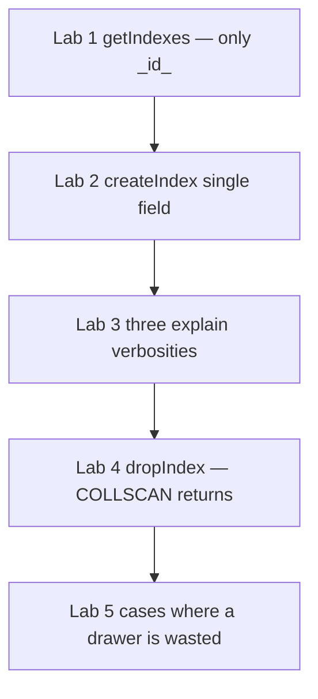

# 25.2 Index Types, APIs, explain(), When Not to Index

> **One-line summary:** Learn the **catalog of index types**, the three methods **`createIndex` / `getIndexes` / `dropIndex`**, how to read **`.explain()` at three verbosities**, and the intuition for **when an index is wasted**. “Better vs worse” is always **query shape**, not a global ranking.

---

## Table of Contents

1. [You Are Here](#you-are-here)
2. [Prerequisites](#prerequisites)
3. [Lab Reset](#lab-reset)
4. [Big-Picture Analogy](#big-picture-analogy)
5. [Sequential Flow (Mental Model)](#sequential-flow-mental-model)
6. [Index Types Catalog](#index-types-catalog)
7. [Lab 1 — `getIndexes()` on a collection (only `_id_`)](#lab-1--getindexes-on-a-collection-only-_id_)
8. [Lab 2 — Single-field `createIndex()` and default names](#lab-2--single-field-createindex-and-default-names)
9. [Lab 3 — Three `explain()` verbosities](#lab-3--three-explain-verbosities)
10. [Lab 4 — `dropIndex()` and the scan returns](#lab-4--dropindex-and-the-scan-returns)
11. [Lab 5 — When **not** to index](#lab-5--when-not-to-index)
12. [Better vs Worse (rule now, proof in 25.3–25.8)](#better-vs-worse-rule-now-proof-in-253258)
13. [Deep Dive — `explain()` field map](#deep-dive--explain-field-map)
14. [Deep Dive — Single-field indexes](#deep-dive--single-field-indexes)
15. [Interview Checkpoint](#interview-checkpoint)
16. [Key Takeaways](#key-takeaways)
17. [Sources](#sources)

---

## You Are Here

```
25.1 B-tree internals  →  **25.2 (you are here)**  →  25.3 Compound / covered
```

You already know COLLSCAN vs IXSCAN. This file is the **toolkit**: types, APIs, `explain`, and **restraint**.

**Previous:** [25.1](./25.1%20COLLSCAN%20vs%20IXSCAN%20and%20B-tree%20Internals.md) · **Next:** [25.3](./25.3%20Compound%20Indexes%2C%20Order%2C%20ESR%2C%20Covered%20Queries.md)

---

## Prerequisites

- Finish 25.1 Labs 1–3 at minimum (`indexLab` with 5,000 docs is useful here).
- If `indexLab` is missing, run the **Lab Reset** below (it re-seeds).

---

## Lab Reset

```javascript
use studentRecords

if (db.indexLab.countDocuments() === 0) {
  const branches = ["CSE", "ECE", "ME", "CE"]
  const docs = []
  for (let i = 1; i <= 5000; i++) {
    docs.push({
      rollNo: i,
      name: "Student" + i,
      branch: branches[i % 4],
      cgpa: 6 + (i % 40) / 10,
      city: i % 2 === 0 ? "Mumbai" : "Delhi",
      isActive: i % 5 !== 0
    })
  }
  db.indexLab.insertMany(docs)
}

// Start this file with a known index set: drop extras, keep _id_
db.indexLab.dropIndexes()   // cannot drop _id_; extras go away
db.indexLab.getIndexes()
```

`dropIndexes()` (plural) removes **user** indexes. `_id_` remains.

---

## Big-Picture Analogy

25.1 printed **one** catalog drawer (`branch`). The campus library actually has **many drawer types**:

| Drawer type | Campus meaning |
|---|---|
| Single-field | Cards sorted by **one** stamp (`rollNo`) |
| Compound | Cards sorted by **branch, then CGPA, then city** (order printed on the divider) |
| Unique | A stamp that **forbids two files with the same roll number** |
| Partial | Catalog **only for honors students** |
| TTL | Cards that also authorize the janitor to **shred old locker slips** |
| Multikey | **One card per skill sticker** on the same file |
| Text | A **word index at the back of a book**, not a roll-number catalog |

The head librarian (`explain` / query planner) tells you which drawer they used. You do not guess.

---

## Sequential Flow (Mental Model)



---

## Index Types Catalog

**Types** (how keys are stored) vs **properties** (rules bolted onto a type). Interviewers mix these; keep them separate.

### Types (physical)

| Type | How you create it | Use when | Depth |
|---|---|---|---|
| **Default `_id_`** | Automatic, unique, cannot drop | Point lookup by `_id` | This file |
| **Single-field** | `{ rollNo: 1 }` | Filter/sort **one** field | This file |
| **Compound** | `{ branch: 1, cgpa: -1 }` | Multi-field filter + sort | **25.3** |
| **Multikey** | Index an **array** field; MongoDB flags it | `skills: "Java"` | **25.7** |
| **Text** | `{ bio: "text" }` | `$text` word search | **25.8** |
| **Hashed** | `{ userId: "hashed" }` | Hash shard keys; equality, not ranges | Mention only |
| **Geospatial** | `"2dsphere"` / `"2d"` | `$near`, GeoJSON | Mention only |
| **Wildcard** | `{ "$**": 1 }` or `{ "attrs.$**": 1 }` | Unpredictable attribute names | Mention only |

### Properties (rules)

| Property | Option | Use when | Depth |
|---|---|---|---|
| **Unique** | `{ unique: true }` | Enforce uniqueness | **25.4** |
| **Partial** | `{ partialFilterExpression: { ... } }` | Index a **subset** of docs | **25.4** |
| **TTL** | `{ expireAfterSeconds: n }` | Auto-delete old docs | **25.5** |
| **Sparse** | `{ sparse: true }` | Skip docs **missing** the field (prefer partial) | 25.4 mention |
| **Hidden** | `{ hidden: true }` or `collMod` | Test dropping an index without dropping it | 25.6 mention |

**Interview one-liner:** “Unique, TTL, and partial are **properties**. Compound and text are **types**. A unique compound TTL is not a thing — TTL is single-field only.”

---

## Lab 1 — `getIndexes()` on a collection (only `_id_`)

### Name trap

There is **no** `db.collection.getIndex()`. The helper is **`getIndexes()`** (plural). Saying `getIndex()` in an interview is a red flag.

### Run

```javascript
db.indexLab.getIndexes()
```

### Watch

```javascript
[
  { v: 2, key: { _id: 1 }, name: "_id_" }
]
```

| Field | Meaning |
|---|---|
| `v` | Index catalog version (you will see `2`) |
| `key` | Pattern: field → `1` / `-1` / `"text"` / `"hashed"` / `"2dsphere"` |
| `name` | Handle for `dropIndex`. Default `_id_` here |

### Learn / validate

Every collection has `_id_`. If Lab Reset ran `dropIndexes()`, you are in a clean state for Lab 2.

---

## Lab 2 — Single-field `createIndex()` and default names

### Run

```javascript
db.indexLab.createIndex({ rollNo: 1 })
db.indexLab.createIndex({ city: -1 }, { name: "idx_city_desc" })
db.indexLab.getIndexes()
```

### Watch

- First index name defaults to **`rollNo_1`** (field + `_` + direction).
- Second index uses your **explicit** name `idx_city_desc`. You **cannot rename** later — drop and recreate.
- `key: { city: -1 }` records descending order.

Idempotent: running `createIndex({ rollNo: 1 })` again returns the existing name; it does **not** build a duplicate of the same key pattern.

### Learn / validate

**Single-field how it is made:**

```javascript
db.<collection>.createIndex(
  { <field>: <1 or -1> },
  { name: "<optional>", unique: false /* other options */ }
)
```

**When a single-field index is the right tool:**

- Hot filter is **one** field: `find({ rollNo: 42 })`, `find({ email: "a@b.c" })`.
- You sort **only** that field: `find().sort({ city: -1 })`.

**When it is the wrong tool:**

- Queries always combine `branch` + `cgpa` + sort — you want **one compound** (25.3), not three overlapping singles.
- The field is a boolean or otherwise **not selective** (Lab 5).

Direction `1` vs `-1` on a **single** field: equality does not care; `sort({ city: -1 })` can walk a `{ city: 1 }` index **backwards**. Compound mixed sorts cannot (25.3).

---

## Lab 3 — Three `explain()` verbosities

### Where and why `explain()` exists

`explain` asks the planner to **narrate** a plan and optionally **run** it for stats. Use it:

- Before shipping a query (“will this COLLSCAN at 10M docs?”).
- After `createIndex` (“did the planner actually pick it?”).
- When a query is slow (“FETCH 2M keys for 10 results?”).

It is **not** an optimization by itself. It is a **measurement**.

### Run the same query three ways

```javascript
const filter = { branch: "CSE" }

// 1) Shape only — no execution counters
printjson(db.indexLab.find(filter).explain("queryPlanner"))

// 2) Shape + how much work the WINNER did
printjson(db.indexLab.find(filter).explain("executionStats"))

// 3) Winner + trial stats for rejected candidates
printjson(db.indexLab.find(filter).explain("allPlansExecution"))
```

You can also write `db.indexLab.explain("executionStats").find(filter)` — same idea, collection-level helper.

Rebuild `branch_1` so Lab 3 has something to pick:

```javascript
db.indexLab.createIndex({ branch: 1 })
```

Then re-run the three `explain`s.

### Watch — verbosity table

| Verbosity | Runs the query? | You came for | Skip when |
|---|---|---|---|
| `"queryPlanner"` (default) | No | `winningPlan.stage`, `indexName`, `rejectedPlans` | You need counts |
| `"executionStats"` | Yes (once, winner only) | `nReturned`, `totalKeysExamined`, `totalDocsExamined`, `executionTimeMillis` | Huge collection in prod without a limit — it **does the work** |
| `"allPlansExecution"` | Yes, including **short trials** of candidates | `executionStats.allPlansExecution[]` trial `nReturned` / keys examined | You wanted plan **cache** contents (you will not get them — see trap) |

### Learn / validate — the plan-cache trap (preview of 25.6)

**`explain()` ignores existing plan-cache entries and does not write a new one.** To populate the cache you must run the **real** `find()` (25.6). Use `allPlansExecution` to **compare candidate trees on this run**, not to inspect the cache.

### What “used the index” looks like

Good:

```
winningPlan.stage = FETCH
  inputStage.stage = IXSCAN
  inputStage.indexName = "branch_1"
totalDocsExamined ≈ nReturned
```

Bad:

```
winningPlan.stage = COLLSCAN
totalDocsExamined ≈ collection size
```

Ugly (index used but still painful):

```
IXSCAN but totalKeysExamined >> nReturned
```

That means the index was a **bad fit** (low selectivity, wrong prefix — 25.3, or `$ne` — Lab 5).

---

## Lab 4 — `dropIndex()` and the scan returns

### Run

```javascript
db.indexLab.getIndexes()

db.indexLab.dropIndex("branch_1")          // by name
// or: db.indexLab.dropIndex({ branch: 1 }) // by key pattern

db.indexLab.find({ branch: "CSE" }).explain("queryPlanner")

db.indexLab.dropIndex("idx_city_desc")
db.indexLab.dropIndex("rollNo_1")
db.indexLab.getIndexes()
```

You cannot:

```javascript
db.indexLab.dropIndex("_id_")   // error — default unique index
```

### Watch

After dropping `branch_1`, `winningPlan.stage` is **`COLLSCAN`** again for `{ branch: "CSE" }`. That is the control experiment: **the index, not luck, caused IXSCAN**.

### Learn / validate

| Method | Role |
|---|---|
| `createIndex(keys, options)` | Build (or no-op if identical keys exist) |
| `getIndexes()` | List specs, names, unique/partial/TTL options |
| `dropIndex(name or keys)` | Remove one user index |
| `dropIndexes()` | Remove all user indexes |

---

## Lab 5 — When **not** to index

Intuition: a catalog drawer is worth it when (a) the cabinet is **large**, (b) the question is **asked often**, (c) the stamp on the card **throws away most files**. If any of those fail, skip the index.

### 5a. Tiny collection

On 20 documents, COLLSCAN is a rounding error. Indexes add write tax for no human-visible gain. **Still index unique business keys** (`email`) for the **constraint**, not for speed (25.4).

### 5b. Low-selectivity field (boolean)

### Run

```javascript
db.indexLab.createIndex({ isActive: 1 })

db.indexLab.find({ isActive: true }).explain("executionStats")
db.indexLab.countDocuments({ isActive: true })
db.indexLab.countDocuments({})
```

### Watch

`isActive: true` is ~80% of the collection (`i % 5 !== 0`). You will see **IXSCAN** (planner may still pick it) but `totalDocsExamined` stays huge — you FETCH almost everyone. COLLSCAN can be **as cheap or cheaper** (sequential I/O vs random FETCHes).

### Learn / validate

**Do not index fields that match most documents** (gender on a 50/50 split is already weakly selective; booleans and “status: active” on an all-active table are worse). Selectivity = how well the predicate **rejects** docs.

### 5c. `$ne` / `$nin`

```javascript
db.indexLab.createIndex({ branch: 1 })

db.indexLab.find({ branch: { $ne: "CSE" } }).explain("executionStats")
```

### Watch

Often `totalKeysExamined` is still most of the index. `$ne` / `$nin` are **not selective** — they match “everything except X”. An index may be used and still lose to a scan, or the planner may COLLSCAN.

### 5d. Unanchored `$regex`

```javascript
db.indexLab.createIndex({ name: 1 })

// cannot use the index as a tight range
db.indexLab.find({ name: { $regex: /dent1/i } }).explain("queryPlanner")

// prefix, case-sensitive, CAN become a range on the index
db.indexLab.find({ name: { $regex: /^Student1/ } }).explain("queryPlanner")
```

### Watch

`/dent1/i` → typically **COLLSCAN** (or a full index scan that is not better). `/^Student1/` → **IXSCAN** range on `name_1`.

### Learn / validate

Indexes store **sorted values**. Only a **left-anchored, case-sensitive** regex turns into `name >= "Student1" && name < "Student2"`-style bounds. Case-insensitive / contains-search needs a **text index** (25.8) or Atlas Search — not a normal B-tree.

### 5e. Field almost never queried

If no screen, API, or report filters `middleName`, do not index it. Catalog drawers you never open still slow **every insert**.

### 5f. Write-heavy logs

Click events, metrics, oplog-like collections: **high write-to-read**. Official docs: indexes have a **negative** impact on writes; that ratio makes them expensive. Prefer time-series / capped / TTL (25.5) designs over 12 secondary indexes.

### 5g. Redundant prefix (preview of 25.3)

If you already have `{ branch: 1, cgpa: 1 }`, a second `{ branch: 1 }` is usually **redundant** (unless unique/sparse/partial differs). Drop the prefix index. You will prove prefix use in 25.3.

### Recap table — need vs skip

| Situation | Index? |
|---|---|
| Large collection, selective equality/range/sort, query is hot | **Yes** |
| Unique business key (`email`, `rollNo`) | **Yes** (constraint) — 25.4 |
| Tiny collection, speed only | **No** |
| Boolean / 80%+ match | **Usually no** |
| `$ne`, `$nin`, unanchored regex | **Index rarely saves you** |
| Field unused in queries | **No** |
| Write-heavy, rare reads | **Minimize** |
| Duplicate of a compound prefix | **No** |

---

## Better vs Worse (rule now, proof in 25.3–25.8)

| Claim | Verdict |
|---|---|
| “Compound is always better than single-field” | **False.** `{ branch: 1 }` is enough for `find({ branch })`. A fat compound wastes RAM if you never use the extra keys. |
| “One compound can replace several singles” | **True when prefixes match** (25.3). `{ a: 1, b: 1 }` serves `a` and `a+b`. |
| “Text index is better for `find({ name: "Rahul" })`” | **False.** Text is for **words** via `$text`. Equality uses a normal B-tree. |
| “More indexes = faster database” | **False.** Faster **some** reads, slower **all** writes, more disk. |
| “Unique is faster than non-unique” | **False.** Unique is a **constraint** (25.4). |

**Rule:** pick the **narrowest** index that supports the **hot query shape** (filter + sort + projection). Verify with `executionStats`. That is “better.”

---

## Deep Dive — `explain()` field map

Print a compact summary you can reuse in every later lab:

```javascript
function planSummary(filter) {
  const e = db.indexLab.find(filter).explain("executionStats")
  const win = e.queryPlanner.winningPlan
  const es = e.executionStats
  return {
    winningStage: win.stage,
    inputStage: win.inputStage && win.inputStage.stage,
    indexName: win.inputStage && win.inputStage.indexName,
    nReturned: es.nReturned,
    keys: es.totalKeysExamined,
    docs: es.totalDocsExamined,
    ms: es.executionTimeMillis,
    rejected: e.queryPlanner.rejectedPlans.length
  }
}

printjson(planSummary({ branch: "CSE" }))
printjson(planSummary({ rollNo: 42 }))
```

On MongoDB 8.0+ you may also see `planCacheShapeHash` / `planCacheKey`. Hashes identify **query shape**, not “this index is cached.” Cache semantics are 25.6.

SBE (slot-based engine) nests stages under `winningPlan.queryPlan`. Hunt for the same names: `COLLSCAN`, `IXSCAN`, `FETCH`.

---

## Deep Dive — Single-field indexes

### Embedded fields (dot notation)

```javascript
db.students.createIndex({ "profile.contact.email": 1 })
```

That indexes the **leaf**, not the whole `profile` object.

### Whole embedded document

```javascript
db.students.createIndex({ profile: 1 })
```

Only queries that compare the **entire** `profile` object as a value use this index. `{ "profile.contact.email": "x" }` does **not**. Prefer dotted single-field or compound keys.

### `1` vs `-1`

Stored order of keys. Equality: either works. `sort({ rollNo: -1 })` can use `{ rollNo: 1 }` by scanning backward.

---

## Interview Checkpoint

### Q1. What is the method to list indexes? Is it `getIndex()`?

**`getIndexes()`**. There is no `getIndex()`.

### Q2. What are the three `explain` verbosities and when do you use each?

`queryPlanner` — which plan, no counters. `executionStats` — winner’s keys/docs/time. `allPlansExecution` — also candidate trials. Use executionStats as your default lab verbosity.

### Q3. Does `explain` use the plan cache?

**No.** It ignores and does not populate it.

### Q4. When should you **not** create an index?

Tiny data; low-selectivity fields; predicates that match almost everything (`$ne`, unanchored regex); unused fields; write-heavy collections; redundant prefixes.

### Q5. Is a compound index always better than a single-field index?

**No.** Better means “matches the query shape with least extra keys and least write tax.” Prove with `explain`.

### Q6. How do you drop an index?

`dropIndex("name")` or `dropIndex({ field: 1 })`. Cannot drop `_id_`.

---

## Key Takeaways

1. **Types vs properties:** compound/text/multikey are types; unique/partial/TTL are properties.

2. **APIs:** `createIndex`, `getIndexes` (plural), `dropIndex` / `dropIndexes`. Default names are `field_1`.

3. **`explain` is how you learn.** Watch `stage`, `indexName`, `totalKeysExamined`, `totalDocsExamined`, `nReturned`.

4. **Do not index everything.** Selectivity + query frequency + collection size + write ratio decide.

5. **Query shape wins.** 25.3 will prove that **order** on a compound index changes which queries can use it.

---

## Sources

- [MongoDB Manual — Index Types](https://www.mongodb.com/docs/manual/core/indexes/index-types/)
- [MongoDB Manual — db.collection.createIndex()](https://www.mongodb.com/docs/manual/reference/method/db.collection.createIndex/)
- [MongoDB Manual — db.collection.getIndexes()](https://www.mongodb.com/docs/manual/reference/method/db.collection.getIndexes/)
- [MongoDB Manual — db.collection.dropIndex()](https://www.mongodb.com/docs/manual/reference/method/db.collection.dropIndex/)
- [MongoDB Manual — cursor.explain()](https://www.mongodb.com/docs/manual/reference/method/cursor.explain/)
- [MongoDB Manual — Query Optimization / selectivity](https://www.mongodb.com/docs/manual/core/query-optimization/)

**Next file:** [25.3 Compound Indexes, Order, ESR, Covered Queries](./25.3%20Compound%20Indexes%2C%20Order%2C%20ESR%2C%20Covered%20Queries.md)
