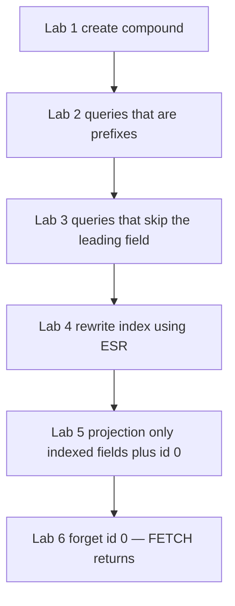

# 25.3 Compound Indexes, Order, ESR, Covered Queries

> **One-line summary:** A compound index is **one B-tree sorted by field1, then field2, then field3**. **Order is the feature** — only **prefixes** of that order can use the tree. A **covered query** is an IXSCAN that never FETCHes because every returned field already sits on the catalog card.

---

## Table of Contents

1. [You Are Here](#you-are-here)
2. [Prerequisites](#prerequisites)
3. [Lab Reset](#lab-reset)
4. [Big-Picture Analogy](#big-picture-analogy)
5. [Sequential Flow (Mental Model)](#sequential-flow-mental-model)
6. [Lab 1 — Build `{ branch: 1, cgpa: -1, city: 1 }`](#lab-1--build--branch-1-cgpa--1-city-1-)
7. [Lab 2 — Prefix hits (order used correctly)](#lab-2--prefix-hits-order-used-correctly)
8. [Lab 3 — Prefix misses (this is why order matters)](#lab-3--prefix-misses-this-is-why-order-matters)
9. [Lab 4 — ESR: Equality, Sort, Range](#lab-4--esr-equality-sort-range)
10. [Lab 5 — Covered query (no FETCH)](#lab-5--covered-query-no-fetch)
11. [Lab 6 — The `_id: 0` trap](#lab-6--the-_id-0-trap)
12. [Deep Dive — Prefix rule and sort directions](#deep-dive--prefix-rule-and-sort-directions)
13. [Which is better: several singles vs one compound?](#which-is-better-several-singles-vs-one-compound)
14. [Interview Checkpoint](#interview-checkpoint)
15. [Key Takeaways](#key-takeaways)
16. [Sources](#sources)

---

## You Are Here

```
25.2 APIs / explain / when not  →  **25.3 (you are here)**  →  25.4 Unique / partial
```

**Previous:** [25.2](./25.2%20Index%20Types%2C%20APIs%2C%20explain()%2C%20When%20Not%20to%20Index.md) · **Next:** [25.4](./25.4%20Unique%20and%20Partial%20Indexes.md)

---

## Prerequisites

- 25.1 (IXSCAN + FETCH) and 25.2 (`explain`, `createIndex`).
- Comfort reading `winningPlan.inputStage`.

---

## Lab Reset

```javascript
use studentRecords

if (db.indexLab.countDocuments() < 1000) {
  const branches = ["CSE", "ECE", "ME", "CE"]
  const docs = []
  for (let i = 1; i <= 5000; i++) {
    docs.push({
      rollNo: i,
      name: "Student" + i,
      branch: branches[i % 4],
      cgpa: 6 + (i % 40) / 10,
      city: i % 2 === 0 ? "Mumbai" : "Delhi",
      isActive: i % 5 !== 0
    })
  }
  db.indexLab.insertMany(docs)
}

db.indexLab.dropIndexes()
db.indexLab.getIndexes()
```

---

## Big-Picture Analogy

A **single-field** catalog is a drawer sorted only by branch. A **compound** catalog is a drawer of cards that say:

```
CSE | 9.2 | Mumbai | shelf #…
CSE | 9.2 | Delhi  | shelf #…
CSE | 8.1 | Mumbai | shelf #…
ECE | 9.0 | Delhi  | shelf #…
```

Cards are sorted **first by branch, then CGPA descending, then city**. You can walk:

- All CSE cards (first stamp).
- CSE cards with CGPA ≥ 8 (first two stamps).
- CSE + CGPA + city (all three).

You **cannot** start in the middle: “all Mumbai cards regardless of branch” — Mumbai is the **third** stamp. The clerk would have to read **every** card. That is a prefix miss.

**ESR** is how you decide **which stamp goes first**: Equality (branch = CSE), then Sort (CGPA desc), then Range (city in … / cgpa > 8).

**Covered query:** the card already lists everything the student asked to see, so the clerk **never walks to the shelf** (no FETCH).

---

## Sequential Flow (Mental Model)



**Why order matters (one paragraph for interviews):**

The B-tree’s sort key is the **tuple** `(branch, cgpa, city)`. A tree search can jump to a leading equality (`branch = CSE`) and then walk a contiguous range of `cgpa`. It **cannot** jump to `city = Mumbai` without knowing `branch` and `cgpa` — those values are not grouped together. Official name: **index prefix**. Prefixes of `{ a, b, c }` are `{ a }`, `{ a, b }`, `{ a, b, c }`. Not `{ b }`, `{ c }`, `{ b, c }`.

---

## Lab 1 — Build `{ branch: 1, cgpa: -1, city: 1 }`

### Run

```javascript
db.indexLab.createIndex({ branch: 1, cgpa: -1, city: 1 })
db.indexLab.getIndexes()
```

### Watch

```javascript
{
  v: 2,
  key: { branch: 1, cgpa: -1, city: 1 },
  name: "branch_1_cgpa_-1_city_1"
}
```

Three keys, **one** tree. `_id_` is still there.

### Learn / validate

Compound prototype:

```javascript
db.<collection>.createIndex({
  <field1>: <1 | -1>,
  <field2>: <1 | -1>,
  // up to 32 fields
})
```

JavaScript object key order **is** the index field order. `{ cgpa: 1, branch: 1 }` is a **different** index from `{ branch: 1, cgpa: 1 }`.

---

## Lab 2 — Prefix hits (order used correctly)

### Run

```javascript
function stages(filter, sort, proj) {
  let c = db.indexLab.find(filter, proj || {})
  if (sort) c = c.sort(sort)
  const e = c.explain("executionStats")
  const w = e.queryPlanner.winningPlan
  function walk(node, acc) {
    if (!node) return acc
    acc.push(node.stage)
    if (node.inputStage) walk(node.inputStage, acc)
    if (node.inputStages) node.inputStages.forEach(s => walk(s, acc))
    if (node.queryPlan) walk(node.queryPlan, acc)
    return acc
  }
  return {
    stages: walk(w, []),
    indexName: e.queryPlanner.winningPlan.inputStage &&
      e.queryPlanner.winningPlan.inputStage.indexName,
    nReturned: e.executionStats.nReturned,
    keys: e.executionStats.totalKeysExamined,
    docs: e.executionStats.totalDocsExamined
  }
}

print("A only branch:")
printjson(stages({ branch: "CSE" }))

print("B branch + cgpa range:")
printjson(stages({ branch: "CSE", cgpa: { $gte: 8 } }))

print("C all three:")
printjson(stages({ branch: "CSE", cgpa: 8, city: "Mumbai" }))
```

### Watch

A, B, C should show **IXSCAN** (often under FETCH). `indexName` is `branch_1_cgpa_-1_city_1`. `keys` and `docs` stay in the same ballpark as `nReturned` (not 5000).

MongoDB can also use the index for `{ branch, city }` **without** `cgpa` — `branch` is still a prefix — but it is **less tight**: it may scan all CSE keys and filter `city` (in-index filter). That is allowed, just not as good as `{ branch, city }` as its own leading pair.

### Learn / validate

Supported by `{ branch: 1, cgpa: -1, city: 1 }`:

| Query fields | Prefix? | Efficient? |
|---|---|---|
| `branch` | yes `{ branch }` | yes |
| `branch` + `cgpa` | yes `{ branch, cgpa }` | yes |
| `branch` + `cgpa` + `city` | yes full | yes |
| `branch` + `city` (skip cgpa) | `branch` is prefix | **usable, not ideal** |

---

## Lab 3 — Prefix misses (this is why order matters)

### Run

```javascript
print("D only cgpa — skipped branch:")
printjson(stages({ cgpa: { $gte: 9 } }))

print("E only city:")
printjson(stages({ city: "Mumbai" }))

print("F city + cgpa, no branch:")
printjson(stages({ city: "Mumbai", cgpa: { $gte: 8 } }))
```

### Watch

D, E, F typically **COLLSCAN** (or an IXSCAN that still examines a huge fraction — planner may pick COLLSCAN as cheaper). `totalDocsExamined` near **5000**. The compound index is **sitting unused** even though `cgpa` and `city` are in it.

### Learn / validate

**This is the interview answer to “why does order matter?”**

The tree is not a bag of three independent columns. It is **one sorted list of tuples**. Without the leading `branch` value, matching `city: "Mumbai"` keys are **scattered** through the tree (one Mumbai under CSE, one under ECE, …). An index scan would devolve into “read almost every leaf.” COLLSCAN is honest about that.

If your hot query is `find({ city: "Mumbai" })`, this compound is the **wrong** index. You need `{ city: 1 }` or a compound that **starts** with `city`.

### Bonus: in-memory SORT

```javascript
print("G filter branch, sort by city — city is not next after equality in a useful way:")
printjson(stages({ branch: "CSE" }, { city: 1 }))
```

You may see a `SORT` stage. `{ branch: 1, cgpa: -1, city: 1 }` is **not** ordered by `city` within branch (it is ordered by `cgpa` then city). Sorting by city requires either a different compound `{ branch: 1, city: 1 }` or an in-memory sort.

Watch for `SORT` in the stage list — that is “index did not satisfy sort.”

---

## Lab 4 — ESR: Equality, Sort, Range

**Guideline:** put fields in the index as **Equality → Sort → Range**.

| Slot | Query feature | Example |
|---|---|---|
| **E** Equality | `{ field: value }`, `$eq`, small `$in` | `status: "paid"` |
| **S** Sort | `.sort({ date: -1 })` | `date: -1` in the index |
| **R** Range | `$gt`, `$gte`, `$lt`, `$lte`, large `$in`, `$ne` | `amount: { $gt: 100 }` |

**Why:** equality groups cards into a **contiguous block**. Inside that block, pre-sorted order can satisfy `sort` with **no SORT stage**. Range is last because a range on an earlier field **breaks** a later sort’s contiguity.

### Run — a realistic shape

```javascript
db.ordersLab.drop()
db.ordersLab.insertMany([
  { status: "paid",    amount: 120, createdAt: new Date("2026-01-01") },
  { status: "paid",    amount: 80,  createdAt: new Date("2026-06-01") },
  { status: "paid",    amount: 500, createdAt: new Date("2026-03-01") },
  { status: "pending", amount: 300, createdAt: new Date("2026-04-01") },
  { status: "paid",    amount: 200, createdAt: new Date("2026-05-01") }
])

// ESR: equality status, sort createdAt, range amount
db.ordersLab.createIndex({ status: 1, createdAt: -1, amount: 1 })

const q = db.ordersLab.find({
  status: "paid",
  amount: { $gte: 100 }
}).sort({ createdAt: -1 })

printjson(q.explain("executionStats").queryPlanner.winningPlan)
```

### Watch

You want **IXSCAN** and **no `SORT` stage**. If you had indexed `{ amount: 1, status: 1 }` instead, you would likely get a SORT or a worse scan.

### Learn / validate

```javascript
// Query
db.orders.find({ status: "paid", amount: { $gt: 100 } }).sort({ createdAt: -1 })

// Index
{ status: 1, createdAt: -1, amount: 1 }
//          E              S              R
```

If equality is **weak** (almost all rows `status: "paid"`) and the range is **tight**, ERS (`equality, range, sort`) can win. ESR is the default interview answer; mention the exception.

**Sort direction rule:** `{ a: 1, b: 1 }` supports `sort({ a: 1, b: 1 })` and the **all-reversed** `sort({ a: -1, b: -1 })`. It does **not** support mixed `sort({ a: 1, b: -1 })`. For mixed sorts, the index directions must **match** the sort pattern.

Clean up:

```javascript
db.ordersLab.drop()
```

---

## Lab 5 — Covered query (no FETCH)

A **covered query** is answered **only from the index**. No collection FETCH.

**Requirements:**

1. All **filter** fields are in the index.
2. All **projected** (returned) fields are in the index — including sort fields.
3. **Inclusion** projection only (`{ branch: 1, cgpa: 1, _id: 0 }`). Exclusion projections do not cover.
4. If `_id` is not in the index, you **must** `{ _id: 0 }` because MongoDB includes `_id` by default.
5. Avoid `$exists` / null quirks; text indexes **cannot** cover; multikey covers only if the **array is not projected** (25.7).

### Run

```javascript
db.indexLab.dropIndexes()
db.indexLab.createIndex({ branch: 1, cgpa: 1, city: 1 })

const covered = db.indexLab.find(
  { branch: "CSE" },
  { branch: 1, cgpa: 1, city: 1, _id: 0 }
).explain("executionStats")

printjson(covered.queryPlanner.winningPlan)
print("docs examined:", covered.executionStats.totalDocsExamined)
print("keys examined:", covered.executionStats.totalKeysExamined)
print("nReturned:", covered.executionStats.nReturned)
```

### Watch

Stage list should look like **IXSCAN** feeding a **PROJECTION_COVERED** (or SBE equivalent) — **no FETCH**.

`totalDocsExamined` is **0** (or not counting collection docs) while `totalKeysExamined` ≈ `nReturned`. That is the signature: **we never opened student files; we read catalog cards only.**

(Engine versions differ slightly. If you still see FETCH, confirm `_id: 0` and that you did not project `name`.)

### Learn / validate

Covered = extra **disk for fatter index keys** in exchange for **zero heap fetches**. Use it for hot APIs that return a small, stable field set (`branch`, `cgpa`, `city`). Do not stuff `bio` into the index “just in case.”

---

## Lab 6 — The `_id: 0` trap

### Run

```javascript
const notCovered = db.indexLab.find(
  { branch: "CSE" },
  { branch: 1, cgpa: 1, city: 1 }   // _id still included by default!
).explain("executionStats")

printjson(notCovered.queryPlanner.winningPlan)
print("docs examined:", notCovered.executionStats.totalDocsExamined)
```

### Watch

**FETCH is back.** `_id` is not in `{ branch, cgpa, city }`, but it is in the result. MongoDB must open the document to read `_id`.

### Learn / validate

```javascript
// NOT covered
{ branch: 1, cgpa: 1 }

// covered (if those three fields are the index)
{ branch: 1, cgpa: 1, city: 1, _id: 0 }
```

Same trap: projecting `name` (not in the index) destroys covering.

---

## Deep Dive — Prefix rule and sort directions

Index `{ item: 1, location: 1, stock: 1 }` prefixes:

- `{ item: 1 }`
- `{ item: 1, location: 1 }`
- `{ item: 1, location: 1, stock: 1 }`

**Cannot** use it for `location`, `stock`, or `location + stock` alone.

If you also created `{ item: 1 }`, and neither index is unique/sparse/partial, **`{ item: 1 }` is redundant** — drop it. The compound already serves that prefix.

---

## Which is better: several singles vs one compound?

| Design | Helps | Hurts |
|---|---|---|
| `{ branch: 1 }` + `{ cgpa: 1 }` + `{ city: 1 }` | Each **solo** query | `find({ branch, cgpa }).sort({ city })` cannot use one tree for filter+sort; three write taxes |
| `{ branch: 1, cgpa: -1, city: 1 }` | Prefix queries + ESR-shaped query | `find({ city })` alone **misses**; fatter keys |
| Both compound **and** `{ branch: 1 }` | Almost never | Double write tax for the same prefix |

**Better:** one compound aligned to the **hottest** multi-field query (ESR), plus extra singles **only** for hot queries the compound cannot prefix. **Worse:** indexing every field “because we can.”

Text vs compound: `{ bio: "text" }` is **not** a substitute for `{ email: 1 }`. Different access path (25.8).

---

## Interview Checkpoint

### Q1. Why does field order matter in a compound index?

The B-tree is sorted by the **tuple in declaration order**. Only **leading prefixes** form contiguous ranges. Skipping the first field scatters matches.

### Q2. What prefixes does `{ a: 1, b: 1, c: 1 }` support?

`{ a }`, `{ a, b }`, `{ a, b, c }`. Not `{ b }`, `{ c }`, `{ b, c }`.

### Q3. What is ESR?

Equality fields first, then sort fields, then range fields. Goal: contiguous IXSCAN and **no in-memory SORT**.

### Q4. What is a covered query?

A query satisfied **entirely from index keys**. No FETCH. Needs inclusion projection and `_id: 0` if `_id` is not indexed.

### Q5. Why did covering fail when I projected `{ branch: 1, cgpa: 1 }`?

`_id` was still returned. FETCH loaded documents to read `_id`.

### Q6. Can a text or multikey index cover?

Text: **no**. Multikey: only if the **array field is not in the projection** (25.7).

---

## Key Takeaways

1. **One tree, one tuple order.** Prefix or you COLLSCAN.

2. **ESR** is how you choose that order for real APIs.

3. **Covered queries** skip FETCH; they require every returned field (and `_id: 0` unless `_id` is in the index).

4. **A compound can replace a prefix single-field index.** Do not keep both without a unique/sparse reason.

5. **Order is not cosmetic.** `{ branch, cgpa }` and `{ cgpa, branch }` are different products.

---

## Sources

- [MongoDB Manual — Compound Indexes](https://www.mongodb.com/docs/manual/core/indexes/index-types/index-compound/)
- [ESR (Equality, Sort, Range) Guideline](https://www.mongodb.com/docs/manual/tutorial/equality-sort-range-guideline/)
- [MongoDB Manual — Query Optimization / Covered Queries](https://www.mongodb.com/docs/manual/core/query-optimization/)
- [Sort Results with Indexes](https://www.mongodb.com/docs/manual/tutorial/sort-results-with-indexes/)

**Next file:** [25.4 Unique and Partial Indexes](./25.4%20Unique%20and%20Partial%20Indexes.md)
