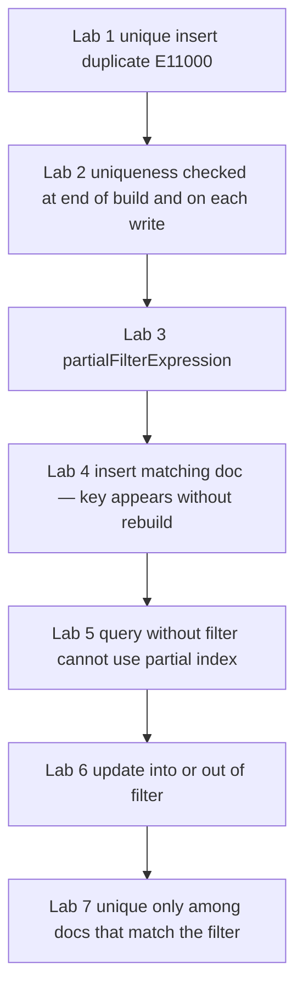

# 25.4 Unique and Partial Indexes

> **One-line summary:** `unique: true` is a **constraint**, not a faster `createIndex()`. A **partial** index stores only documents that match a filter, and **new qualifying writes join the B-tree automatically** — you never re-run `createIndex()` for them.

---

## Table of Contents

1. [You Are Here](#you-are-here)
2. [Prerequisites](#prerequisites)
3. [Lab Reset](#lab-reset)
4. [Big-Picture Analogy](#big-picture-analogy)
5. [Sequential Flow (Mental Model)](#sequential-flow-mental-model)
6. [Lab 1 — Unique vs plain `createIndex()`](#lab-1--unique-vs-plain-createindex)
7. [Lab 2 — When uniqueness is checked (build vs later writes)](#lab-2--when-uniqueness-is-checked-build-vs-later-writes)
8. [Lab 3 — Partial index metadata](#lab-3--partial-index-metadata)
9. [Lab 4 — New qualifying inserts (no rebuild)](#lab-4--new-qualifying-inserts-no-rebuild)
10. [Lab 5 — Non-qualifying docs are invisible to the partial index](#lab-5--non-qualifying-docs-are-invisible-to-the-partial-index)
11. [Lab 6 — `$set` into / out of the filter](#lab-6--set-into--out-of-the-filter)
12. [Lab 7 — Partial + unique together](#lab-7--partial--unique-together)
13. [Deep Dive — Unique is not “better,” partial vs sparse](#deep-dive--unique-is-not-better-partial-vs-sparse)
14. [Interview Checkpoint](#interview-checkpoint)
15. [Key Takeaways](#key-takeaways)
16. [Sources](#sources)

---

## You Are Here

```
25.3 Compound / covered  →  **25.4 (you are here)**  →  25.5 TTL
```

These are **properties** on an index, not new tree species. The B-tree from 25.1 still applies.

**Previous:** [25.3](./25.3%20Compound%20Indexes%2C%20Order%2C%20ESR%2C%20Covered%20Queries.md) · **Next:** [25.5](./25.5%20TTL%20Indexes.md)

---

## Prerequisites

- 25.1–25.3 (`createIndex`, `getIndexes`, `explain`, prefix idea).
- Isolated collections `uniqLab` and `partialLab` — do not reuse `indexLab` for unique tests.

---

## Lab Reset

```javascript
use studentRecords
db.uniqLab.drop()
db.partialLab.drop()
```

---

## Big-Picture Analogy

**Unique:** the registrar stamps **“this roll number may exist only once.”** The stamp is printed **on the catalog**. Lookups by roll number still use the same B-tree walk as a non-unique index. The extra behavior is **rejecting a second file with roll 101**.

**Partial:** a catalog drawer that **only contains honors students** (`status: "active"` / `cgpa >= 9`). Freshers who later make honors get a **new card printed that night** — the clerk does not reprint the whole catalog (`createIndex` is not re-run). Students who leave honors have their card **pulled**.

---

## Sequential Flow (Mental Model)



---

## Lab 1 — Unique vs plain `createIndex()`

### Run

```javascript
db.uniqLab.drop()
db.uniqLab.insertMany([
  { email: "rahul@college.edu", name: "Rahul" },
  { email: "priya@college.edu", name: "Priya" }
])

// A) ordinary index — duplicates ARE allowed
db.uniqLab.createIndex({ name: 1 })
db.uniqLab.insertOne({ email: "other@college.edu", name: "Rahul" })
print("Two Rahuls exist:", db.uniqLab.countDocuments({ name: "Rahul" }))

// B) unique index — duplicates are FORBIDDEN
db.uniqLab.createIndex({ email: 1 }, { unique: true })

try {
  db.uniqLab.insertOne({ email: "rahul@college.edu", name: "Copycat" })
} catch (e) {
  print("Duplicate email error code:", e.code)
  print(e.message)
}

printjson(db.uniqLab.getIndexes())
```

### Watch

- Two documents named Rahul: **OK** (`name_1` is not unique).
- Second `rahul@college.edu`: **`E11000` duplicate key error**.
- `getIndexes()` shows `unique: true` on `email_1`.

### Learn / validate

| | `createIndex({ email: 1 })` | `createIndex({ email: 1 }, { unique: true })` |
|---|---|---|
| Speeds `find({ email })` | Yes (B-tree) | Yes (same idea) |
| Forbids two docs with the same email | **No** | **Yes** |
| “Better”? | Better for **speed only** | Better for **data integrity** |
| Interview wording | Secondary index | Unique **constraint** implemented **as** an index |

**`unique: true` is not a performance upgrade.** It is a **rule**. You still get an index (so lookups by that field can IXSCAN). You do **not** get a magically faster B-tree than the non-unique one.

Where it is applied: **login emails, roll numbers, order SKUs, usernames** — anywhere the business rule is “at most one document per key.” Do not put unique on `city` or `branch`.

---

## Lab 2 — When uniqueness is checked (build vs later writes)

Official behavior on **populated** collections: constraint checks on **pre-existing and concurrently written** documents happen **after** the index build completes. Duplicates can exist **during** the build; if they still exist at the **end**, the build **fails**.

### Run — build fails because duplicates already exist

```javascript
db.uniqLab.drop()
db.uniqLab.insertMany([
  { sku: "ABC" },
  { sku: "ABC" }           // already duplicate
])

try {
  db.uniqLab.createIndex({ sku: 1 }, { unique: true })
} catch (e) {
  print("Build failed:", e.code, e.message)
}

printjson(db.uniqLab.getIndexes())  // unique index should NOT be there
```

### Watch

`createIndex` throws **E11000** (or a createIndexes error wrapping it). `getIndexes()` has only `_id_`.

### Learn / validate

| Moment | Unique enforced? |
|---|---|
| During a long index build | **Not fully** — concurrent duplicate writes may succeed until commit |
| **End of build** | **Yes** — leftover duplicates abort the build |
| Every later `insert` / `update` | **Yes** — E11000 |

**Interview:** “Unique is enforced at commit of the index build and on subsequent writes. Building unique indexes on dirty data fails at the end, not as a magical pre-check of the whole table in isolation from concurrent writes.”

---

## Lab 3 — Partial index metadata

### Run

```javascript
db.partialLab.drop()
db.partialLab.insertMany([
  { name: "Amit",  status: "active",   cgpa: 9.1 },
  { name: "Priya", status: "inactive", cgpa: 8.2 },
  { name: "Rahul", status: "active",   cgpa: 7.4 }
])

db.partialLab.createIndex(
  { name: 1 },
  { partialFilterExpression: { status: "active" } }
)

printjson(db.partialLab.getIndexes())
```

### Watch

The user index document includes:

```javascript
partialFilterExpression: { status: { $eq: "active" } }  // or { status: "active" }
```

Only **active** students have `name` cards in this drawer.

### Learn / validate

`partialFilterExpression` accepts a subset of query operators (equality, `$exists`, `$gt`/`$gte`/`$lt`/`$lte`, `$type`, `$and`, etc. — see current manual if you need an exotic predicate). You **cannot** combine `partialFilterExpression` with `sparse: true`.

The query **must include a predicate that is a subset of that filter** or MongoDB **will not use** the partial index (it would return an **incomplete** set).

---

## Lab 4 — New qualifying inserts (no rebuild)

This is the question: *after partial indexing, if new values qualify, are they included without re-running indexing?*

**Answer: yes.** WiredTiger maintains the B-tree on **every write**. `createIndex` is not a one-shot photograph.

### Run

```javascript
print("Before new insert — active names via the partial index:")
printjson(
  db.partialLab.find({ name: "Sara", status: "active" }).explain("executionStats")
)

db.partialLab.insertOne({ name: "Sara", status: "active", cgpa: 9.0 })
// We did NOT call createIndex again.

print("After insert — same query:")
const e = db.partialLab.find({ name: "Sara", status: "active" }).explain("executionStats")
printjson({
  nReturned: e.executionStats.nReturned,
  keys: e.executionStats.totalKeysExamined,
  docs: e.executionStats.totalDocsExamined,
  stages: e.queryPlanner.winningPlan
})

print("Sara is in the collection:", db.partialLab.countDocuments({ name: "Sara" }))
```

### Watch

- `nReturned` becomes **1**.
- Winning plan uses `name_1` **IXSCAN** (query includes `status: "active"`, which matches the partial filter).
- You never re-ran `createIndex`.

### Learn / validate

**Mental model:**

```
insertOne({ status: "active", name: "Sara" })
   ├─ write document to collection
   └─ extract name, test partial filter
         ├─ MATCH → insert { "Sara", RecordId } into the partial B-tree
         └─ NO MATCH → do not touch this index
```

There is no “rebuild job” scheduled. Same incremental maintenance as Lab 5 in 25.1, plus a **filter gate**.

---

## Lab 5 — Non-qualifying docs are invisible to the partial index

### Run

```javascript
db.partialLab.insertOne({ name: "Ned", status: "inactive", cgpa: 6.0 })

print("Query WITH the filter (can use partial index):")
printjson(
  db.partialLab.find({ name: "Rahul", status: "active" }).explain("queryPlanner").queryPlanner.winningPlan
)

print("Query WITHOUT the filter (must NOT use partial — incomplete):")
printjson(
  db.partialLab.find({ name: "Ned" }).explain("queryPlanner").queryPlanner.winningPlan
)

print("Query that contradicts the filter:")
printjson(
  db.partialLab.find({ name: "Ned", status: "inactive" }).explain("queryPlanner").queryPlanner.winningPlan
)
```

### Watch

- `{ name, status: "active" }` → **IXSCAN** on the partial index.
- `{ name: "Ned" }` alone → typically **COLLSCAN** (or another index). Using the partial index would **miss** inactive Ned.
- `{ name, status: "inactive" }` → **cannot** use this partial index.

### Learn / validate

Planner rule: **never use a partial index if the query could match documents the index omitted.** That is correctness, not a performance quirk.

---

## Lab 6 — `$set` into / out of the filter

### Run

```javascript
const id = db.partialLab.insertOne({
  name: "Vikram",
  status: "inactive",
  cgpa: 9.5
}).insertedId

print("Vikram inactive — query as active (should return 0, index unused or empty):")
print("count:", db.partialLab.countDocuments({ name: "Vikram", status: "active" }))

db.partialLab.updateOne({ _id: id }, { $set: { status: "active" } })

print("After promotion — count:", db.partialLab.countDocuments({ name: "Vikram", status: "active" }))
printjson(
  db.partialLab.find({ name: "Vikram", status: "active" }).explain("executionStats").executionStats
)

db.partialLab.updateOne({ _id: id }, { $set: { status: "inactive" } })

print("After demotion — count:", db.partialLab.countDocuments({ name: "Vikram", status: "active" }))
```

### Watch

- Promotion to `active`: count 0 → 1. The **index key is inserted**. No `createIndex`.
- Demotion: count 1 → 0. The **index key is deleted**. Document **remains** in the collection.

### Learn / validate

Partial indexes track **membership over time**. Updates that change filter fields are **index inserts/deletes**. This is the same answer as “are new qualifying values included?” — **yes, on the write that made them qualify.**

---

## Lab 7 — Partial + unique together

Uniqueness applies **only** to documents that **match the filter**.

### Run

```javascript
db.partialLab.drop()
db.partialLab.createIndex(
  { email: 1 },
  {
    unique: true,
    partialFilterExpression: { email: { $exists: true } }
  }
)

db.partialLab.insertOne({ name: "NoEmail" })
db.partialLab.insertOne({ name: "AlsoNoEmail" })          // OK — filter not matched

db.partialLab.insertOne({ name: "A", email: "a@x.com" })
try {
  db.partialLab.insertOne({ name: "B", email: "a@x.com" })
} catch (e) {
  print("Duplicate among emailed users:", e.code)
}
```

### Watch

Two documents **without** `email` are allowed (they are not in the unique partial index). Two documents **with** the same `email` are not.

Classic use: unique email **only when present** (sparse-like, but with an explicit filter). Prefer this over old `sparse: true` unique indexes when you need precise rules.

---

## Deep Dive — Unique is not “better,” partial vs sparse

### Unique vs non-unique (speed)

Both are B-trees. Unique adds **duplicate detection** on insert/update and at the end of the build. It does **not** change big-O of IXSCAN. Choose unique because the **domain** says the key is unique — then you get both integrity **and** a usable index.

### Partial vs sparse

| | Sparse | Partial |
|---|---|---|
| Membership | Field **exists** (compound sparse: at least one key exists / type-dependent) | **Any filter you specify** |
| Filter on a **non-indexed** field | No | **Yes** (`index name`, filter `status`) |
| Prefer in new designs | Legacy | **Yes** — official recommendation over sparse for control |

### `_id` and shard keys

`_id_` cannot be partial. Shard-key indexes cannot be partial.

---

## Interview Checkpoint

### Q1. Is `unique: true` better than `createIndex()`?

**Different job.** Unique enforces a constraint. Both can speed lookups on that field. Unique is not a faster tree.

### Q2. After a partial index exists, do new matching documents require `createIndex` again?

**No.** Qualifying inserts/updates **add keys immediately**. Non-qualifying writes skip that index. Leaving the filter **removes** the key.

### Q3. Why won’t `find({ name: "Ned" })` use a partial index filtered on `status: "active"`?

Using it would **omit inactive Neds**. Incomplete result. Planner refuses.

### Q4. When is uniqueness checked?

At **end of index build** and on **later writes**. Duplicates during a build can still abort commit.

### Q5. Can I have two documents without email if unique is partial on `{ email: { $exists: true } }`?

**Yes.** Unique applies only inside the filter.

---

## Key Takeaways

1. **Unique = constraint + index.** Not a speed-up flag.

2. **E11000** is the duplicate-key error to name in interviews.

3. **Partial = smaller tree + cheaper writes** for the docs you care about.

4. **Maintenance is incremental.** New qualifying values are indexed **on that write**.

5. **Queries must imply the filter** or the partial index is unusable.

---

## Sources

- [MongoDB Manual — Unique Indexes](https://www.mongodb.com/docs/manual/core/index-unique/)
- [MongoDB Manual — Partial Indexes](https://www.mongodb.com/docs/manual/core/index-partial/)
- [MongoDB Manual — Index Builds (constraint checking)](https://www.mongodb.com/docs/manual/core/index-creation/)
- [MongoDB Manual — Sparse Indexes](https://www.mongodb.com/docs/manual/core/index-sparse/)

**Next file:** [25.5 TTL Indexes](./25.5%20TTL%20Indexes.md)
