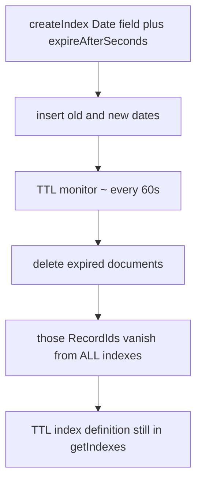

# 25.5 TTL Indexes

> **One-line summary:** A TTL index is a **single-field Date index** plus `expireAfterSeconds`. A background thread **deletes expired documents**; it does **not** drop the index. When a document is deleted, its B-tree keys disappear like any other delete.

---

## Table of Contents

1. [You Are Here](#you-are-here)
2. [Prerequisites](#prerequisites)
3. [Lab Reset](#lab-reset)
4. [Big-Picture Analogy](#big-picture-analogy)
5. [Sequential Flow (Mental Model)](#sequential-flow-mental-model)
6. [Lab 1 — Create a TTL index](#lab-1--create-a-ttl-index)
7. [Lab 2 — Insert past vs future dates](#lab-2--insert-past-vs-future-dates)
8. [Lab 3 — Wait for the monitor; prove the index remains](#lab-3--wait-for-the-monitor-prove-the-index-remains)
9. [Lab 4 — Compound indexes ignore `expireAfterSeconds`](#lab-4--compound-indexes-ignore-expireafterseconds)
10. [Lab 5 — Documents without a Date never expire](#lab-5--documents-without-a-date-never-expire)
11. [When to use TTL (and when not)](#when-to-use-ttl-and-when-not)
12. [Deep Dive — TTL monitor internals](#deep-dive--ttl-monitor-internals)
13. [Interview Checkpoint](#interview-checkpoint)
14. [Key Takeaways](#key-takeaways)
15. [Sources](#sources)

---

## You Are Here

```
25.4 Unique / partial  →  **25.5 (you are here)**  →  25.6 Plan cache
```

**Previous:** [25.4](./25.4%20Unique%20and%20Partial%20Indexes.md) · **Next:** [25.6](./25.6%20Winning%20Plan%2C%20Plan%20Cache%2C%20allPlansExecution.md)

---

## Prerequisites

- 25.1 (index = separate B-tree) and 25.4 (properties vs types).
- Ability to wait ~**60–90 seconds** without assuming instant deletes.
- Dates must be BSON **Date**, not strings.

---

## Lab Reset

```javascript
use studentRecords
db.ttlLab.drop()
```

---

## Big-Picture Analogy

Hostel **lockers for guest Wi-Fi passwords**. Each slip has a timestamp. A janitor walks the locker room **about once a minute**, shreds slips older than N seconds, and throws away those students’ **catalog cards** as part of shredding the file.

The **janitor’s schedule** is not the catalog itself. After a night of shredding, the **TTL catalog drawer is still on the wall**. You only remove the drawer with `dropIndex`.

**Wrong sentence:** “When a TTL index expires, MongoDB removes the index.”
**Right sentence:** “When a **document** expires, MongoDB **deletes the document**. The TTL index remains and keeps being used for queries and future expirations.”

---

## Sequential Flow (Mental Model)



---

## Lab 1 — Create a TTL index

### Run

```javascript
db.ttlLab.drop()

db.ttlLab.createIndex(
  { createdAt: 1 },
  { expireAfterSeconds: 30 }
)

printjson(db.ttlLab.getIndexes())
```

### Watch

```javascript
{
  v: 2,
  key: { createdAt: 1 },
  name: "createdAt_1",
  expireAfterSeconds: 30
}
```

`expireAfterSeconds` must be between `0` and `2147483647`. The indexed field must be a **Date** (or an array of Dates — earliest date wins).

### Learn / validate

Prototype:

```javascript
db.<collection>.createIndex(
  { <dateField>: 1 },
  { expireAfterSeconds: <seconds> }
)
```

This is still a **normal B-tree** on `createdAt`. It **supports queries** like `find({ createdAt: { $gt: ... } })` the same way a non-TTL date index would. TTL is an extra **reaper** using that tree.

To **change** `expireAfterSeconds` later, do **not** `createIndex` again on the same key. Use `collMod`:

```javascript
db.runCommand({
  collMod: "ttlLab",
  index: {
    keyPattern: { createdAt: 1 },
    expireAfterSeconds: 60
  }
})
```

---

## Lab 2 — Insert past vs future dates

### Run

```javascript
const now = new Date()

db.ttlLab.insertMany([
  { note: "already-expired", createdAt: new Date(now.getTime() - 120000) }, // 120s ago
  { note: "fresh",           createdAt: now },
  { note: "future",          createdAt: new Date(now.getTime() + 3600_000) }
])

print("count immediately after insert:", db.ttlLab.countDocuments())
printjson(db.ttlLab.find({}, { note: 1, createdAt: 1, _id: 0 }).toArray())
```

### Watch

Count is **3**. Nothing is deleted **synchronously** on insert. Expiry is **lazy** (monitor).

---

## Lab 3 — Wait for the monitor; prove the index remains

The TTL monitor runs **about every 60 seconds**. `expireAfterSeconds: 30` plus monitor delay means “already-expired” should vanish within **roughly one to two minutes**, not at T+30.000s.

### Run

```javascript
print("Waiting 75 seconds for the TTL monitor...")
sleep(75000)

print("count after wait:", db.ttlLab.countDocuments())
printjson(db.ttlLab.find({}, { note: 1, createdAt: 1, _id: 0 }).toArray())
print("indexes still defined:")
printjson(db.ttlLab.getIndexes())
```

If `sleep` is inconvenient, run the count/`getIndexes` block manually after a wall-clock minute.

### Watch

| Item | Expected |
|---|---|
| Document `already-expired` | **Gone** |
| `fresh` | May still exist (only 30s + monitor slack — if you waited long enough it may also go) |
| `future` | **Stays** |
| `getIndexes()` still lists `createdAt_1` with `expireAfterSeconds` | **Yes** |

If `already-expired` is still there, wait another 60s. Under load, deletions batch (up to 50,000 per index per pass) and can lag.

### Learn / validate

**What is “removed” at expiry?**

1. The **document** is deleted (foreground delete, like `deleteMany` internally).
2. **Every index entry** for that RecordId is removed (`_id_`, TTL index, any others) — normal delete maintenance (25.1 Lab 5).
3. The **TTL index definition is not dropped**.

Saying “the indexing is removed” is the trap this lab exists to kill.

---

## Lab 4 — Compound indexes ignore `expireAfterSeconds`

### Run

```javascript
db.ttlCompound.drop()
db.ttlCompound.createIndex(
  { createdAt: 1, userId: 1 },
  { expireAfterSeconds: 30 }
)
printjson(db.ttlCompound.getIndexes())
```

### Watch

The compound index is created as a **normal** compound index. `expireAfterSeconds` is **ignored** (it will not appear as a TTL reaper). `_id` cannot be a TTL field either.

### Learn / validate

**TTL indexes are single-field.** Need filtered TTL? Use a **partial TTL** (filter + `expireAfterSeconds` on one Date field) — see time-series notes in the manual. Do not expect compound TTL.

```javascript
db.ttlCompound.drop()
```

---

## Lab 5 — Documents without a Date never expire

### Run

```javascript
db.ttlLab.insertMany([
  { note: "string-date", createdAt: "2020-01-01" },  // NOT a Date
  { note: "missing-field", payload: true }
])

printjson(db.ttlLab.find({ note: { $in: ["string-date", "missing-field"] } }).toArray())
```

Wait another minute if you want; those two **will not** be removed by TTL.

### Watch / Learn

- Missing field → no expiry.
- Wrong type (string, number) → no expiry.
- Array of Dates → **earliest** date in the array is used.

Use schema validation if expiry must be reliable:

```javascript
db.createCollection("eventlog", {
  validator: {
    $jsonSchema: {
      bsonType: "object",
      required: ["lastModifiedDate"],
      properties: {
        lastModifiedDate: { bsonType: "date" }
      }
    }
  }
})
```

---

## When to use TTL (and when not)

| Use TTL | Do not use TTL |
|---|---|
| Session tokens, OTP rows, password-reset links | Data you must **archive** (use Online Archive / cold storage, not delete) |
| Machine logs / events you only keep N days | Source of truth the business may audit years later |
| Cache / lock documents with a natural lifetime | “Maybe we will need it” collections |
| Capping growth of a hot collection of **ephemeral** docs | Replacing proper backups |

**Intuition:** TTL is a **janitor**, not a warehouse. If a human might ask for that row next year, do not TTL it.

**Operational warning:** creating TTL on a huge collection that is **already** expired can delete tens of millions of docs at once (I/O spike). Delete in batches first, or build TTL in a maintenance window.

---

## Deep Dive — TTL monitor internals

- A **background thread** in `mongod` reads **TTL index keys**, compares `indexedDate + expireAfterSeconds` to now, and deletes.
- Default cadence: **every 60 seconds** (`ttlMonitorSleepSecs` can change this — know 60s for interviews).
- Expiry is **not instant**. Delay = monitor interval + delete batch time.
- Replica sets: TTL deletes run on the **primary**; secondaries **replicate** the deletes. Secondaries do not independently reap.
- MongoDB 6.1+: deletes may be **batched** (`BATCHED_DELETE` in explain of those internals).
- Metrics: `serverStatus().metrics.ttl.deletedDocuments`, `.passes`, `.subPasses`.
- Pass limits: e.g. stop after 50,000 deletes on one index or ~1 second, then continue later — so a huge backlog drains over many minutes.
- TTL index **still answers queries** like a normal index (25.1 IXSCAN).

**Clock:** expiry uses the **mongod** clock, not the client’s.

---

## Interview Checkpoint

### Q1. How do you create a TTL index?

`createIndex({ createdAt: 1 }, { expireAfterSeconds: 3600 })` on a **Date** field.

### Q2. When documents expire, is the index removed?

**No.** Documents are deleted. Index entries for those docs are removed as part of the delete. The TTL **index stays** until `dropIndex`.

### Q3. How soon after expiry is the document gone?

Not guaranteed immediately. Monitor ~**60s**, plus delete work. Expect slack.

### Q4. When should you use TTL?

Ephemeral data: sessions, OTPs, short-lived logs. Not legal records.

### Q5. Can a compound index be TTL?

**No.** `expireAfterSeconds` on a compound index is ignored. `_id` cannot be TTL.

---

## Key Takeaways

1. **TTL = Date B-tree + reaper.** Same IXSCAN benefits, plus timed deletes.

2. **Documents die. The index does not.**

3. **~60 second monitor.** Never write “deleted exactly at T+expireAfterSeconds.”

4. **Type must be Date.** Strings do not expire.

5. **Janitor, not archive.**

---

## Sources

- [MongoDB Manual — TTL Indexes](https://www.mongodb.com/docs/manual/core/index-ttl/)
- [MongoDB Manual — Expire Data from Collections by Setting TTL](https://www.mongodb.com/docs/manual/tutorial/expire-data/)
- [MongoDB Manual — collMod (change expireAfterSeconds)](https://www.mongodb.com/docs/manual/reference/command/collMod/)

**Next file:** [25.6 Winning Plan, Plan Cache, allPlansExecution](./25.6%20Winning%20Plan%2C%20Plan%20Cache%2C%20allPlansExecution.md)
