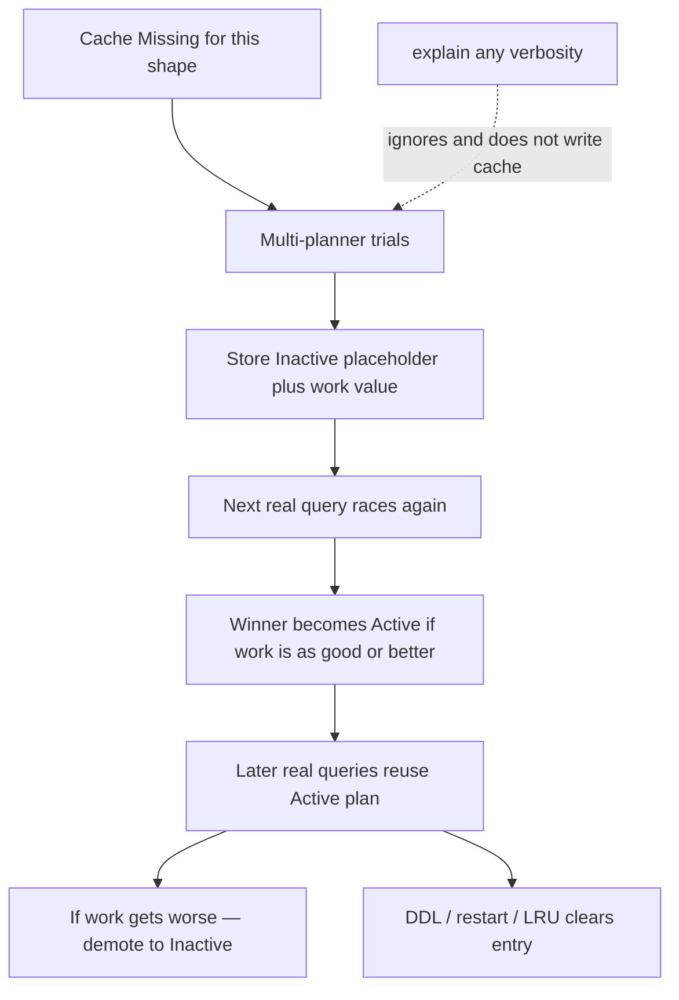

# 25.6 Winning Plan, Plan Cache, allPlansExecution

> **One-line summary:** When several indexes could serve a query, MongoDB **races candidate plans**, caches the **winner** for that **query shape**, and reuses it. **`explain()` bypasses that cache.** To see the cache you must **run the real query**, then `$planCacheStats`.

---

## Table of Contents

1. [You Are Here](#you-are-here)
2. [Prerequisites](#prerequisites)
3. [Lab Reset](#lab-reset)
4. [Big-Picture Analogy](#big-picture-analogy)
5. [Sequential Flow (Mental Model)](#sequential-flow-mental-model)
6. [Lab 1 — Two competing indexes](#lab-1--two-competing-indexes)
7. [Lab 2 — `explain("allPlansExecution")` (cache bypassed)](#lab-2--explainallplansexecution-cache-bypassed)
8. [Lab 3 — Real queries populate the cache](#lab-3--real-queries-populate-the-cache)
9. [Lab 4 — Cache states: Missing → Inactive → Active](#lab-4--cache-states-missing--inactive--active)
10. [Lab 5 — What flushes the cache](#lab-5--what-flushes-the-cache)
11. [Lab 6 — `planCacheKey` vs `planCacheShapeHash`](#lab-6--plancachekey-vs-plancacheshapehash)
12. [Deep Dive — How the winner is chosen](#deep-dive--how-the-winner-is-chosen)
13. [What to watch, what to learn](#what-to-watch-what-to-learn)
14. [Interview Checkpoint](#interview-checkpoint)
15. [Key Takeaways](#key-takeaways)
16. [Sources](#sources)

---

## You Are Here

```
25.5 TTL  →  **25.6 (you are here)**  →  25.7 Multikey
```

You already read `explain` in 25.2. This file is why **two indexes fight**, where the decision is **remembered**, and why **`explain` is a liar about the cache**.

**Previous:** [25.5](./25.5%20TTL%20Indexes.md) · **Next:** [25.7](./25.7%20Multikey%20Indexes%20on%20Arrays.md)

---

## Prerequisites

- 25.2 (`explain` verbosities) and 25.3 (compound prefixes).
- mongosh on MongoDB 4.4+ (8.0+ shows `planCacheShapeHash`; older shows `queryHash`).

---

## Lab Reset

```javascript
use studentRecords
db.indexLab.drop()

const branches = ["CSE", "ECE", "ME", "CE"]
const docs = []
for (let i = 1; i <= 5000; i++) {
  docs.push({
    rollNo: i,
    name: "Student" + i,
    branch: branches[i % 4],
    city: i % 2 === 0 ? "Mumbai" : "Delhi",
    cgpa: 6 + (i % 40) / 10
  })
}
db.indexLab.insertMany(docs)
```

---

## Big-Picture Analogy

Two catalog drawers could answer “CSE students in Mumbai”:

- Drawer A: sorted only by `branch`
- Drawer B: sorted by `branch` then `city`

The head librarian **does not philosophize**. She gives **each strategy a short trial** (pull a few results, measure work). The strategy that returns **more results for less work** wins. She writes that on a **clipboard** (plan cache) labeled with the **question shape** (`branch = ?, city = ?`), not the literal strings `"CSE"` / `"Mumbai"`.

Tomorrow’s identical-shaped question reuses the clipboard — **unless** you ask her to **narrate** (`explain`). Narration is a fire drill: she races again and **does not update the clipboard**.

---

## Sequential Flow (Mental Model)



---

## Lab 1 — Two competing indexes

### Run

```javascript
db.indexLab.createIndex({ branch: 1 })
db.indexLab.createIndex({ branch: 1, city: 1 })
db.indexLab.getIndexes()
```

### Watch

Three indexes: `_id_`, `branch_1`, `branch_1_city_1`. Both user indexes **can** serve:

```javascript
db.indexLab.find({ branch: "CSE", city: "Mumbai" })
```

- `{ branch: 1 }` → IXSCAN all CSE, FETCH, filter city.
- `{ branch: 1, city: 1 }` → IXSCAN CSE+Mumbai directly (tighter).

The compound is usually the better **shape**. The planner still **proves** it with a trial when the cache is empty.

### Learn / validate

Competing indexes are normal. “I created an index” ≠ “it is the winner.” Always inspect the plan.

---

## Lab 2 — `explain("allPlansExecution")` (cache bypassed)

### Run

```javascript
const expl = db.indexLab.find({ branch: "CSE", city: "Mumbai" })
  .explain("allPlansExecution")

print("winning index:")
printjson(expl.queryPlanner.winningPlan)

print("rejectedPlans count:", expl.queryPlanner.rejectedPlans.length)
printjson(expl.queryPlanner.rejectedPlans)

print("allPlansExecution trial stats:")
printjson(expl.executionStats.allPlansExecution)
```

### Watch

| Field | What it proves |
|---|---|
| `winningPlan` | Tree the planner **picked on this explain run** (often FETCH ← IXSCAN on `branch_1_city_1`) |
| `rejectedPlans` | Candidates that lost **this** race |
| `executionStats.allPlansExecution` | **Trial** `nReturned`, `totalKeysExamined`, `totalDocsExamined` per candidate — the “work vs results” numbers |
| `executionStats` (top-level) | Full execution of the **winner** |

On SBE, look under `queryPlan` for the same stages.

### Learn / validate

**`explain` does not read or write the plan cache.** Official docs: explain ignores cache entries and prevents caching the winner.

So:

- Use `allPlansExecution` to **learn why A beat B on this trial**.
- Do **not** use it to prove “the cache currently holds X.” That is Lab 3.

**What to watch in trials:** the loser often has **more keys examined** for the same (or fewer) results during the trial window. Winner = **most results, least work** (classic multi-planner). MongoDB 8.3+ may use a cost-based ranker (CBR) as backup for some queries — interview default is still the **trial / works** story.

---

## Lab 3 — Real queries populate the cache

### Run

```javascript
function cacheRows() {
  return db.indexLab.aggregate([{ $planCacheStats: {} }]).toArray()
}

print("cache before real finds:", cacheRows().length)

// IMPORTANT: no .explain() here
db.indexLab.find({ branch: "CSE", city: "Mumbai" }).toArray()
db.indexLab.find({ branch: "ECE", city: "Delhi" }).toArray()
db.indexLab.find({ branch: "ME", city: "Mumbai" }).itcount()

printjson(cacheRows())
```

### Watch

After **real** executions you should see at least one `$planCacheStats` document whose `createdFromQuery` / `queryHash` / `planCacheShapeHash` corresponds to `{ branch: …, city: … }`.

Useful fields (names vary by version):

| Field | Meaning |
|---|---|
| `planCacheShapeHash` or `queryHash` | Hash of the **shape** (predicates, not values) |
| `planCacheKey` | Shape **plus** which indexes currently exist |
| `isActive` / state | Whether this entry is used to skip replanning |
| `works` / `score` / estimated size | Work accounting |
| `version` / `plan` | Cached winning tree |

If the array is empty: you only ran `explain`; or the shape expired; or you are on a mongos/shard setup where stats are per shard. Run `find` again, then `$planCacheStats` on the **same** collection.

### Learn / validate

Same shape, different literals (`CSE`/`Mumbai` vs `ECE`/`Delhi`) → **one** cache entry. That is why it is a **shape** cache, not a value cache.

Clear for experiments:

```javascript
db.indexLab.getPlanCache().clear()
```

---

## Lab 4 — Cache states: Missing → Inactive → Active

You will not always see the internal enum printed as `Missing`. Learn the **state machine** for interviews; `$planCacheStats` shows the **Active** (and sometimes Inactive) entries that exist.

| State | Meaning | Next real query |
|---|---|---|
| **Missing** | Never seen this shape | Race plans. Create **Inactive** placeholder with a work value |
| **Inactive** | Placeholder — **not** used to generate plans yet | Race again. If new winner’s work ≤ placeholder, replace with **Active**. If worse, bump the placeholder’s work value |
| **Active** | Cached winner **is** used | Reuse it. If measured work **degrades**, demote to **Inactive** (replanning next time) |

### Run — observe reuse vs explain

```javascript
db.indexLab.getPlanCache().clear()

// 1) first real query — missing → inactive path internally
db.indexLab.find({ branch: "CSE", city: "Mumbai" }).itcount()
print("after 1 real query:")
printjson(db.indexLab.aggregate([{ $planCacheStats: {} }]).toArray())

// 2) more real queries — promote / stay active
for (let i = 0; i < 5; i++) {
  db.indexLab.find({ branch: "CSE", city: "Mumbai" }).itcount()
}
print("after more real queries:")
printjson(db.indexLab.aggregate([{ $planCacheStats: {} }]).toArray())

// 3) explain still bypasses
db.indexLab.find({ branch: "CSE", city: "Mumbai" }).explain("queryPlanner")
print("cache count unchanged by explain (still the same entries):")
print(db.indexLab.aggregate([{ $planCacheStats: {} }]).toArray().length)
```

### Watch

Cache **gains** entries after `find`, **not** after `explain`. Active entries persist across many identical-shape finds until flush or demotion.

---

## Lab 5 — What flushes the cache

### Run

```javascript
print("before dropIndex:", db.indexLab.aggregate([{ $planCacheStats: {} }]).toArray().length)

db.indexLab.dropIndex("branch_1")

print("after dropIndex:", db.indexLab.aggregate([{ $planCacheStats: {} }]).toArray().length)

// recreate so later files / retries still work
db.indexLab.createIndex({ branch: 1 })
```

### Watch

**Creating, dropping, or hiding an index** is a DDL event → **plan cache for that collection is cleared**. Count drops to 0 (or the shape’s `planCacheKey` changes because available indexes changed).

### Learn / validate — flush list

| Event | Cache |
|---|---|
| `mongod` restart | **Gone** (not persisted) |
| `createIndex` / `dropIndex` / hide index / drop collection | **Cleared** for that collection |
| LRU when cache is large | Least recently used entries evicted |
| `PlanCache.clear()` | Manual wipe |
| `explain()` | **Does not** flush or fill |

MongoDB 5.0+: if total plan caches exceed ~0.5 GB, new entries may store **without** some debug info. Size is in `$planCacheStats`.

---

## Lab 6 — `planCacheKey` vs `planCacheShapeHash`

### Run

```javascript
const e1 = db.indexLab.find({ branch: "CSE", city: "Mumbai" }).explain("queryPlanner")
print("shape hash:", e1.queryPlanner.planCacheShapeHash || e1.queryPlanner.queryHash)
print("planCacheKey:", e1.queryPlanner.planCacheKey)

db.indexLab.createIndex({ city: 1 })

const e2 = db.indexLab.find({ branch: "CSE", city: "Mumbai" }).explain("queryPlanner")
print("shape hash after extra index:", e2.queryPlanner.planCacheShapeHash || e2.queryPlanner.queryHash)
print("planCacheKey after extra index:", e2.queryPlanner.planCacheKey)
```

### Watch

- **`planCacheShapeHash` / `queryHash`:** same query shape → **same** hash even after you add `{ city: 1 }`.
- **`planCacheKey`:** often **changes** when the set of relevant indexes changes — it hashes shape **plus** available indexes.

MongoDB 8.0 duplicates `queryHash` as `planCacheShapeHash`. Prefer the new name going forward.

### Learn / validate

Two different shapes **can** theoretically hash-collide. Unlikely; still, treat hashes as identifiers, not security.

---

## Deep Dive — How the winner is chosen

**Classic multi-planner (interview default):**

1. Generate candidate plans (each IXSCAN combo, COLLSCAN, …).
2. Run each for a **short trial** (works units / results).
3. Winner = **highest productivity**: more documents returned per unit of work (and not stalled).
4. Cache that plan for the shape.

**Why trials exist:** cardinality estimates can be wrong. Racing on **this** data is empirical.

**CBR (MongoDB 8.3+):** if the short trial cannot finish a result in time, a cost-based ranker may score plan nodes. Still cached the same way. You do not need CBR internals for a campus interview unless asked.

**Index filters / `setQuerySettings`:** admins can **pin** allowed indexes for a shape. `explain.queryPlanner.indexFilterSet` tells you if a filter was applied. Out of scope for the lab; know the flag exists.

---

## What to watch, what to learn

| You run | You watch | You learn |
|---|---|---|
| `explain("queryPlanner")` | `winningPlan`, `rejectedPlans` | Which index **would** win **this** replan |
| `explain("executionStats")` | `totalKeysExamined` vs `nReturned` | Whether the winner is **efficient**, not just “uses an index” |
| `explain("allPlansExecution")` | `allPlansExecution[]` trial counts | **Why** A beat B in the race |
| Real `find` + `$planCacheStats` | Cached plan, `planCacheKey` | What production will **reuse** |
| `dropIndex` then stats | Empty cache | DDL **invalidates** memory of winners |

**Validate this sentence:** “The winning plan is cached per query shape, flushed on index changes, and `explain` is not how you inspect that cache.”

---

## Interview Checkpoint

### Q1. How is a winning plan chosen when multiple indexes exist?

The multi-planner **trials** candidates and picks the plan that produces **more results with less work**. That plan is stored in the **plan cache** for the **query shape**.

### Q2. Does `explain("allPlansExecution")` show the cache?

It shows **this run’s** race. It **ignores** the cache and **does not** write to it. Use `$planCacheStats` after real queries.

### Q3. When is the cache updated or deleted?

Filled after real executions (Missing → Inactive → Active). Deleted on restart, index create/drop/hide, collection drop, LRU, or `clear()`. Demoted Active → Inactive if work degrades.

### Q4. `planCacheKey` vs shape hash?

Shape hash = query shape only. `planCacheKey` = shape + **current indexes**.

---

## Key Takeaways

1. **Race, then remember.** Winner is empirical, not “newest index.”

2. **Shape, not values.** `{ branch: "CSE" }` and `{ branch: "ECE" }` share a cache entry.

3. **`explain` is a fire drill.** Clipboard unchanged.

4. **DDL wipes the clipboard.** After `createIndex`, expect replanning.

5. **`allPlansExecution` teaches the race; `$planCacheStats` teaches memory.**

---

## Sources

- [MongoDB Manual — Query Plans](https://www.mongodb.com/docs/manual/core/query-plans/)
- [MongoDB Manual — Explain Results](https://www.mongodb.com/docs/manual/reference/explain-results/)
- [$planCacheStats](https://www.mongodb.com/docs/manual/reference/operator/aggregation/planCacheStats/)
- [PlanCache.clear()](https://www.mongodb.com/docs/manual/reference/method/PlanCache.clear/)

**Next file:** [25.7 Multikey Indexes on Arrays](./25.7%20Multikey%20Indexes%20on%20Arrays.md)
