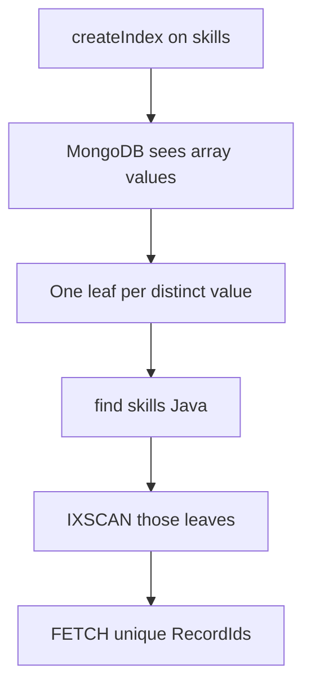

# 25.7 Multikey Indexes on Arrays

> **One-line summary:** Index an array field and MongoDB **automatically** makes a **multikey** index: **one B-tree leaf per distinct array value**, each leaf pointing at the **same** document’s RecordId.

---

## Table of Contents

1. [You Are Here](#you-are-here)
2. [Prerequisites](#prerequisites)
3. [Lab Reset](#lab-reset)
4. [Big-Picture Analogy](#big-picture-analogy)
5. [Sequential Flow (Mental Model)](#sequential-flow-mental-model)
6. [Lab 1 — Auto-multikey (no special flag)](#lab-1--auto-multikey-no-special-flag)
7. [Lab 2 — Distinct values, one document, many leaves](#lab-2--distinct-values-one-document-many-leaves)
8. [Lab 3 — Query an array element with IXSCAN](#lab-3--query-an-array-element-with-ixscan)
9. [Lab 4 — Compound multikey: at most one array field](#lab-4--compound-multikey-at-most-one-array-field)
10. [Lab 5 — Covering: do not project the array](#lab-5--covering-do-not-project-the-array)
11. [Deep Dive — Internals and unique-multikey](#deep-dive--internals-and-unique-multikey)
12. [Interview Checkpoint](#interview-checkpoint)
13. [Key Takeaways](#key-takeaways)
14. [Sources](#sources)

---

## You Are Here

```
25.6 Plan cache  →  **25.7 (you are here)**  →  25.8 Text
```

Same B-tree as 25.1, but **one document fans out** into several keys.

**Previous:** [25.6](./25.6%20Winning%20Plan%2C%20Plan%20Cache%2C%20allPlansExecution.md) · **Next:** [25.8](./25.8%20Text%20Indexes%2C%20Tokenize%2C%20Stem%2C%20Score.md)

---

## Prerequisites

- 25.1 (RecordId + IXSCAN) and 25.3 (covered queries).
- Note [2](./2.%20Embedded%20Documents%20i.e%20Nested%20documents%20in%20mongodb.md) array matching: `{ skills: "Java" }` means “array **contains** Java.”

---

## Lab Reset

```javascript
use studentRecords
db.multiLab.drop()
```

---

## Big-Picture Analogy

Rahul’s file has **three skill stickers**: Java, MongoDB, Java (duplicate sticker). The catalog clerk prints **two cards** (distinct skills), both with Rahul’s **same shelf number**. Searching “who has Java?” pulls Rahul’s card once per distinct key, then FETCH still loads **one** file.

You never say `createIndex({ skills: 1 }, { multikey: true })`. If **any** document has an array at that path, the index **becomes** multikey.

---

## Sequential Flow (Mental Model)



---

## Lab 1 — Auto-multikey (no special flag)

### Run

```javascript
db.multiLab.insertMany([
  { name: "Rahul", skills: ["Java", "MongoDB"] },
  { name: "Priya", skills: ["Python"] },
  { name: "Amit",  skills: ["Java", "C++"] }
])

db.multiLab.createIndex({ skills: 1 })
printjson(db.multiLab.getIndexes())
```

### Watch

```javascript
{ v: 2, key: { skills: 1 }, name: "skills_1" }
```

There is often **no** `"multikey": true` field in older `getIndexes` output. Proof is behavioral (Lab 3) and, on many versions:

```javascript
db.multiLab.aggregate([{ $indexStats: {} }])
// or:
db.multiLab.stats().indexDetails  // may be empty without extra flags
```

The reliable proof: `explain` IXSCAN on `{ skills: "Java" }` plus the **compound array restriction** in Lab 4.

You can also inspect:

```javascript
db.multiLab.find({ skills: "Java" }).explain("queryPlanner")
```

`isMultiKey` may appear on the IXSCAN stage (`true`).

### Learn / validate

Prototype is the same as a single-field index:

```javascript
db.<collection>.createIndex({ <arrayField>: 1 })
```

If **every** value at that path is a scalar, the index is **not** multikey yet. Insert **one** array later and MongoDB **converts** it to multikey (you cannot go back without dropping).

---

## Lab 2 — Distinct values, one document, many leaves

### Run

```javascript
db.multiLab.insertOne({
  name: "Sara",
  skills: ["Java", "MongoDB", "Java"]   // duplicate Java
})
```

Picture Sara’s leaves:

```
Java     → RecordId_Sara
MongoDB  → RecordId_Sara
```

**Not three leaves.** Duplicate `"Java"` is stored **once** per document.

### Watch / Learn

| Array | Leaves | RecordIds |
|---|---|---|
| `["Java", "MongoDB"]` | 2 | both same doc |
| `["Java", "MongoDB", "Java"]` | 2 | both same doc |
| `[]` empty | typically **no** keys for that doc on this index |
| missing field | no keys (like sparse-ish absence) |

**Write tax:** a document with 50 distinct tags produces **50** index inserts. Unbounded arrays are a schema smell (Note 2) **and** an index bomb.

---

## Lab 3 — Query an array element with IXSCAN

### Run

```javascript
const e = db.multiLab.find({ skills: "Java" }).explain("executionStats")
printjson(e.queryPlanner.winningPlan)
print("nReturned:", e.executionStats.nReturned)
print("keys:", e.executionStats.totalKeysExamined)
print("docs:", e.executionStats.totalDocsExamined)
```

### Watch

- Stage: **IXSCAN** on `skills_1` (often under FETCH).
- `isMultiKey: true` if present.
- `nReturned` = number of **documents** with Java (Rahul, Amit, Sara) — not number of leaves globally.
- `totalKeysExamined` ≥ `nReturned` (one key per matching doc here; more if other predicates).

Without the index, same filter is **COLLSCAN** (drop index to compare, then recreate).

### Learn / validate

Query `{ skills: "Java" }` uses the **Java** leaf list. `{ skills: ["Java", "MongoDB"] }` is **exact array equality**, not “contains both” — that is a different predicate (`$all`). Multikey helps **containment of a value**, which is the common pattern.

```javascript
db.multiLab.find({ skills: { $all: ["Java", "MongoDB"] } }).explain("queryPlanner")
```

Still uses the multikey index; bounds intersection is a deeper topic (`$elemMatch` + compound bounds). For interviews: **multikey supports “array contains X”.**

---

## Lab 4 — Compound multikey: at most one array field

### Run

```javascript
db.multiLab.createIndex({ skills: 1, clubs: 1 })  // may succeed if no doc has BOTH as arrays yet

try {
  db.multiLab.insertOne({
    name: "Bad",
    skills: ["Go"],
    clubs: ["Robotics", "Music"]   // second array in the same compound index
  })
} catch (e) {
  print("Insert failed as expected:")
  print(e.message)
}
```

If `clubs` never existed, the compound create succeeds. The **insert** that makes **two** paths arrays fails.

If you already have arrays in two fields, **`createIndex` itself fails**.

### Watch

Error text mentions **cannot index parallel arrays** / compound multikey restriction.

### Learn / validate

**Rule:** in one compound index, **at most one** indexed field may be an array **per document**.

Allowed: `{ tags: 1, year: 1 }` when `year` is a number. Forbidden: `{ tags: 1, scores: 1 }` when both are arrays.

**Why:** a Cartesian explosion of keys (every tag × every score) — unbounded index growth and ambiguous bounds.

Hashed indexes **cannot** be multikey. Shard key cannot be a multikey index (trailing non-shard-key fields in a compound **may** become multikey).

---

## Lab 5 — Covering: do not project the array

### Run

```javascript
db.multiLab.dropIndexes()
db.multiLab.createIndex({ skills: 1, name: 1 })

print("array NOT in projection — can cover:")
printjson(
  db.multiLab.find(
    { skills: "Java" },
    { name: 1, _id: 0 }
  ).explain("executionStats").queryPlanner.winningPlan
)

print("array IN projection — cannot cover:")
printjson(
  db.multiLab.find(
    { skills: "Java" },
    { name: 1, skills: 1, _id: 0 }
  ).explain("executionStats").queryPlanner.winningPlan
)
```

### Watch

First query: **PROJECTION_COVERED** / no FETCH (engine-dependent). Second: **FETCH** because the full array is not reconstructed from a single leaf (one leaf is only `"Java"`, not `["Java","MongoDB"]`).

### Learn / validate

Ties to 25.3: covering needs **all returned data in the index in reconstructable form**. A multikey leaf is **one array element**, not the whole array.

---

## Deep Dive — Internals and unique-multikey

### Internal steps

1. `createIndex({ skills: 1 })`.
2. For each document, for each **distinct** value in `skills`, insert `{ value, RecordId }`.
3. `find({ skills: "Java" })` → B-tree equality on `"Java"` → list of RecordIds → FETCH unique documents.
4. Update `$push` a new distinct skill → **one new leaf**. `$pull` the last copy of a value → **delete that leaf**.

### Unique + multikey

Uniqueness is **across documents**, not inside one array.

```javascript
db.uniqMulti.drop()
db.uniqMulti.createIndex({ tags: 1 }, { unique: true })
db.uniqMulti.insertOne({ tags: ["a", "b"] })           // OK
db.uniqMulti.insertOne({ tags: ["a", "a"] })           // OK — dup inside SAME doc
try {
  db.uniqMulti.insertOne({ tags: ["a"] })              // E11000 — "a" owned by first doc
} catch (e) { print(e.code) }
db.uniqMulti.drop()
```

### Sort on multikey fields

Often adds an in-memory **SORT** unless bounds are `[MinKey, MaxKey]` with extra conditions. Do not assume `sort({ skills: 1 })` is index-only.

---

## Interview Checkpoint

### Q1. How do you create a multikey index?

`createIndex` on a field that **contains arrays**. MongoDB flags it automatically. No `multikey: true` option.

### Q2. How many index entries for `{ skills: ["Java", "Java", "Go"] }`?

**Two** (distinct values), both pointing at the **same** RecordId.

### Q3. Why can’t a compound index include two array fields?

Cartesian product of keys; forbidden. At most **one** array field per compound index.

### Q4. Can a multikey index cover `{ skills: 1 }` in the projection?

**No.** Projecting the array requires FETCH. Covering works if you project **non-array** indexed fields only.

---

## Key Takeaways

1. **Multikey = array field + automatic fan-out.**

2. **Distinct values only; same RecordId.**

3. **Great for “contains X.”** Dangerous for huge arrays (write and storage amplification).

4. **One array per compound index.**

5. **Covering cannot return the array** from the index alone.

---

## Sources

- [MongoDB Manual — Multikey Indexes](https://www.mongodb.com/docs/manual/core/indexes/index-types/index-multikey/)
- [Multikey Index Bounds](https://www.mongodb.com/docs/manual/core/indexes/index-types/index-multikey/multikey-index-bounds/)
- [Unique Indexes — arrays](https://www.mongodb.com/docs/manual/core/index-unique/)

**Next file:** [25.8 Text Indexes, Tokenize, Stem, Score](./25.8%20Text%20Indexes%2C%20Tokenize%2C%20Stem%2C%20Score.md)
