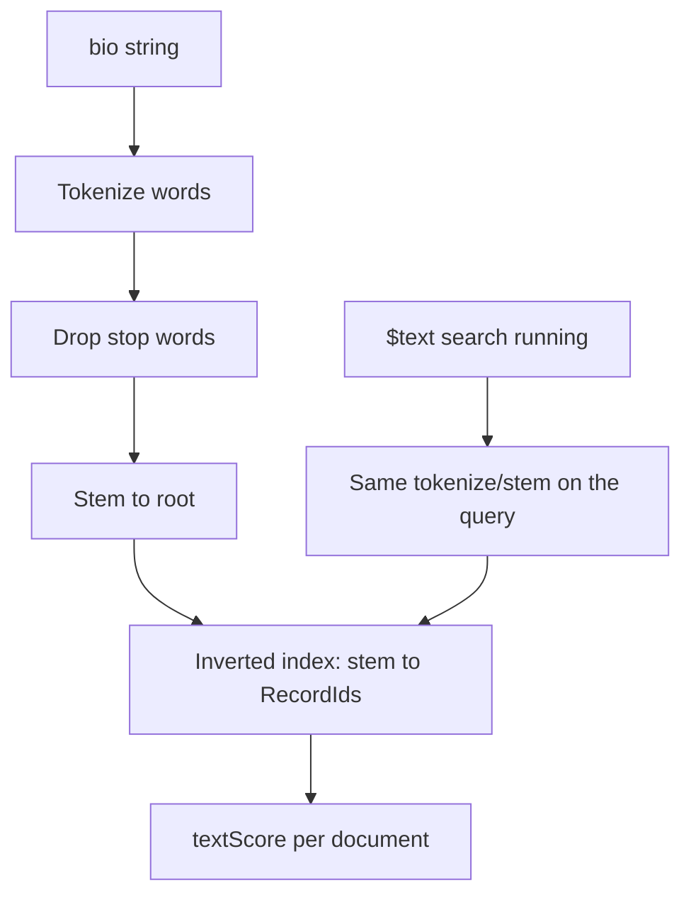

# 25.8 Text Indexes, Tokenize, Stem, Score

> **One-line summary:** A text index is an **inverted index of stemmed words**, not a B-tree of whole strings. `$text` **requires** that index. Without it, substring search is `$regex` (usually **COLLSCAN**). Tokenize → drop stop words → stem → rank with **`textScore`**.

---

## Table of Contents

1. [You Are Here](#you-are-here)
2. [Prerequisites](#prerequisites)
3. [Lab Reset](#lab-reset)
4. [Big-Picture Analogy](#big-picture-analogy)
5. [Sequential Flow (Mental Model)](#sequential-flow-mental-model)
6. [Lab 1 — Search **without** a text index](#lab-1--search-without-a-text-index)
7. [Lab 2 — Create a text index](#lab-2--create-a-text-index)
8. [Lab 3 — Tokenize, stop words, stemming](#lab-3--tokenize-stop-words-stemming)
9. [Lab 4 — Relevance score](#lab-4--relevance-score)
10. [Lab 5 — Weights and one-text-index-per-collection](#lab-5--weights-and-one-text-index-per-collection)
11. [When to use text indexes (and when not)](#when-to-use-text-indexes-and-when-not)
12. [Deep Dive — Pipeline from string to score](#deep-dive--pipeline-from-string-to-score)
13. [Interview Checkpoint](#interview-checkpoint)
14. [Key Takeaways](#key-takeaways)
15. [Sources](#sources)

---

## You Are Here

```
25.7 Multikey  →  **25.8 (you are here)**  →  25.9 Builds / interview recap
```

This is a **different physical layout** from 25.1’s `{ branch: 1 }` B-tree.

**Previous:** [25.7](./25.7%20Multikey%20Indexes%20on%20Arrays.md) · **Next:** [25.9](./25.9%20Index%20Builds%2C%20Locks%2C%20Interview%20Recap.md)

---

## Prerequisites

- 25.1–25.2 (`explain`, COLLSCAN).
- English stemming examples (default `default_language: "english"`).

---

## Lab Reset

```javascript
use studentRecords
db.textLab.drop()
```

---

## Big-Picture Analogy

A **roll-number catalog** (25.1) stores the **whole** stamp `"CSE"`. A **book index at the back of a textbook** stores **words**: *recursion, 12, 45, 88*.

Building that index:

1. **Tokenize** — split the sentence on spaces and punctuation.
2. Throw away **stop words** (*the, a, is, of*).
3. **Stem** — *running, runs, ran* collapse toward `run` (Porter stemmer for English).
4. Each stem points at **which student bios** mentioned it.

Searching `$text: "running"` looks up the stem, not a substring scan of every bio. **Score** is “how relevant is this page” — term frequency, field weights — not “alphabetical order.”

---

## Sequential Flow (Mental Model)



---

## Lab 1 — Search **without** a text index

### Run — `$text` fails

```javascript
db.textLab.drop()
db.textLab.insertMany([
  { name: "Rahul", bio: "I love running marathons and teaching Java." },
  { name: "Priya", bio: "She runs the robotics club." },
  { name: "Amit",  bio: "The cat sat on the mat." }
])

try {
  db.textLab.find({ $text: { $search: "running" } }).toArray()
} catch (e) {
  print("Expected error without text index:")
  print(e.message)
}
```

### Watch

Error: **text index required** (wording like `text index required for $text query` / `need exactly one text index`).

### Run — `$regex` instead (the slow path)

```javascript
printjson(
  db.textLab.find({ bio: { $regex: /run/i } }).explain("executionStats")
)
```

### Watch

`stage: "COLLSCAN"`. Every bio is opened and the regex engine hunts for `run`. Fine for 3 docs. Disaster at 30 million.

### Run — anchored regex **can** use a **normal** string index

```javascript
db.textLab.createIndex({ bio: 1 })
printjson(
  db.textLab.find({ bio: { $regex: /^I love/ } }).explain("queryPlanner").queryPlanner.winningPlan
)
db.textLab.dropIndex("bio_1")
```

### Watch

Prefix `/^I love/` can be an **IXSCAN range** on a B-tree of **whole strings**. `/run/` in the **middle** cannot. This is **not** stemming: `/^I love/` will **not** match “love” in the middle of Priya’s sentence.

### Learn / validate

| Need | Tool | Index |
|---|---|---|
| Exact `name: "Rahul"` | equality | `{ name: 1 }` |
| Prefix `bio` starts with `"I love"` | anchored `$regex` | `{ bio: 1 }` |
| Word `running` ≈ `runs` anywhere | **`$text`** | **text index** |
| Contains substring, no stem | `$regex` | usually COLLSCAN |

**Without a text index, word search is a collection scan (or impossible via `$text`).**

---

## Lab 2 — Create a text index

### Run

```javascript
db.textLab.createIndex({ bio: "text" })
printjson(db.textLab.getIndexes())

printjson(
  db.textLab.find({ $text: { $search: "running" } }).toArray()
)
```

### Watch

`getIndexes()` shows keys like `{ _fts: "text", _ftsx: 1 }`, `default_language: "english"`, `textIndexVersion: 3`, `weights: { bio: 1 }`.

`$text: "running"` returns Rahul **and likely Priya** (`runs` → same stem). Amit (`cat/mat`) stays out.

```javascript
db.textLab.find({ $text: { $search: "running" } }).explain("executionStats")
```

Watch for a **TEXT** stage (or IXSCAN on the text index internals), **not** COLLSCAN.

### Learn / validate

```javascript
db.<collection>.createIndex({ <field>: "text" })
// or several string fields in ONE text index:
db.<collection>.createIndex({ title: "text", body: "text" })
```

**A collection may have only one text index.** That one index may include **many** fields. Second `createIndex({ other: "text" })` fails.

Text indexes are **always sparse**: missing/null/empty-array fields contribute no stems. The `sparse` option is ignored.

Text indexes **cannot cover** a query (25.3).

---

## Lab 3 — Tokenize, stop words, stemming

Do this on paper, then confirm with queries.

Rahul’s bio: `"I love running marathons and teaching Java."`

| Step | Result (illustrative) |
|---|---|
| Tokenize | `I`, `love`, `running`, `marathons`, `and`, `teaching`, `Java` |
| Drop stop words | `love`, `running`, `marathons`, `teaching`, `Java` (`I`, `and` dropped) |
| Stem (English) | `love`, `run`, `marathon`, `teach`, `java` |

### Run

```javascript
print("stop word 'the' should not match Amit by itself in a useful way:")
printjson(db.textLab.find({ $text: { $search: "the" } }).toArray())

print("stem: running vs runs vs run")
print("running:", db.textLab.find({ $text: { $search: "running" } }).map(d => d.name))
print("runs:",    db.textLab.find({ $text: { $search: "runs" } }).map(d => d.name))
print("run:",     db.textLab.find({ $text: { $search: "run" } }).map(d => d.name))
```

### Watch

- Search `"the"`: **empty or useless** — stop words are stripped from the query too.
- `running` / `runs` / `run`: **same documents** (Rahul, Priya) if stemming grouped them.

Stemming is **language-specific**. `{ default_language: "none" }` disables stemming (stores tokens as-is). `{ language_override: "language" }` lets a per-document field pick the language.

### Learn / validate

Tokenization splits on whitespace and most punctuation. It does **not** store phrases as first-class neighbors (no true proximity index). Phrase search `"\"robotics club\""` is a **post-filter** on documents that already matched the terms — still not like Atlas Search.

---

## Lab 4 — Relevance score

### Run

```javascript
db.textLab.insertMany([
  { name: "Dev1", bio: "Java" },
  { name: "Dev2", bio: "Java Java Java I teach Java all day Java" }
])

printjson(
  db.textLab.find(
    { $text: { $search: "Java" } },
    { name: 1, bio: 1, score: { $meta: "textScore" }, _id: 0 }
  ).sort({ score: { $meta: "textScore" } }).toArray()
)
```

### Watch

`Dev2` (many `Java` stems) scores **higher** than `Dev1` (one occurrence), all else equal. Rahul (one Java) sits in between or near Dev1.

`$meta: "textScore"` must appear in **projection** (or aggregation `$meta`) to **see** the score. Sorting by score uses the same meta.

### Learn / validate

Score is **not** a probability. It is a **ranking number** for this query against this index (TF-IDF-style: term frequency in the doc, inverse document frequency across the collection, plus **weights**). Compare scores **within one query**, not across days.

Negation: `$search: "java -marathon"` excludes docs that contain the stemmed `marathon`.

---

## Lab 5 — Weights and one-text-index-per-collection

### Run

```javascript
db.textLab.drop()
db.textLab.insertMany([
  { title: "Java basics", body: "A gentle intro" },
  { title: "Gentle intro", body: "This book is about Java Java Java" }
])

db.textLab.createIndex(
  { title: "text", body: "text" },
  { weights: { title: 10, body: 1 }, name: "TextIndex" }
)

printjson(
  db.textLab.find(
    { $text: { $search: "Java" } },
    { title: 1, score: { $meta: "textScore" }, _id: 0 }
  ).sort({ score: { $meta: "textScore" } }).toArray()
)

try {
  db.textLab.createIndex({ title: "text" })
} catch (e) {
  print("Second text index rejected:")
  print(e.message)
}
```

### Watch

The document with **Java in the title** outranks the one with Java only in a long body (weight 10 vs 1), even if body repeats Java.

Second text index → error.

### Learn / validate

One inverted index per collection keeps `$text` unambiguous (which index would `$text` use?). Put **all** searchable string fields in that single definition.

---

## When to use text indexes (and when not)

| Use `$text` + text index | Do not |
|---|---|
| Keyword search on comments, bios, product descriptions | Exact email / SKU equality → normal unique B-tree |
| Stemming (“run” ≈ “running”) in **one** language | Autocomplete / typeahead → Atlas Search or prefix index |
| Self-managed MongoDB without Atlas Search | Fuzzy typo tolerance, synonyms, highlighting, facets → **Atlas Search** |
| Small/medium collections where a fat inverted index fits RAM | Phrase proximity / relevance tuning of a search engine |

**Cost:** one index entry **per unique stem per field per document**. Writes tokenize and stem **every** indexed string. Heavier than `{ email: 1 }`. Similar in spirit to a **large multikey** index (25.7).

**Better vs worse vs compound:** a compound `{ status: 1, createdAt: -1 }` is **better** for ESR filters. Text is **better** for bag-of-words. Using text for `find({ status: "active" })` is **worse**.

---

## Deep Dive — Pipeline from string to score

**At `createIndex` / insert / update of `bio`:**

1. Read string field(s).
2. Tokenize.
3. Remove stop words for `default_language`.
4. Stem.
5. For each remaining stem, insert an inverted posting (document + positions/weights internally).
6. Empty / missing field → no postings (sparse).

**At `$text`:**

1. Tokenize and stem the **search string** the same way.
2. Look up postings.
3. Combine (OR of terms by default; phrases and negations modify).
4. Compute **textScore**.
5. FETCH documents (text indexes **do not cover**).

**Explain what to watch:**

- No text index → `$text` **throws** (Lab 1).
- With text index → not COLLSCAN for the text predicate.
- `nReturned` vs keys: inverted index can still FETCH many docs if the term is common (`the` is stopped; `data` in a CS corpus is not).

---

## Interview Checkpoint

### Q1. How does MongoDB search text **without** a text index?

`$text` **cannot run**. `$regex` (or `$where`, do not use) **scans documents**. Unanchored regex → COLLSCAN.

### Q2. What is tokenization and stemming?

Tokenization splits strings into words. Stemming reduces inflections to a root so `running` and `runs` share a key.

### Q3. How is relevance generated?

`$meta: "textScore"` — term frequency, rarity, field **weights**. Sort with the same meta.

### Q4. How many text indexes per collection?

**Exactly one**, which may list multiple fields.

### Q5. When do you choose text vs single-field vs Atlas Search?

Equality/range → B-tree. Keywords/stemming on-prem → text index. Product-grade search → Atlas Search.

---

## Key Takeaways

1. **`$text` requires a text index.** Regex without one is a scan.

2. **Inverted stems, not whole sentences.** That is why `runs` hits `running`.

3. **Stop words are dropped** from docs and queries.

4. **`textScore` ranks** this query; weights boost title vs body.

5. **One text index, cannot cover, expensive writes.** Use it only for word search.

---

## Sources

- [MongoDB Manual — Text Indexes](https://www.mongodb.com/docs/manual/core/indexes/index-types/index-text/)
- [$text operator](https://www.mongodb.com/docs/manual/reference/operator/query/text/)
- [$meta textScore](https://www.mongodb.com/docs/manual/reference/operator/projection/meta/)
- [Text Search (self-managed)](https://www.mongodb.com/docs/manual/text-search/)

**Next file:** [25.9 Index Builds, Locks, Interview Recap](./25.9%20Index%20Builds%2C%20Locks%2C%20Interview%20Recap.md)
