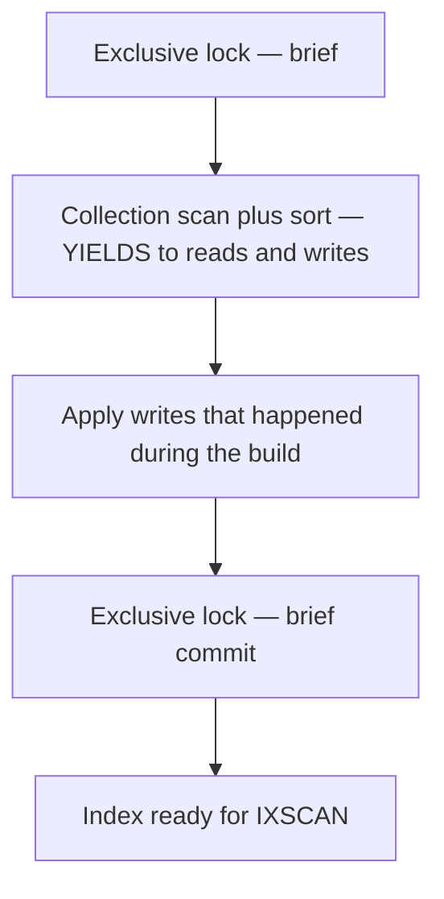
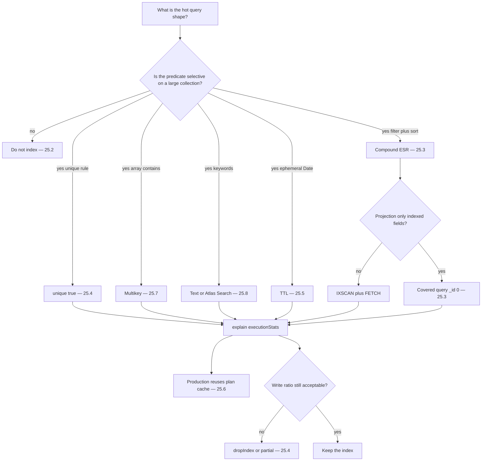

# 25.9 Index Builds, Locks, Interview Recap

> **One-line summary:** Old courses taught **foreground vs `background: true`**. Since MongoDB **4.2**, that option is **ignored** — builds take an exclusive lock only at **start and end**, and **yield** in between. This file is the lock story plus the **interview wrap** of 25.1–25.8.

---

## Table of Contents

1. [You Are Here](#you-are-here)
2. [Prerequisites](#prerequisites)
3. [Lab Reset](#lab-reset)
4. [Big-Picture Analogy](#big-picture-analogy)
5. [Sequential Flow (Mental Model)](#sequential-flow-mental-model)
6. [Lab 1 — Syllabus story (pre-4.2)](#lab-1--syllabus-story-pre-42)
7. [Lab 2 — What `background: true` does **today**](#lab-2--what-background-true-does-today)
8. [Lab 3 — Hybrid build: lock only at the edges](#lab-3--hybrid-build-lock-only-at-the-edges)
9. [Lab 4 — Watch a build with `currentOp`](#lab-4--watch-a-build-with-currentop)
10. [Master analogy recap (all of lesson 25)](#master-analogy-recap-all-of-lesson-25)
11. [Decision flowchart — how you will actually use this](#decision-flowchart--how-you-will-actually-use-this)
12. [SQL vs MongoDB index cheat sheet](#sql-vs-mongodb-index-cheat-sheet)
13. [Interview Q-bank (25.1–25.8)](#interview-q-bank-251258)
14. [Key Takeaways](#key-takeaways)
15. [Sources](#sources)

---

## You Are Here

```
25.8 Text  →  **25.9 (you are here)**  →  series complete
```

**Previous:** [25.8](./25.8%20Text%20Indexes%2C%20Tokenize%2C%20Stem%2C%20Score.md) · **Hub:** [25. Master MongoDB Indexing](./25.%20%20Master%20MongoDB%20Indexing.md)

---

## Prerequisites

- Entire 25.1–25.8 lab path (or at least 25.1 + 25.2).
- MongoDB **4.2+** (Atlas is well past this). If an interviewer is on 3.6 notes, Lab 1 is their world.

---

## Lab Reset

```javascript
use studentRecords
db.buildLab.drop()
```

---

## Big-Picture Analogy

Printing a **new catalog drawer** for 5 million files:

- **Old foreground:** the library **closes**. No borrowing, no returns, until every card is printed. Fast printing, angry students.
- **Old background (`background: true`):** the library **stays open**, but the clerk prints cards in scraps of time. Slow. The drawer is a bit messy (less compact).
- **Modern hybrid (4.2+):** staff **locks the door for two minutes** to set up tables, then prints **while students keep borrowing** (yields), then **locks again for two minutes** to bolt the drawer in place. You get foreground-quality cards without an all-day closure.

---

## Sequential Flow (Mental Model)



---

## Lab 1 — Syllabus story (pre-4.2)

Memorize this **as history**, then correct it in Lab 2.

| Build | Reads/writes during build | Speed | Resulting tree |
|---|---|---|---|
| **Foreground** (`background: false`, default then) | **Blocked** on the **database** that owns the collection (yes: whole DB, not only one collection, in old versions) | Faster | Compact, efficient |
| **Background** `{ background: true }` | **Allowed** | Slower | Less compact; slightly worse than foreground at query time |

Many MCQs still say: “`createIndex` locks the collection so **no query passes** until indexing completes; set `background: true` to prevent that.”

**That MCQ is the 3.x/4.0 world.** If you only recite it in 2026, a strong interviewer will mark you outdated.

### Interview script

“In older MongoDB, foreground index builds took a long exclusive lock so queries waited. `background: true` yielded so traffic continued. **Starting in 4.2**, optimized hybrid builds replaced both: the `background` option is **ignored**. Exclusive locks are only at start and end; the long scan yields. Unique-constraint failures are reported at **commit**.”

---

## Lab 2 — What `background: true` does **today**

### Run

```javascript
db.buildLab.drop()
for (let i = 0; i < 2000; i++) {
  db.buildLab.insertOne({ n: i, tag: i % 3 === 0 ? "a" : "b" })
}

const t0 = Date.now()
const name = db.buildLab.createIndex({ n: 1 }, { background: true })
print("createIndex returned:", name, "in ms:", Date.now() - t0)

printjson(db.buildLab.getIndexes())
```

### Watch

- Index **is created**. There is **no** `background: true` stored on the index document as a lasting mode.
- Official docs: MongoDB **ignores** `background` on `createIndexes` / `createIndex()`.
- Queries issued from **another** `mongosh` tab during a **large** build on 4.2+ typically **succeed** (may slow down). They do **not** wait for the entire build like old foreground.

### Learn / validate

Passing `{ background: true }` is **harmless and useless** on modern servers. Passing `{ background: false }` does **not** restore old full-DB locks. Do not ship `background: true` as if it were a production tuning knob.

`foreground: true` was **never** a real `createIndex` option name. People say “foreground build” meaning **not background**. The option was only `background: true|false`.

---

## Lab 3 — Hybrid build: lock only at the edges

You cannot see the two brief locks without tracing `currentOp` on a **large** collection. Trust the documented phases:

1. **Start (exclusive, short):** setup.
2. **Scan + bulk load (yields):** reads and writes **interleave**. Concurrent writes go to a side structure and are **drained**.
3. **Commit (exclusive, short):** install the index. Unique violations that survived until here **fail the build**.
4. Index becomes visible to the planner (plan cache for the collection is **flushed** — 25.6).

Replica sets (4.4+): builds run on data-bearing members; **commit quorum** must agree before the index is ready. Secondaries are not “queries blocked for hours” by default the way old foreground DB locks were.

**Heavy writes during a build** still slow both the build and the application. Prefer a **maintenance window** for huge unique indexes (25.4: duplicates abort at the end).

Default cap: a few concurrent user index builds (`maxNumActiveUserIndexBuilds`, historically 3). Extra `createIndex` calls **queue**.

MongoDB 7.1+: many index errors abort **during scan** (faster diagnosis); disk-space guard `indexBuildMinAvailableDiskSpaceMB`.

---

## Lab 4 — Watch a build with `currentOp`

Only interesting on a **big** collection. On 2,000 docs the build finishes before you blink.

### Run (optional, two shells)

**Shell A:**

```javascript
use studentRecords
// make it slower: more docs
for (let i = 2000; i < 200000; i++) {
  db.buildLab.insertOne({ n: i, tag: "x" })
}
db.buildLab.createIndex({ tag: 1, n: 1 })
```

**Shell B while A is building:**

```javascript
db.currentOp({ "command.createIndexes": { $exists: true } })
// or:
db.currentOp({ op: "command", ns: /buildLab/ })
```

### Watch

Progress fields (`msg`, `progress`, `locks`) if the build is still running. `command.createIndexes` identifies the job.

### Learn / validate

`currentOp` is how ops teams see **index build progress** without guessing. After commit, `getIndexes()` lists the new key; `explain` can IXSCAN it.

Cleanup:

```javascript
db.buildLab.drop()
```

---

## Master analogy recap (all of lesson 25)

Keep one campus story in your head for the whole interview.

| Topic | Analogy | File |
|---|---|---|
| Collection | Filing cabinet of student files | Hub, 25.1 |
| **Index** | **Library card catalog** — sorted cards + shelf numbers | 25.1 |
| RecordId | Shelf location on the card | 25.1 |
| COLLSCAN | Open **every** file | 25.1 |
| IXSCAN + FETCH | Walk matching cards, then open those files | 25.1 |
| Write tax | Every new file also needs new cards in **every** drawer | 25.1 |
| `explain` | Ask the librarian to **narrate** a strategy | 25.2 |
| When not to index | Do not print cards for “is a student: true” | 25.2 |
| Compound order | Cards sorted by **branch, then CGPA, then city** — you must start from the left | 25.3 |
| ESR | Stamp equality first, then the order you want on the counter, then the range | 25.3 |
| Covered query | Answer from the **card only** — never walk to the shelf | 25.3 |
| Unique | Registrar **forbids** two files with the same roll number | 25.4 |
| Partial | Honors-only catalog; new honors students get a card **that night** | 25.4 |
| TTL | Janitor shreds **old locker slips** ~every minute; the **drawer stays** | 25.5 |
| Winning plan / cache | Librarian **races** two drawers, writes the winner on a **clipboard** of question shapes | 25.6 |
| `explain` vs cache | Narration is a fire drill — **clipboard unchanged** | 25.6 |
| Multikey | One file, **many skill cards**, same shelf number | 25.7 |
| Text | **Back-of-book word index**: tokenize, drop “the”, stem `running` → `run`, rank pages | 25.8 |
| Index build | Print a new drawer: lock twice, keep the library open in the middle | 25.9 |

---

## Decision flowchart — how you will actually use this



**Serialized habit:**

1. Write the query.
2. `explain("executionStats")` — COLLSCAN?
3. Design the **narrowest** index (ESR, unique/partial/TTL as **properties**).
4. `createIndex` (hybrid build; do not worship `background: true`).
5. `explain` again — keys ≈ returned? Covered if you claimed covering?
6. If two indexes compete, read `allPlansExecution` **and** `$planCacheStats` after real finds.
7. Revisit when the query shape changes.

---

## SQL vs MongoDB index cheat sheet

| SQL | MongoDB |
|---|---|
| `CREATE INDEX idx ON t (a)` | `db.t.createIndex({ a: 1 }, { name: "idx" })` |
| `CREATE UNIQUE INDEX …` | `createIndex({ a: 1 }, { unique: true })` |
| `CREATE INDEX ON t (a, b DESC)` | `createIndex({ a: 1, b: -1 })` |
| `DROP INDEX idx ON t` | `db.t.dropIndex("idx")` |
| `SHOW INDEX FROM t` | `db.t.getIndexes()` |
| `EXPLAIN` / `EXPLAIN ANALYZE` | `find(…).explain("queryPlanner" \| "executionStats")` |
| Partial index (`WHERE status = 'active'`) | `{ partialFilterExpression: { status: "active" } }` |
| Table scan | `COLLSCAN` |
| Index range scan + heap fetch | `IXSCAN` + `FETCH` |
| Index-only scan | Covered query (`PROJECTION_COVERED`) |

---

## Interview Q-bank (25.1–25.8)

### Internals

**Q. Step by step, how does MongoDB find `{ branch: "CSE" }` after indexing `branch`?**

`createIndex` builds a separate B-tree of `{ branch, RecordId }`. Query planner chooses IXSCAN, walks equal keys, FETCHes documents by RecordId. Writes maintain the tree in place.

**Q. COLLSCAN vs IXSCAN?**

COLLSCAN examines every document. IXSCAN examines index keys then (usually) FETCHes matching docs. Proof: `totalDocsExamined` vs `nReturned`.

### APIs

**Q. `getIndex` or `getIndexes`?**

**`getIndexes()`.**

**Q. Three `explain` modes?**

`queryPlanner`, `executionStats`, `allPlansExecution`. Explain **does not** use the plan cache.

### Compound / covered

**Q. Why does order matter?**

One tuple sort order; only **prefixes** are contiguous. `{ a, b, c }` does not serve `{ b }` alone.

**Q. ESR?**

Equality, then sort, then range.

**Q. Covered query?**

All filter + projection fields in the index; inclusion projection; `_id: 0` if `_id` not indexed; no FETCH.

### Properties

**Q. Is unique faster?**

No. Unique is a **constraint** (E11000). Still an index.

**Q. Do partial indexes need a rebuild for new matching docs?**

No. Qualifying writes add keys immediately.

**Q. Does TTL drop the index?**

No. TTL **deletes documents**. The index remains. Monitor ~60s.

### Planner

**Q. How is the winner cached?**

Trial → cache by query shape (Missing / Inactive / Active). Flushed on restart and index DDL. `explain` bypasses it; `$planCacheStats` after real queries shows it.

### Multikey / text / builds

**Q. Multikey?**

Automatic on arrays; one leaf per **distinct** value; same RecordId; at most one array field in a compound index.

**Q. Text without an index?**

`$text` errors. `$regex` scans (unless anchored prefix on a string index). Tokenize, stop words, stem, `textScore`.

**Q. `background: true`?**

Pre-4.2: yielded so queries ran. **Now ignored.** Hybrid: exclusive lock at start and end only.

---

## Key Takeaways

1. **Foreground vs background is a history question.** The production answer is **hybrid index builds**; `background` is ignored.

2. **Queries are not blocked for the entire modern build** — only brief exclusive locks at the edges. Huge builds still **compete** for I/O.

3. **The series in one sentence:** indexes are extra sorted trees of pointers; pick them from **query shape**; prove with **`explain`**; pay in **writes**; unique/partial/TTL are **rules on those trees**; the planner **remembers** winners until DDL.

4. **Go back to the hub checklist** and tick every box only after you have **run** the matching lab, not after highlighting the markdown.

---

## Sources

- [MongoDB Manual — Index Builds on Populated Collections](https://www.mongodb.com/docs/manual/core/index-creation/)
- [createIndexes command](https://www.mongodb.com/docs/manual/reference/command/createIndexes/)
- [db.currentOp()](https://www.mongodb.com/docs/manual/reference/method/db.currentOp/)
- [Indexes overview](https://www.mongodb.com/docs/manual/indexes/)

**Series hub:** [25. Master MongoDB Indexing](./25.%20%20Master%20MongoDB%20Indexing.md)
