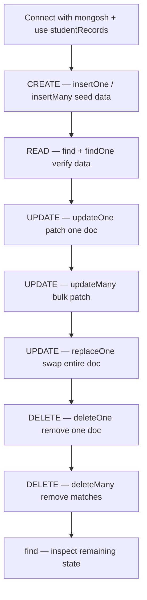

# CRUD Operations in MongoDB

> **One-line summary:** CRUD is how you **Create, Read, Update, and Delete** documents — the four operations every MongoDB interview expects you to explain with method signatures, return values, and One-vs-Many traps.

---

## Table of Contents

1. [Prerequisites](#prerequisites)
2. [Big-Picture Analogy](#big-picture-analogy)
3. [CRUD Methods at a Glance](#crud-methods-at-a-glance)
4. [Sequential Flow (Mental Model)](#sequential-flow-mental-model)
5. [Step-by-Step Commands](#step-by-step-commands)
   - [Step 1: `insertOne(data, options)`](#step-1-insertonedata-options)
   - [Step 2: `insertMany(data, options)`](#step-2-insertmanydata-options)
   - [Step 3: `find(filter, options)`](#step-3-findfilter-options)
   - [Step 4: `findOne(filter, options)`](#step-4-findonefilter-options)
   - [Step 5: `updateOne(filter, data, options)`](#step-5-updateonefilter-data-options)
   - [Step 6: `updateMany(filter, data, options)`](#step-6-updatemanyfilter-data-options)
   - [Step 7: `replaceOne(filter, data, options)`](#step-7-replaceonefilter-data-options)
   - [Step 8: `deleteOne(filter, options)`](#step-8-deleteonefilter-options)
   - [Step 9: `deleteMany(filter, options)`](#step-9-deletemanyfilter-options)
6. [Complete End-to-End Script](#complete-end-to-end-script)
7. [CRUD Return Values — Master Reference](#crud-return-values--master-reference)
8. [One vs Many — Interview Trap Sheet](#one-vs-many--interview-trap-sheet)
9. [Update Operators Quick Reference](#update-operators-quick-reference)
10. [Upsert Behavior](#upsert-behavior)
11. [updateOne vs updateMany vs replaceOne](#updateone-vs-updatemany-vs-replaceone)
12. [SQL vs MongoDB Quick Reference](#sql-vs-mongodb-quick-reference)
13. [Common Interview Questions](#common-interview-questions)
14. [Key Takeaways](#key-takeaways)

---

## Prerequisites

Before running any command below, you need:

1. A running MongoDB instance and the MongoDB Shell (`mongosh`)
2. Basic familiarity with creating a database and collection — see [1. How to create database in MongoDb.md](./1.%20How%20to%20create%20database%20in%20MongoDb.md)
3. For nested updates with `$set` and dot notation — see [2. Embedded Documents i.e Nested documents in mongodb.md](./2.%20Embedded%20Documents%20i.e%20Nested%20documents%20in%20mongodb.md)

**Connect locally:**

```bash
mongosh
```

**Connect to MongoDB Atlas:**

```bash
mongosh "mongodb+srv://your-cluster.mongodb.net/" --username yourUser
```

**Select our working database:**

```javascript
use studentRecords
```

Throughout this note we use:

- **Database:** `studentRecords`
- **Collection:** `students`

---

## Big-Picture Analogy

In Notes #1 and #2, we compared MongoDB to a **university campus** — databases are departments, collections are filing cabinets, documents are student files. This note maps the four CRUD letters to what a **filing clerk** does with those files.

| CRUD Letter | MongoDB Action | Real-World Analogy | Methods |
|---|---|---|---|
| **C** — Create | Insert new documents | File new student records into the cabinet | `insertOne`, `insertMany` |
| **R** — Read | Query documents | Pull file(s) from the cabinet to read | `find`, `findOne` |
| **U** — Update | Modify existing documents | Edit one page, stamp all files, or swap the entire file | `updateOne`, `updateMany`, `replaceOne` |
| **D** — Delete | Remove documents | Shred one file or purge all matching files | `deleteOne`, `deleteMany` |

### Interview one-liners (memorize all four)

| Letter | One-liner |
|---|---|
| **Create** | "`insertOne` files one record; `insertMany` files a batch — both trigger lazy collection/database creation on first write." |
| **Read** | "`find` returns a cursor of all matches; `findOne` returns a single document or `null` — no guaranteed order when multiple match." |
| **Update** | "`updateOne`/`updateMany` patch fields with operators like `$set`; `replaceOne` swaps the entire document body except `_id`." |
| **Delete** | "`deleteOne` removes at most one match; `deleteMany` removes all matches — `{}` on deleteMany wipes the entire collection." |

---

## CRUD Methods at a Glance

| Operation | Method | Signature (syllabus form) | Scope |
|---|---|---|---|
| **Create** | `insertOne(data, options)` | `db.col.insertOne({...}, { writeConcern })` | 1 document |
| **Create** | `insertMany(data, options)` | `db.col.insertMany([{...}, {...}], { ordered })` | Many documents |
| **Read** | `find(filter, options)` | `db.col.find({ filter }, { projection })` | 0 or more (cursor) |
| **Read** | `findOne(filter, options)` | `db.col.findOne({ filter }, { projection }, { options })` | 0 or 1 document |
| **Update** | `updateOne(filter, data, options)` | `db.col.updateOne({ filter }, { $set: {...} }, { upsert })` | At most 1 |
| **Update** | `updateMany(filter, data, options)` | `db.col.updateMany({ filter }, { $set: {...} }, { upsert })` | All matches |
| **Update** | `replaceOne(filter, data, options)` | `db.col.replaceOne({ filter }, { replacement }, { upsert })` | At most 1 |
| **Delete** | `deleteOne(filter, options)` | `db.col.deleteOne({ filter }, { writeConcern })` | At most 1 |
| **Delete** | `deleteMany(filter, options)` | `db.col.deleteMany({ filter }, { writeConcern })` | All matches |

---

## Sequential Flow (Mental Model)

Follow this order every time — each step depends on the previous one:



**Sequential thinking rule:** You cannot **read**, **update**, or **delete** documents you never **created**. Skipping the Create step makes every later command meaningless — just like you cannot pull a file from an empty cabinet.

### Seed data (run this before all steps)

```javascript
use studentRecords

// Clear previous runs (optional)
db.students.drop()

db.students.insertMany([
  { name: "Rahul", rollNo: 101, branch: "CSE", cgpa: 8.5, status: "active" },
  { name: "Priya", rollNo: 102, branch: "ECE", cgpa: 9.1, status: "active" },
  { name: "Amit",  rollNo: 103, branch: "CSE", cgpa: 7.8, status: "inactive" }
])
```

---

## Step-by-Step Commands

---

### Step 1: `insertOne(data, options)`

#### What it does

Inserts a **single document** into a collection. On the first write to a new collection/database, MongoDB also performs **lazy creation** (see Note #1).

#### Analogy

Like filing **one new student record** into the cabinet — the clerk creates the cabinet and registers the department the moment the first file lands inside.

#### Code — generic syllabus form

```javascript
db.collection_Name_You_Want_To_Create.insertOne(
  { key: "Value", number: 12 },
  { writeConcern: { w: "majority" } }   // options — optional
)
```

#### Code — concrete example

```javascript
db.students.insertOne({ name: "Sneha", rollNo: 104, branch: "CSE", cgpa: 8.9, status: "active" })
```

#### Expected output

```javascript
{
  acknowledged: true,
  insertedId: ObjectId('674a1b2c3d4e5f6789012345')
}
```

| Field | Meaning |
|---|---|
| `acknowledged` | Write succeeded (write concern was met) |
| `insertedId` | The `_id` of the newly inserted document |

#### What MongoDB stored

```javascript
{
  _id: ObjectId('674a1b2c3d4e5f6789012345'),
  name: "Sneha",
  rollNo: 104,
  branch: "CSE",
  cgpa: 8.9,
  status: "active"
}
```

#### Options — `writeConcern`

| Option | Type | Purpose |
|---|---|---|
| `writeConcern` | document | Controls durability — e.g. `{ w: "majority" }` waits for replica-set majority acknowledgment |

Omit options to use the server default write concern.

#### Interview tip

> **Q:** "What does `insertOne` return and why does it matter?"
>
> **A:** `{ acknowledged: true, insertedId: ObjectId('...') }`. In application code (Node.js, Python), you use `insertedId` to reference, update, or link to the new document without running another query.

> **Q:** "Does `insertOne` create the database and collection?"
>
> **A:** Yes — on the first write. See Note #1 for the lazy creation deep dive.

---

### Step 2: `insertMany(data, options)`

#### What it does

Inserts **multiple documents** in a single operation. Accepts an array of documents and optional `ordered` flag.

#### Analogy

Like the clerk filing a **stack of student records at once** instead of walking to the cabinet one file at a time. If one file has a duplicate roll number (`_id` conflict), behavior depends on whether the clerk stops at the first error or keeps going.

#### Code — generic syllabus form

```javascript
db.collection_Name_You_Want_To_Create.insertMany(
  [
    { key: "Value1", number: 1 },
    { key: "Value2", number: 2 }
  ],
  { ordered: true, writeConcern: { w: "majority" } }
)
```

#### Code — concrete example

```javascript
db.students.insertMany([
  { name: "Kavya", rollNo: 105, branch: "ME",  cgpa: 8.0, status: "active" },
  { name: "Rohan", rollNo: 106, branch: "CSE", cgpa: 7.5, status: "active" }
])
```

#### Expected output

```javascript
{
  acknowledged: true,
  insertedIds: {
    '0': ObjectId('674a1b2c3d4e5f6789012346'),
    '1': ObjectId('674a1b2c3d4e5f6789012347')
  }
}
```

| Field | Meaning |
|---|---|
| `insertedIds` | Map of array index → generated `_id` for each inserted document |

#### Options — `ordered` (interview favorite)

| `ordered` value | Behavior on error |
|---|---|
| `true` (default) | **Stops** at first failed insert; documents before the error are still inserted |
| `false` | **Continues** inserting remaining valid documents after an error |

```javascript
// ordered: false — insert as many as possible even if one fails
db.students.insertMany(
  [
    { name: "Valid1", rollNo: 107, branch: "CSE" },
    { _id: "DUPLICATE", name: "Bad", rollNo: 108 },   // assume _id already exists
    { name: "Valid2", rollNo: 109, branch: "ECE" }
  ],
  { ordered: false }
)
// Valid1 and Valid2 are inserted; Bad is skipped
```

#### Interview tip

> **Q:** "When should you use `insertOne` vs `insertMany`?"
>
> **A:** Use `insertOne` for a single record or when you need the `insertedId` immediately for one doc. Use `insertMany` for batch seeding, migrations, or bulk imports — it is more efficient because MongoDB consolidates the operation in the oplog.

> **Q:** "What does `ordered: false` do?"
>
> **A:** It tells MongoDB to continue inserting remaining documents even if one insert fails (e.g., duplicate `_id`). With `ordered: true` (default), it stops at the first error.

---

### Step 3: `find(filter, options)`

#### What it does

Retrieves **zero or more documents** matching the filter. Returns a **cursor** — not a plain array. In `mongosh`, the cursor auto-iterates and prints results.

#### Analogy

Like asking the clerk: "Give me **all** CSE student files from the cabinet." You get a stack (cursor) you can sort, limit, or page through.

#### Code — generic syllabus form

```javascript
// All documents
db.collection_Name_You_Want_To_Create.find()

// With filter
db.collection_Name_You_Want_To_Create.find({ key: "value_you_want_to_find" })

// With projection (only return selected fields)
db.collection_Name_You_Want_To_Create.find(
  { key: "value_you_want_to_find" },
  { key: 1, number: 1, _id: 0 }
)
```

#### Code — concrete examples

```javascript
// All students
db.students.find().pretty()

// Filter by branch
db.students.find({ branch: "CSE" }).pretty()

// Filter + projection (name and cgpa only, hide _id)
db.students.find(
  { branch: "CSE" },
  { name: 1, cgpa: 1, _id: 0 }
).pretty()

// Cursor chaining — sort, skip, limit (pagination)
db.students.find({ status: "active" })
  .sort({ cgpa: -1 })    // highest CGPA first
  .skip(0)
  .limit(2)
  .pretty()
```

#### Expected output (filter: `{ branch: "CSE" }`)

```javascript
[
  { _id: ObjectId('...'), name: 'Rahul', rollNo: 101, branch: 'CSE', cgpa: 8.5, status: 'active' },
  { _id: ObjectId('...'), name: 'Amit',  rollNo: 103, branch: 'CSE', cgpa: 7.8, status: 'inactive' }
]
```

#### How to read the parameters

| Part | Role |
|---|---|
| First argument `{ filter }` | **Which documents** to match — `{}` matches all |
| Second argument `{ projection }` | **Which fields** to return — `1` include, `0` exclude |
| `.sort()`, `.limit()`, `.skip()` | **Cursor methods** chained after `find()` |

#### Empty filter `{}`

```javascript
db.students.find({})   // equivalent to find() — returns ALL documents
```

#### Cross-link

For nested field queries, array matching, and dot notation, see Note #2.

#### Interview tip

> **Q:** "What is the difference between `find()` and SQL `SELECT *`?"
>
> **A:** Conceptually similar — both query with a filter (WHERE clause). But `find()` returns a **cursor** (lazy, iterable, chainable with sort/limit/skip), not a result set array. In application drivers, you iterate the cursor or convert it to an array.

> **Q:** "What is a projection?"
>
> **A:** The second argument to `find()` that selects which fields to include or exclude. `{ name: 1, cgpa: 1, _id: 0 }` returns only `name` and `cgpa`, hiding the default `_id`.

---

### Step 4: `findOne(filter, options)`

#### What it does

Returns **a single document** matching the filter, or `null` if none match.

#### Analogy

Like asking the clerk: "Give me **one** file for roll number 101." You get exactly one folder — not a stack.

#### Code — generic syllabus form

```javascript
db.collection_Name_You_Want_To_Create.findOne({ key: "value_you_want_to_find" })

// With projection and options (3-parameter form)
db.collection_Name_You_Want_To_Create.findOne(
  { key: "value_you_want_to_find" },
  { key: 1, _id: 0 },
  { sort: { number: -1 } }
)
```

#### Code — concrete example

```javascript
db.students.findOne({ rollNo: 101 })
```

#### Expected output

```javascript
{
  _id: ObjectId('...'),
  name: 'Rahul',
  rollNo: 101,
  branch: 'CSE',
  cgpa: 8.5,
  status: 'active'
}
```

#### No match → returns `null`

```javascript
db.students.findOne({ rollNo: 999 })
// null
```

#### `findOne()` vs `find()` — comparison

| Method | Returns | Multiple matches | Use when |
|---|---|---|---|
| `findOne({ filter })` | Document object or `null` | Returns **one arbitrary** match | You need exactly one record |
| `find({ filter })` | Cursor (0 or more) | Returns **all** matches | You need every matching record |
| `find({ filter }).limit(1)` | Cursor with at most 1 doc | Same as findOne but cursor type | When you need cursor chaining |

#### No guaranteed order

If multiple documents match, `findOne` returns **one of them** in **undefined order**:

```javascript
// Rahul (101) and Amit (103) both have branch "CSE"
db.students.findOne({ branch: "CSE" })
// Returns ONE document — could be Rahul or Amit
```

To get a predictable result, use the `sort` option:

```javascript
db.students.findOne(
  { branch: "CSE" },
  null,
  { sort: { rollNo: 1 } }   // lowest rollNo first
)
```

#### Interview tip

> **Q:** "If the collection contains multiple documents with the same filter value, what does `findOne` return?"
>
> **A:** It returns **one** matching document. MongoDB does not guarantee which one — there is no stable natural order. To get a predictable result, use `sort` in the options or filter on a unique field like `rollNo` or `_id`.

---

### Step 5: `updateOne(filter, data, options)`

#### What it does

Finds documents matching the filter and updates **at most one** of them using **update operators** (`$set`, `$inc`, `$unset`, etc.).

#### Analogy

Like opening **one** student file, finding it by roll number, and editing specific fields — without replacing the entire file.

#### Code — generic syllabus form

```javascript
db.collection_Name_You_Want_To_Create.updateOne(
  { key: "value_you_want_to_find" },          // filter
  { $set: { newKey: "newValue" } },             // update operators (NOT a plain doc)
  { upsert: false }                              // options
)
```

#### Code — concrete example

```javascript
db.students.updateOne(
  { rollNo: 103 },
  { $set: { status: "active", cgpa: 8.0 } }
)
```

#### Expected output

```javascript
{
  acknowledged: true,
  insertedId: null,
  matchedCount: 1,
  modifiedCount: 1,
  upsertedCount: 0
}
```

| Field | Meaning |
|---|---|
| `matchedCount` | Documents that matched the filter |
| `modifiedCount` | Documents actually changed (0 if new values equal old values) |
| `upsertedCount` | New documents created via upsert (0 here) |

#### Critical rule — must use update operators

```javascript
// WRONG — passing a plain document without operators causes an error
db.students.updateOne({ rollNo: 101 }, { status: "graduated" })
// Error: Update document requires atomic operators

// CORRECT
db.students.updateOne({ rollNo: 101 }, { $set: { status: "graduated" } })
```

Use `replaceOne` if you want to pass a plain replacement document (see Step 7).

#### Options — `upsert`

```javascript
db.students.updateOne(
  { rollNo: 999 },                              // no match exists
  { $set: { name: "NewStudent", branch: "CSE", status: "active" } },
  { upsert: true }
)
// Creates a new document combining filter fields + $set fields
```

#### Cross-link

For nested `$set` with dot notation vs whole-object replacement, see Note #2.

#### Interview tip

> **Q:** "What if your filter matches 5 documents?"
>
> **A:** `updateOne` modifies **at most one**. Use `updateMany` if you need all 5 updated.

> **Q:** "Why can't I pass `{ status: 'active' }` directly as the update argument?"
>
> **A:** MongoDB requires **update operators** (`$set`, `$inc`, etc.) to prevent accidental full-document overwrites. Plain documents are for `replaceOne`, not `updateOne`.

---

### Step 6: `updateMany(filter, data, options)`

#### What it does

Updates **all documents** matching the filter. Same operator syntax as `updateOne`, but scope is every match.

#### Analogy

Like the admin stamping **"Graduated 2025"** on **every** student file that matches a criteria — or on **all** files if no criteria is given.

#### Code — generic syllabus form

```javascript
db.collection_Name_You_Want_To_Create.updateMany(
  { key: "value_you_want_to_find" },
  { $set: { newKey: "newValue" } },
  { upsert: false }
)
```

#### Code — concrete example

```javascript
// Update all CSE students
db.students.updateMany(
  { branch: "CSE" },
  { $set: { department: "Computer Science" } }
)
```

#### Expected output

```javascript
{
  acknowledged: true,
  insertedId: null,
  matchedCount: 2,
  modifiedCount: 2,
  upsertedCount: 0
}
```

#### Empty filter `{}` — updates ALL documents

```javascript
db.students.updateMany(
  {},
  { $set: { verified: true } }
)
// Every document in the collection gets verified: true
```

#### `updateOne({}, ...)` vs `updateMany({}, ...)` — the trap

| Method | Empty filter `{}` | Documents modified |
|---|---|---|
| `updateOne({}, { $set: {...} })` | Matches all, updates **only 1** | 1 |
| `updateMany({}, { $set: {...} })` | Matches all, updates **every** doc | All |

#### Interview tip

> **Q:** "What is the difference between `updateOne` and `updateMany`?"
>
> **A:** Same syntax, different scope. `updateOne` modifies at most **one** matching document. `updateMany` modifies **all** matching documents. Both require update operators like `$set`.

---

### Step 7: `replaceOne(filter, data, options)`

#### What it does

Finds **at most one** matching document and **replaces its entire body** with a new document. The `_id` is preserved unless you explicitly change it in both filter and replacement.

#### Analogy

Like pulling a student file from the cabinet and **swapping it with a brand-new file** — the roll number sticker (`_id`) stays, but every page inside is replaced.

#### Code — generic syllabus form

```javascript
db.collection_Name_You_Want_To_Create.replaceOne(
  { key: "value_you_want_to_find" },
  { key: "newValue", number: 99 },    // plain replacement doc — NO $set
  { upsert: false }
)
```

#### Code — concrete example

```javascript
db.students.replaceOne(
  { rollNo: 102 },
  { name: "Priya Sharma", rollNo: 102, branch: "ECE", cgpa: 9.5, status: "graduated" }
)
```

#### Expected output

```javascript
{
  acknowledged: true,
  matchedCount: 1,
  modifiedCount: 1,
  upsertedCount: 0
}
```

#### Before vs After — fields NOT in replacement are **removed**

**Before:**

```javascript
{
  _id: ObjectId('...'),
  name: "Priya",
  rollNo: 102,
  branch: "ECE",
  cgpa: 9.1,
  status: "active"
}
```

**After `replaceOne`:**

```javascript
{
  _id: ObjectId('...'),          // _id preserved
  name: "Priya Sharma",
  rollNo: 102,
  branch: "ECE",
  cgpa: 9.5,
  status: "graduated"
  // old fields not in replacement doc are GONE
}
```

#### `updateOne` vs `replaceOne` — side by side

| | `updateOne` | `replaceOne` |
|---|---|---|
| Second argument | Update operators (`$set`, `$inc`) | Plain replacement document |
| Unaffected fields | **Kept** | **Removed** if not in replacement |
| Scope | 1 document | 1 document |
| Use when | Patching specific fields | Full document swap |

#### Interview tip

> **Q:** "What is the difference between `updateOne` and `replaceOne`?"
>
> **A:** `updateOne` patches specific fields using operators like `$set` — other fields remain untouched. `replaceOne` swaps the **entire document body** (except `_id`) with a new document — any field not in the replacement is deleted.

---

### Step 8: `deleteOne(filter, options)`

#### What it does

Removes **at most one** document matching the filter.

#### Analogy

Like shredding **one** student file from the cabinet — the clerk finds the first match and removes it.

#### Code — generic syllabus form

```javascript
db.collection_Name_You_Want_To_Create.deleteOne(
  { key: "value_you_want_to_find" },
  { writeConcern: { w: "majority" } }
)
```

#### Code — concrete example

```javascript
db.students.deleteOne({ rollNo: 103 })
```

#### Expected output

```javascript
{ acknowledged: true, deletedCount: 1 }
```

| Field | Meaning |
|---|---|
| `deletedCount` | Number of documents removed (0 or 1) |

#### No match

```javascript
db.students.deleteOne({ rollNo: 999 })
// { acknowledged: true, deletedCount: 0 }
```

#### Empty filter `{}` — deletes first arbitrary document

```javascript
db.students.deleteOne({})
// Deletes ONE document — you cannot control which one
// Always filter on a unique field like _id or rollNo
```

#### Interview tip

> **Q:** "How do you safely delete exactly one document?"
>
> **A:** Filter on a **unique** field — `_id`, `rollNo`, or any field with a unique index. Never rely on `deleteOne({})` in production; it removes an arbitrary first document.

---

### Step 9: `deleteMany(filter, options)`

#### What it does

Removes **all documents** matching the filter.

#### Analogy

Like shredding **every** student file that matches a criteria — or **every file in the cabinet** if no criteria is given.

#### Code — generic syllabus form

```javascript
db.collection_Name_You_Want_To_Create.deleteMany(
  { key: "value_you_want_to_find" },
  { writeConcern: { w: "majority" } }
)
```

#### Code — concrete example

```javascript
// Delete all inactive students
db.students.deleteMany({ status: "inactive" })
```

#### Expected output

```javascript
{ acknowledged: true, deletedCount: 1 }
```

#### Empty filter `{}` — **wipes the entire collection**

```javascript
db.students.deleteMany({})
// Deletes EVERY document in the collection — collection shell remains, all data gone
```

#### `deleteOne({})` vs `deleteMany({})` — the trap

| Method | Empty filter `{}` | Result |
|---|---|---|
| `deleteOne({})` | Deletes **1** arbitrary document | Collection still has data |
| `deleteMany({})` | Deletes **all** documents | Collection is empty |

#### Interview tip

> **Q:** "What happens if you run `deleteMany({})`?"
>
> **A:** It deletes **every document** in the collection. The collection itself still exists (as an empty shell), but all data is gone. This is equivalent to `TRUNCATE TABLE` in SQL — use with extreme caution.

> **Q:** "Does `deleteMany` drop the collection?"
>
> **A:** No. It removes all **documents** but keeps the collection metadata. To remove the collection entirely, use `db.students.drop()`.

---

## Complete End-to-End Script

Copy-paste this entire block into `mongosh` to run all CRUD operations in sequence:

```javascript
// ── SETUP ─────────────────────────────────────────────────────
use studentRecords
db.students.drop()

// ── CREATE: insertMany seed ───────────────────────────────────
db.students.insertMany([
  { name: "Rahul", rollNo: 101, branch: "CSE", cgpa: 8.5, status: "active" },
  { name: "Priya", rollNo: 102, branch: "ECE", cgpa: 9.1, status: "active" },
  { name: "Amit",  rollNo: 103, branch: "CSE", cgpa: 7.8, status: "inactive" }
])

// ── CREATE: insertOne single doc ──────────────────────────────
db.students.insertOne({ name: "Sneha", rollNo: 104, branch: "CSE", cgpa: 8.9, status: "active" })

// ── READ: find all + filtered + projection ────────────────────
db.students.find().pretty()
db.students.find({ branch: "CSE" }).pretty()
db.students.find({ branch: "CSE" }, { name: 1, cgpa: 1, _id: 0 }).pretty()

// ── READ: findOne ─────────────────────────────────────────────
db.students.findOne({ rollNo: 101 })

// ── UPDATE: updateOne — patch one doc ─────────────────────────
db.students.updateOne(
  { rollNo: 103 },
  { $set: { status: "active", cgpa: 8.0 } }
)

// ── UPDATE: updateMany — bulk patch CSE students ──────────────
db.students.updateMany(
  { branch: "CSE" },
  { $set: { department: "Computer Science" } }
)

// ── UPDATE: replaceOne — swap entire document ─────────────────
db.students.replaceOne(
  { rollNo: 102 },
  { name: "Priya Sharma", rollNo: 102, branch: "ECE", cgpa: 9.5, status: "graduated" }
)

// ── DELETE: deleteOne ─────────────────────────────────────────
db.students.deleteOne({ rollNo: 104 })

// ── DELETE: deleteMany ────────────────────────────────────────
db.students.deleteMany({ status: "inactive" })

// ── FINAL READ: inspect remaining state ───────────────────────
db.students.find().pretty()
```

---

## CRUD Return Values — Master Reference

| Method | Return shape | Key fields |
|---|---|---|
| `insertOne` | `{ acknowledged, insertedId }` | `insertedId` — `_id` of new doc |
| `insertMany` | `{ acknowledged, insertedIds }` | `insertedIds` — map of index → `_id` |
| `find` | **Cursor** (not a result object) | Iterate with `.forEach()`, `.toArray()`, or `.pretty()` |
| `findOne` | **Document** or `null` | Returns the doc directly, not wrapped |
| `updateOne` | `{ acknowledged, matchedCount, modifiedCount, upsertedCount, upsertedId }` | `matchedCount` vs `modifiedCount` |
| `updateMany` | Same as updateOne | `matchedCount` can be > 1 |
| `replaceOne` | `{ acknowledged, matchedCount, modifiedCount, upsertedCount, upsertedId }` | Same shape as updateOne |
| `deleteOne` | `{ acknowledged, deletedCount }` | `deletedCount` is 0 or 1 |
| `deleteMany` | `{ acknowledged, deletedCount }` | `deletedCount` is 0 to N |

### `matchedCount` vs `modifiedCount` (update methods)

| Scenario | `matchedCount` | `modifiedCount` |
|---|---|---|
| Filter matches, value actually changes | 1+ | 1+ |
| Filter matches, new value equals old value | 1+ | **0** |
| No documents match | **0** | **0** |
| Upsert creates new doc | **0** | **0** (check `upsertedCount` instead) |

---

## One vs Many — Interview Trap Sheet

| Operation | One method | Many method | Empty `{}` filter behavior |
|---|---|---|---|
| **Read** | `findOne` → 1 doc or null | `find` → cursor of all docs | Returns all documents |
| **Update** | `updateOne` → modifies 1 doc | `updateMany` → modifies all matches | 1 doc vs **all** docs |
| **Delete** | `deleteOne` → removes 1 doc | `deleteMany` → removes all matches | 1 doc vs **wipe collection** |
| **Create** | `insertOne` → 1 doc | `insertMany` → array of docs | N/A (no filter) |

**Memorize this:** The empty filter `{}` is safe for **read** (returns all) but **dangerous** for update/delete Many methods.

---

## Update Operators Quick Reference

Updates with `updateOne` and `updateMany` **must** use these operators:

| Operator | Purpose | Example |
|---|---|---|
| `$set` | Add or replace a field | `{ $set: { status: "graduated" } }` |
| `$inc` | Increment a numeric field | `{ $inc: { cgpa: 0.5 } }` |
| `$unset` | Remove a field | `{ $unset: { tempField: "" } }` |
| `$push` | Append to an array | `{ $push: { skills: "React" } }` |
| `$pull` | Remove from an array | `{ $pull: { skills: "Java" } }` |

```javascript
// Combine multiple operators in one update
db.students.updateOne(
  { rollNo: 101 },
  {
    $set: { status: "graduated" },
    $inc: { cgpa: 0.2 },
    $unset: { tempNote: "" }
  }
)
```

For nested field updates with dot notation, see Note #2.

---

## Upsert Behavior

**Upsert** = **Up**date + in**sert**. If no document matches the filter, MongoDB **creates** a new one instead of doing nothing.

Supported on: `updateOne`, `updateMany`, `replaceOne`.

| Method | Upsert creates doc from... |
|---|---|
| `updateOne` / `updateMany` | Filter fields + update operator fields (`$set`, etc.) |
| `replaceOne` | The replacement document |

```javascript
// updateOne with upsert — student doesn't exist yet
db.students.updateOne(
  { rollNo: 200 },
  { $set: { name: "Arjun", branch: "CSE", status: "active" } },
  { upsert: true }
)
// Return: { matchedCount: 0, modifiedCount: 0, upsertedCount: 1, upsertedId: ObjectId('...') }

// replaceOne with upsert
db.students.replaceOne(
  { rollNo: 201 },
  { name: "Divya", rollNo: 201, branch: "ECE", status: "active" },
  { upsert: true }
)
```

**Interview tip:** Always put a **unique** field in the filter when using upsert — otherwise you may create duplicate logical records.

---

## updateOne vs updateMany vs replaceOne

| Method | Documents modified | Second argument | Unaffected fields |
|---|---|---|---|
| `updateOne` | At most **1** | Update operators (`$set`, `$inc`, ...) | **Kept** |
| `updateMany` | **All** matches | Update operators | **Kept** |
| `replaceOne` | At most **1** | Plain replacement document | **Removed** |

**Visual:**

```
Original:  { name: "Rahul", rollNo: 101, branch: "CSE", cgpa: 8.5, status: "active" }

updateOne({ rollNo: 101 }, { $set: { status: "graduated" } })
Result:    { name: "Rahul", rollNo: 101, branch: "CSE", cgpa: 8.5, status: "graduated" }
           ↑ only status changed

replaceOne({ rollNo: 101 }, { name: "Rahul", rollNo: 101, status: "graduated" })
Result:    { name: "Rahul", rollNo: 101, status: "graduated" }
           ↑ branch and cgpa are GONE
```

---

## SQL vs MongoDB Quick Reference

For students coming from MySQL, PostgreSQL, or Oracle labs:

| Task | SQL | MongoDB (`mongosh`) |
|---|---|---|
| Insert one row | `INSERT INTO t VALUES (...);` | `db.col.insertOne({...})` |
| Insert many rows | `INSERT INTO t VALUES (...), (...);` | `db.col.insertMany([{...}, {...}])` |
| Select all rows | `SELECT * FROM t;` | `db.col.find()` |
| Select with condition | `SELECT * FROM t WHERE col = 'val';` | `db.col.find({ col: "val" })` |
| Select one row | `SELECT * FROM t WHERE ... LIMIT 1;` | `db.col.findOne({...})` |
| Select specific columns | `SELECT name, cgpa FROM t;` | `db.col.find({}, { name: 1, cgpa: 1, _id: 0 })` |
| Update one row | `UPDATE t SET col = val WHERE ... LIMIT 1;` | `db.col.updateOne({...}, { $set: { col: val } })` |
| Update all rows | `UPDATE t SET col = val;` | `db.col.updateMany({}, { $set: { col: val } })` |
| Replace entire row | Manual DELETE + INSERT | `db.col.replaceOne({...}, {...})` |
| Delete one row | `DELETE FROM t WHERE ... LIMIT 1;` | `db.col.deleteOne({...})` |
| Delete all matching rows | `DELETE FROM t WHERE ...;` | `db.col.deleteMany({...})` |
| Truncate table | `TRUNCATE TABLE t;` | `db.col.deleteMany({})` |
| Drop table | `DROP TABLE t;` | `db.col.drop()` |
| Primary key | `id INT PRIMARY KEY` | `_id` (ObjectId, auto-generated) |

---

## Common Interview Questions

### Q1. What are the four CRUD operations in MongoDB and their methods?

| Operation | Methods |
|---|---|
| **Create** | `insertOne`, `insertMany` |
| **Read** | `find`, `findOne` |
| **Update** | `updateOne`, `updateMany`, `replaceOne` |
| **Delete** | `deleteOne`, `deleteMany` |

---

### Q2. What is the difference between `insertOne` and `insertMany`?

`insertOne` inserts a single document and returns `insertedId`. `insertMany` inserts an array of documents in one operation and returns `insertedIds` (a map). Use `insertMany` for batch seeding; use `insertOne` when you need one record and its ID immediately. The `ordered` option (default `true`) controls whether MongoDB stops or continues on insert errors.

---

### Q3. What is the difference between `find` and `findOne`?

`find` returns a **cursor** of zero or more matching documents — chainable with `.sort()`, `.limit()`, `.skip()`. `findOne` returns a **single document object** or `null`. When multiple documents match, `findOne` returns one in undefined order unless you specify `sort`.

---

### Q4. What is the difference between `updateOne`, `updateMany`, and `replaceOne`?

| Method | Scope | Update style |
|---|---|---|
| `updateOne` | 1 document | Operators (`$set`, `$inc`) — patches fields |
| `updateMany` | All matches | Operators — patches fields on every match |
| `replaceOne` | 1 document | Plain document — replaces entire body except `_id` |

---

### Q5. Why must updates use operators like `$set` instead of a plain document?

MongoDB requires atomic update operators to prevent accidental full-document overwrites. Passing `{ status: "active" }` directly to `updateOne` throws an error. Use `$set` for field patches or `replaceOne` for full document swaps.

---

### Q6. What is `upsert` and which methods support it?

Upsert means "update if matched, insert if not." Supported on `updateOne`, `updateMany`, and `replaceOne` via `{ upsert: true }`. When no document matches, a new one is created from the filter + update/replacement fields.

---

### Q7. What do `matchedCount` and `modifiedCount` mean?

- `matchedCount` — how many documents matched the filter
- `modifiedCount` — how many were actually changed (can be 0 if the new value equals the old value)

They differ when the filter matches but the data is already in the desired state.

---

### Q8. What happens with `deleteMany({})` vs `deleteOne({})`?

- `deleteOne({})` — removes **one** arbitrary document; collection still has data
- `deleteMany({})` — removes **all** documents; collection becomes empty (like SQL `TRUNCATE`)

Both are dangerous in production without a specific filter.

---

### Q9. What does each CRUD method return?

| Method | Returns |
|---|---|
| `insertOne` | `{ acknowledged, insertedId }` |
| `insertMany` | `{ acknowledged, insertedIds }` |
| `find` | Cursor |
| `findOne` | Document or `null` |
| `updateOne` / `updateMany` / `replaceOne` | `{ acknowledged, matchedCount, modifiedCount, upsertedCount, upsertedId }` |
| `deleteOne` / `deleteMany` | `{ acknowledged, deletedCount }` |

---

### Q10. How does MongoDB CRUD relate to lazy collection/database creation?

The first **write** operation (`insertOne`, `insertMany`, or `createIndex`) to a new collection automatically creates both the collection and its parent database. Read, update, and delete operations do **not** create databases or collections. See Note #1 for the full lazy creation explanation.

---

## Key Takeaways

1. **CRUD maps to 9 methods:** Create (`insertOne`, `insertMany`), Read (`find`, `findOne`), Update (`updateOne`, `updateMany`, `replaceOne`), Delete (`deleteOne`, `deleteMany`).

2. **One vs Many is the #1 trap.** `updateOne` and `deleteOne` affect at most **one** document; `updateMany` and `deleteMany` affect **all** matches. Empty `{}` makes this difference critical.

3. **`replaceOne` is not `updateOne`.** Updates patch fields with operators; replace swaps the entire document body and drops fields not in the replacement.

4. **Updates require operators.** Use `$set`, `$inc`, `$unset` with `updateOne`/`updateMany`. Plain documents go with `replaceOne`.

5. **`find` returns a cursor; `findOne` returns a document.** No guaranteed order on `findOne` when multiple match — use `sort` or filter on unique fields.

6. **Know your return values.** `insertedId` for creates, `matchedCount`/`modifiedCount` for updates, `deletedCount` for deletes.

7. **Empty filter `{}` is dangerous on delete/update Many.** `deleteMany({})` wipes the collection; `updateMany({}, ...)` updates every document.

8. **Reading order for this digest:** Note #1 (setup) → Note #2 (nested docs) → Note #3 (CRUD reference). Each builds on the previous.

---

## Sources

- [MongoDB Manual — Perform CRUD Operations (mongosh)](https://www.mongodb.com/docs/mongodb-shell/crud/)
- [MongoDB Manual — `db.collection.insertOne()`](https://www.mongodb.com/docs/manual/reference/method/db.collection.insertone/)
- [MongoDB Manual — `db.collection.insertMany()`](https://www.mongodb.com/docs/manual/reference/method/db.collection.insertmany/)
- [MongoDB Manual — `db.collection.find()`](https://www.mongodb.com/docs/manual/reference/method/db.collection.find/)
- [MongoDB Manual — `db.collection.findOne()`](https://www.mongodb.com/docs/manual/reference/method/db.collection.findone/)
- [MongoDB Manual — `db.collection.updateOne()`](https://www.mongodb.com/docs/manual/reference/method/db.collection.updateone/)
- [MongoDB Manual — `db.collection.updateMany()`](https://www.mongodb.com/docs/manual/reference/method/db.collection.updatemany/)
- [MongoDB Manual — `db.collection.replaceOne()`](https://www.mongodb.com/docs/manual/reference/method/db.collection.replaceone/)
- [MongoDB Manual — `db.collection.deleteOne()`](https://www.mongodb.com/docs/manual/reference/method/db.collection.deleteone/)
- [MongoDB Manual — `db.collection.deleteMany()`](https://www.mongodb.com/docs/manual/reference/method/db.collection.deletemany/)
- [MongoDB Manual — Update Operators](https://www.mongodb.com/docs/manual/reference/operator/update/)
