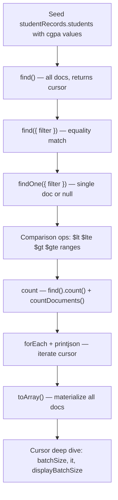
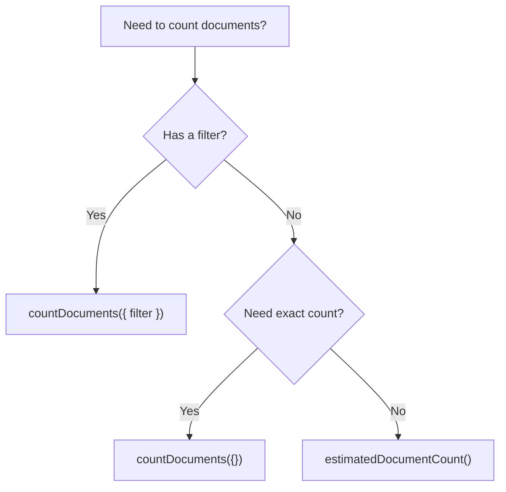

# find() vs findOne() in MongoDB

> **One-line summary:** `find()` returns a **cursor** of zero or more matching documents fetched in batches; `findOne()` returns **one document or `null`** — this note teaches cursors, comparison operators, counting, and iteration for MongoDB read operations in interviews.

---

## Table of Contents

1. [Prerequisites](#prerequisites)
2. [Big-Picture Analogy](#big-picture-analogy)
3. [find() vs findOne() — Master Comparison](#find-vs-findone--master-comparison)
4. [Sequential Flow (Mental Model)](#sequential-flow-mental-model)
5. [Step-by-Step Commands](#step-by-step-commands)
   - [Step 1: `find()` — all documents](#step-1-find--all-documents)
   - [Step 2: Cursor and batching](#step-2-cursor-and-batching)
   - [Step 3: `find({ queryKey: 'queryValue' })`](#step-3-find-querykey-queryvalue-)
   - [Step 4: `findOne({ queryKey: 'queryValue' })`](#step-4-findone-querykey-queryvalue-)
   - [Step 5: `find().count()` and counting](#step-5-findcount-and-counting)
   - [Step 6: `forEach()` with `printjson()`](#step-6-foreach-with-printjson)
   - [Step 7: `$lt` — less than](#step-7-lt--less-than)
   - [Step 8: `$lte` — less than or equal](#step-8-lte--less-than-or-equal)
   - [Step 9: `$gt` — greater than](#step-9-gt--greater-than)
   - [Step 10: `$gte` — greater than or equal](#step-10-gte--greater-than-or-equal)
   - [Step 11: Range queries — open vs closed intervals](#step-11-range-queries--open-vs-closed-intervals)
   - [Step 12: `find().toArray()`](#step-12-findtoarray)
6. [Cursor Deep Dive](#cursor-deep-dive)
7. [Comparison Operators — Reference Table](#comparison-operators--reference-table)
8. [Complete End-to-End Script](#complete-end-to-end-script)
9. [find vs findOne vs find().limit(1) — Interview Trap Sheet](#find-vs-findone-vs-findlimit1--interview-trap-sheet)
10. [count() vs countDocuments() — Modern vs Syllabus](#count-vs-countdocuments--modern-vs-syllabus)
11. [SQL vs MongoDB Quick Reference](#sql-vs-mongodb-quick-reference)
12. [Common Interview Questions](#common-interview-questions)
13. [Key Takeaways](#key-takeaways)

---

## Prerequisites

Before running any command below, you need:

1. A running MongoDB instance and the MongoDB Shell (`mongosh`)
2. Basic familiarity with creating a database and collection — see [1. How to create database in MongoDb.md](./1.%20How%20to%20create%20database%20in%20MongoDb.md)
3. For nested field queries and array matching — see [2. Embedded Documents i.e Nested documents in mongodb.md](./2.%20Embedded%20Documents%20i.e%20Nested%20documents%20in%20mongodb.md)
4. For the full CRUD overview (Create, Update, Delete) — see [3. CRUD operations in MongoDb.md](./3.%20CRUD%20operations%20in%20MongoDb.md)

**Note #3 introduces `find` and `findOne` at a CRUD level.** This note (#4) goes **deeper** on read mechanics: cursors, batching, comparison operators, counting, and iteration.

**Connect locally:**

```bash
mongosh
```

**Connect to MongoDB Atlas:**

```bash
mongosh "mongodb+srv://your-cluster.mongodb.net/" --username yourUser
```

**Select our working database:**

```javascript
use studentRecords
```

Throughout this note we use:

- **Database:** `studentRecords`
- **Collection:** `students`

---

## Big-Picture Analogy

In Notes #1–#3, we compared MongoDB to a **university campus** — databases are departments, collections are filing cabinets, documents are student files. This note focuses on what happens when you ask the **filing clerk to read files back to you**.

| MongoDB Concept | Real-World Analogy | SQL Equivalent |
|---|---|---|
| `find()` | Clerk slides **every matching file** across the counter — in **stacks** (batches), not all at once | `SELECT * FROM t WHERE ...` |
| Cursor | A **bookmark + conveyor belt** pointing to the next batch of files | Result set iterator |
| `findOne()` | Clerk hands you **exactly one folder** — whichever they reach first unless you specify sort | `SELECT * FROM t WHERE ... LIMIT 1` |
| `find({ branch: "CSE" })` | "Give me all CSE student files" | `WHERE branch = 'CSE'` |
| `$lt`, `$gt`, etc. | "Give me files where CGPA is below / above a cutoff" | `WHERE cgpa < 8.0` |
| `.count()` | "How many files match?" — clerk counts without handing them over | `SELECT COUNT(*) FROM t WHERE ...` |
| `.forEach(printjson)` | Clerk reads each file aloud, one by one, in readable JSON format | Row-by-row fetch loop |
| `.toArray()` | Clerk photocopies **all** matching files into one bundle before handing them to you | Fetch entire result set into memory |

### Interview one-liners (memorize these)

| Topic | One-liner |
|---|---|
| **`find()`** | "`find()` returns a **cursor**, not an array — documents are fetched in batches as you iterate." |
| **`findOne()`** | "`findOne()` returns a **single document or `null`** — when multiple match, order is **not guaranteed**." |
| **Cursor batching** | "**20** is mongosh's **display** default; the server's network batch default is **101 docs or 16 MiB**." |
| **Comparison ops** | "`$lt`/`$gt` are strict (exclude boundary); `$lte`/`$gte` include the boundary value." |
| **Counting** | "Prefer **`countDocuments(filter)`** over deprecated **`find().count()`** for accurate counts." |

---

## find() vs findOne() — Master Comparison

| Method | Returns | Multiple matches | Chainable? | Use when |
|---|---|---|---|---|
| `find()` | **Cursor** (0 or more docs) | Returns **all** matches | Yes — `.sort()`, `.limit()`, `.skip()`, `.forEach()` | You need every matching record |
| `findOne({ filter })` | **Document** or `null` | Returns **one arbitrary** match | No — returns doc directly | You need exactly one record |
| `find({ filter }).limit(1)` | **Cursor** with at most 1 doc | Same as findOne but cursor type | Yes — still a cursor | When you need cursor chaining after limiting |

### Return type — the #1 interview distinction

```javascript
// find() → CURSOR (lazy, iterable)
const cursor = db.students.find({ branch: "CSE" })
typeof cursor   // "object" — but it's a cursor, not a plain array

// findOne() → DOCUMENT or null (eager, single value)
const doc = db.students.findOne({ rollNo: 101 })
doc === null    // false — you got a document
doc.name        // "Rahul" — access fields directly
```

---

## Sequential Flow (Mental Model)

Follow this order every time — each step depends on the previous one:



**Sequential thinking rule:** You cannot query documents you never inserted. You cannot count or iterate a cursor you never created. Each step builds on the previous — just like you cannot ask the clerk to read files from an empty cabinet.

### Seed data (run this before all steps)

```javascript
use studentRecords

// Clear previous runs (optional)
db.students.drop()

db.students.insertMany([
  { name: "Rahul", rollNo: 101, branch: "CSE", cgpa: 8.5, status: "active" },
  { name: "Priya", rollNo: 102, branch: "ECE", cgpa: 9.1, status: "active" },
  { name: "Amit",  rollNo: 103, branch: "CSE", cgpa: 7.8, status: "inactive" },
  { name: "Sneha", rollNo: 104, branch: "ME",  cgpa: 6.2, status: "active" },
  { name: "Karan", rollNo: 105, branch: "CSE", cgpa: 5.5, status: "inactive" }
])
```

**Why this seed data?** Five students with CGPAs from **5.5 to 9.1** and three branches (CSE, ECE, ME) — perfect for equality filters, range queries, and counting demos.

---

## Step-by-Step Commands

---

### Step 1: `find()` — all documents

#### What it does

Retrieves **zero or more documents** from a collection. With no filter (or `{}`), it matches **every document**. Returns a **cursor** — a pointer to results that are fetched in batches, not a full array loaded into memory at once.

#### Analogy

Like asking the clerk: "Show me **every student file** in the cabinet." They don't dump all files on the counter at once — they slide them across in **stacks** (batches). You can keep asking for more.

#### Code — generic syllabus form

```javascript
db.collection_Name_You_Want_To_Create.find()
```

#### Code — concrete example

```javascript
db.students.find()
// or equivalently:
db.students.find({})
```

#### Expected output (mongosh auto-displays first 20)

```javascript
[
  { _id: ObjectId('...'), name: 'Rahul', rollNo: 101, branch: 'CSE', cgpa: 8.5, status: 'active' },
  { _id: ObjectId('...'), name: 'Priya', rollNo: 102, branch: 'ECE', cgpa: 9.1, status: 'active' },
  { _id: ObjectId('...'), name: 'Amit',  rollNo: 103, branch: 'CSE', cgpa: 7.8, status: 'inactive' },
  { _id: ObjectId('...'), name: 'Sneha', rollNo: 104, branch: 'ME',  cgpa: 6.2, status: 'active' },
  { _id: ObjectId('...'), name: 'Karan', rollNo: 105, branch: 'CSE', cgpa: 5.5, status: 'inactive' }
]
```

With our 5-document seed, all docs appear in one batch. In larger collections, mongosh shows the first **20** and prompts you to type `it` for the next batch.

#### Pretty-print variant

```javascript
db.students.find().pretty()
// Same results, formatted with indentation for readability
```

#### Interview tip

> **Q:** "Does `find()` return all documents immediately?"
>
> **A:** No. `find()` returns a **cursor** — a lazy pointer. Documents are fetched from the server in **batches** as you iterate (display, `forEach`, `toArray`, or manual `next()`). The full result set is not loaded into memory at once.

---

### Step 2: Cursor and batching

#### What it does

A **cursor** is a pointer to a query result set. MongoDB does not send all matching documents in a single network round trip. Instead, it fetches them in **batches** — think of it as a conveyor belt delivering files in stacks.

There are **two different "batch size" concepts** — this is a common interview trap:

| Layer | Default | What it controls |
|---|---|---|
| **mongosh display** | **20 documents** | How many docs the shell auto-prints when you run `find()` without assigning to a variable |
| **Server network batch** | **101 documents** or **16 MiB** (whichever is smaller) | How many docs travel per network round trip between server and client |

#### Analogy

- **Display batch (20):** The clerk shows you the **first 20 files** on the counter. To see more, you say "next batch" (`it`).
- **Network batch (101):** Behind the scenes, the clerk fetches files from the warehouse in **crates of up to 101** — you don't see this directly, but it affects performance.

#### Code — see more results in mongosh

```javascript
// After find() shows first 20 docs, type:
it
// Shows the next batch of documents
```

#### Code — change mongosh display batch size

```javascript
config.set("displayBatchSize", 3)
// Future find() calls will auto-display only 3 docs per batch

db.students.find()
// Shows 3 docs, then prompts for `it`
```

#### Code — control server network batch size

```javascript
db.collection_Name_You_Want_To_Create.find().batchSize(50)

// Concrete example:
db.students.find({ branch: "CSE" }).batchSize(2)
// Server sends 2 docs per network round trip
```

#### Code — prevent auto-iteration (manual cursor control)

```javascript
// Assign to var — mongosh will NOT auto-print results
var myCursor = db.students.find({ branch: "CSE" })

myCursor.hasNext()   // true — more docs available
myCursor.next()      // returns one document at a time
myCursor.itcount()   // number of docs in the current batch
```

#### Interview tip

> **Q:** "What is the default batch size for `find()`?"
>
> **A:** It depends on context. In **mongosh**, the shell auto-displays the first **20** documents (configurable via `displayBatchSize`). At the **server/network level**, the default initial batch is the lesser of **101 documents** or **16 MiB**. Use `.batchSize(n)` on the cursor for programmatic control.

> **Q:** "Is a cursor the same as an array?"
>
> **A:** No. A cursor is a **lazy, iterable handle** to a result set. An array holds all elements in memory. Convert with `.toArray()` if you need an array — but use carefully on large collections.

---

### Step 3: `find({ queryKey: 'queryValue' })`

#### What it does

Finds **all documents** where the specified field equals the given value. This is MongoDB's equivalent of SQL's `WHERE column = 'value'`.

#### Analogy

Like asking the clerk: "Give me all files where the **branch** field says **CSE**." You get every matching file, not just one.

#### Code — generic syllabus form

```javascript
db.collection_Name_You_Want_To_Create.find({ queryKey: 'queryValue' })
```

#### Code — concrete examples

```javascript
// All CSE students
db.students.find({ branch: "CSE" })

// All active students
db.students.find({ status: "active" })

// Student with a specific roll number (usually use findOne for unique fields)
db.students.find({ rollNo: 101 })
```

#### Expected output

```javascript
db.students.find({ branch: "CSE" }).pretty()
// Returns Rahul (101), Amit (103), Karan (105) — three documents

db.students.find({ status: "active" }).pretty()
// Returns Rahul, Priya, Sneha — three documents

db.students.find({ rollNo: 101 }).pretty()
// Returns Rahul only — one document (but still a cursor, not findOne)
```

#### Multiple conditions (AND logic)

```javascript
// CSE students who are active
db.students.find({ branch: "CSE", status: "active" })
// Returns Rahul only
```

#### Interview tip

> **Q:** "How is `find({ branch: 'CSE' })` different from SQL?"
>
> **A:** Conceptually identical to `SELECT * FROM students WHERE branch = 'CSE'`. The difference is MongoDB returns a **cursor**, not a result set array. Multiple conditions in the same filter object are combined with **AND** logic.

---

### Step 4: `findOne({ queryKey: 'queryValue' })`

#### What it does

Returns **a single document** matching the filter, or **`null`** if no document matches. Unlike `find()`, it returns the document **directly** — not wrapped in a cursor.

#### Analogy

Like asking the clerk: "Give me **one** file for roll number 101." You get exactly one folder placed on the counter — not a stack.

#### Code — generic syllabus form

```javascript
db.collection_Name_You_Want_To_Create.findOne({ queryKey: 'queryValue' })
```

#### Code — concrete examples

```javascript
db.students.findOne({ rollNo: 101 })
// Returns Rahul's document

db.students.findOne({ branch: "ECE" })
// Returns Priya's document (only one ECE student)

db.students.findOne({ rollNo: 999 })
// Returns null — no match
```

#### Expected output

```javascript
// Match found:
{
  _id: ObjectId('...'),
  name: 'Rahul',
  rollNo: 101,
  branch: 'CSE',
  cgpa: 8.5,
  status: 'active'
}

// No match:
null
```

#### No guaranteed order when multiple match

```javascript
// Rahul (101), Amit (103), and Karan (105) all have branch "CSE"
db.students.findOne({ branch: "CSE" })
// Returns ONE document — could be Rahul, Amit, or Karan
// MongoDB does NOT guarantee which one
```

#### Get predictable results with `sort`

```javascript
db.students.findOne(
  { branch: "CSE" },
  null,
  { sort: { rollNo: 1 } }   // lowest rollNo first → Rahul (101)
)
```

#### Interview tip

> **Q:** "If multiple documents match, what does `findOne` return?"
>
> **A:** It returns **one** matching document. MongoDB does **not** guarantee which one — there is no stable "first inserted" order. To get a predictable result, use the `sort` option or filter on a unique field like `rollNo` or `_id`.

> **Q:** "What is the difference between `findOne()` and `find().limit(1)`?"
>
> **A:** Both return at most one document, but `findOne()` returns a **document object** (or `null`), while `find().limit(1)` returns a **cursor** containing at most one document. Use `findOne()` when you need the doc directly; use `find().limit(1)` when you need to chain cursor methods.

---

### Step 5: `find().count()` and counting

#### What it does

Returns the **number of documents** that match a query — without returning the actual documents. The syllabus syntax chains `.count()` on a find cursor.

#### Analogy

Like asking the clerk: "How many student files are in the cabinet?" or "How many CSE files are there?" — you get a **number**, not the files themselves.

#### Code — generic syllabus form

```javascript
// Total count in collection
db.collection_Name_You_Want_To_Create.find().count()

// Filtered count
db.collection_Name_You_Want_To_Create.find({ queryKey: 'queryValue' }).count()
```

#### Code — concrete examples (syllabus syntax)

```javascript
db.students.find().count()
// Returns: 5

db.students.find({ branch: "CSE" }).count()
// Returns: 3

db.students.find({ status: "active" }).count()
// Returns: 3
```

#### Modern best practice (recommended for interviews and production)

```javascript
// Total count
db.students.countDocuments({})
// Returns: 5

// Filtered count
db.students.countDocuments({ branch: "CSE" })
// Returns: 3

// Fast approximate total (no filter allowed)
db.students.estimatedDocumentCount()
// Returns: ~5 (metadata-based, may be approximate)
```

> **Important:** `cursor.count()` and `find().count()` are **deprecated** since MongoDB 4.0. Prefer `countDocuments(filter)` for accurate counts. Your syllabus may still show `.count()` — **know both**, but recommend the modern method in interviews. See also Note #2, Steps 5–6.

#### Why the deprecation matters

| Method | Status | Behavior |
|---|---|---|
| `find().count()` | **Deprecated** | May give inaccurate counts in sharded clusters |
| `countDocuments({ filter })` | **Recommended** | Accurate count using aggregation engine |
| `estimatedDocumentCount()` | Fast alternative | Metadata-based; approximate; **no filter support** |

#### Interview tip

> **Q:** "What is the difference between `find().count()` and `countDocuments()`?"
>
> **A:** Both count matching documents, but `countDocuments()` is the modern, accurate method. `cursor.count()` is deprecated because it could return inaccurate results in sharded clusters and cannot be used in transactions. Use `countDocuments({ filter })` for filtered counts and `estimatedDocumentCount()` only when you need a fast, approximate total with no filter.

---

### Step 6: `forEach()` with `printjson()`

#### What it does

The `forEach()` method **iterates through every document** in the cursor, passing each document to a callback function. `printjson(x)` displays each document in a **readable, indented JSON format** in the mongosh console.

#### Analogy

Like asking the clerk to **read each file aloud**, one at a time, in a clear format you can understand. The clerk doesn't hand you the whole stack — they process each file individually.

#### Code — generic syllabus form

```javascript
db.collection_Name_You_Want_To_Create.find().forEach((x) => { printjson(x) })
```

#### Code — concrete examples

```javascript
// Print every student document
db.students.find().forEach((x) => { printjson(x) })

// Print only CSE students
db.students.find({ branch: "CSE" }).forEach((x) => { printjson(x) })

// Print with custom formatting
db.students.find({ status: "active" }).forEach((doc) => {
  print(`${doc.name} (Roll ${doc.rollNo}): CGPA ${doc.cgpa}`)
})
```

#### Expected output

```javascript
db.students.find({ branch: "CSE" }).forEach((x) => { printjson(x) })

// Output (one doc at a time):
{
  "_id": ObjectId("..."),
  "name": "Rahul",
  "rollNo": 101,
  "branch": "CSE",
  "cgpa": 8.5,
  "status": "active"
}
{
  "_id": ObjectId("..."),
  "name": "Amit",
  "rollNo": 103,
  ...
}
// ... and so on for each matching document
```

#### `printjson()` vs `print()`

| Function | Output style |
|---|---|
| `printjson(x)` | Indented, multi-line JSON — best for reading full documents |
| `print(x)` | Single-line string representation — compact but harder to read |
| `pretty()` | Cursor method — formats the entire result set at once (not per-doc callback) |

#### Interview tip

> **Q:** "What is the difference between `forEach()` and `toArray()`?"
>
> **A:** `forEach()` **processes one document at a time** via a callback — memory-efficient for large collections. `toArray()` **loads all matching documents into a JavaScript array** at once — simpler but can exhaust memory on large result sets.

---

### Step 7: `$lt` — less than

#### What it does

Finds documents where the specified field's value is **strictly less than** the given number. The boundary value itself is **excluded**.

#### Analogy

Like asking: "Give me all files where CGPA is **below 8.0** — but **not** exactly 8.0."

#### Code — generic syllabus form

```javascript
db.collection_Name_You_Want_To_Create.find({ queryKey: { $lt: 12 } })
```

#### Code — concrete example

```javascript
db.students.find({ cgpa: { $lt: 8.0 } })
// Returns: Amit (7.8), Sneha (6.2), Karan (5.5)
// Excludes: Rahul (8.5), Priya (9.1) — both are >= 8.0
```

#### Expected output

```javascript
[
  { name: 'Amit',  rollNo: 103, branch: 'CSE', cgpa: 7.8, status: 'inactive' },
  { name: 'Sneha', rollNo: 104, branch: 'ME',  cgpa: 6.2, status: 'active' },
  { name: 'Karan', rollNo: 105, branch: 'CSE', cgpa: 5.5, status: 'inactive' }
]
```

#### Number line visualization

```
  5.5    6.2    7.8         8.0    8.5    9.1
   ●──────●──────●───────────○──────○──────○
   Karan  Sneha  Amit       ↑ excluded boundary
   ◄─────────── $lt: 8.0 matches ──────────►
```

#### Interview tip

> **Q:** "Does `$lt: 8.0` include a document with `cgpa: 8.0`?"
>
> **A:** No. `$lt` means **strictly less than**. A document with `cgpa: 8.0` would **not** match. Use `$lte` if you want to include the boundary.

---

### Step 8: `$lte` — less than or equal

#### What it does

Finds documents where the field value is **less than or equal to** the given number. The boundary value **is included**.

#### Analogy

Like asking: "Give me all files where CGPA is **8.0 or below**."

#### Code — generic syllabus form

```javascript
db.collection_Name_You_Want_To_Create.find({ queryKey: { $lte: 12 } })
```

#### Code — concrete example

```javascript
db.students.find({ cgpa: { $lte: 8.0 } })
// Returns: Amit (7.8), Sneha (6.2), Karan (5.5)
// Note: no student has exactly 8.0 in our seed data
// If Rahul had cgpa: 8.0, he WOULD be included
```

#### Compare `$lt` vs `$lte` side by side

```javascript
// Hypothetical: if we had a student with cgpa: 8.0
db.students.find({ cgpa: { $lt: 8.0 } })   // excludes 8.0
db.students.find({ cgpa: { $lte: 8.0 } })  // includes 8.0
```

#### Number line visualization

```
  5.5    6.2    7.8    8.0    8.5    9.1
   ●──────●──────●──────●──────○──────○
   Karan  Sneha  Amit          Rahul  Priya
   ◄────────── $lte: 8.0 matches ──────────► (includes 8.0)
```

#### Interview tip

> **Q:** "What is the difference between `$lt` and `$lte`?"
>
> **A:** `$lt` is **strict** — excludes the boundary value. `$lte` is **inclusive** — includes documents where the field **equals** the boundary. Same logic applies to `$gt` vs `$gte`.

---

### Step 9: `$gt` — greater than

#### What it does

Finds documents where the field value is **strictly greater than** the given number. The boundary value is **excluded**.

#### Analogy

Like asking: "Give me all files where CGPA is **above 8.0** — but **not** exactly 8.0."

#### Code — generic syllabus form

```javascript
db.collection_Name_You_Want_To_Create.find({ queryKey: { $gt: 12 } })
```

#### Code — concrete example

```javascript
db.students.find({ cgpa: { $gt: 8.0 } })
// Returns: Rahul (8.5), Priya (9.1)
// Excludes: Amit (7.8), Sneha (6.2), Karan (5.5)
```

#### Expected output

```javascript
[
  { name: 'Rahul', rollNo: 101, branch: 'CSE', cgpa: 8.5, status: 'active' },
  { name: 'Priya', rollNo: 102, branch: 'ECE', cgpa: 9.1, status: 'active' }
]
```

#### Interview tip

> **Q:** "SQL equivalent of `{ cgpa: { $gt: 8.0 } }`?"
>
> **A:** `SELECT * FROM students WHERE cgpa > 8.0`

---

### Step 10: `$gte` — greater than or equal

#### What it does

Finds documents where the field value is **greater than or equal to** the given number. The boundary value **is included**.

#### Analogy

Like asking: "Give me all files where CGPA is **8.0 or above**."

#### Code — generic syllabus form

```javascript
db.collection_Name_You_Want_To_Create.find({ queryKey: { $gte: 12 } })
```

#### Code — concrete example

```javascript
db.students.find({ cgpa: { $gte: 8.0 } })
// Returns: Rahul (8.5), Priya (9.1)
// If a student had cgpa: 8.0 exactly, they would also be included
```

#### Interview tip

> **Q:** "Can comparison operators be used on strings?"
>
> **A:** Yes. MongoDB compares strings **lexicographically** (alphabetically). `{ name: { $gt: "M" } }` matches names starting after "M" in Unicode order. For dates, comparisons work on chronological order when stored as BSON Date types.

---

### Step 11: Range queries — open vs closed intervals

#### What it does

Combine two comparison operators on the **same field** to query a **range** of values. This is like interval notation from discrete mathematics.

#### Analogy

- **Open interval (exclude boundaries):** "CGPA **strictly between** 6 and 9 — not exactly 6, not exactly 9."
- **Closed interval (include boundaries):** "CGPA **from 6 up to and including** 9."

#### Code — open interval (exclude boundaries)

Generic syllabus form:

```javascript
db.collection_Name_You_Want_To_Create.find({ queryKey: { $gt: 12, $lt: 56 } })
```

Concrete example:

```javascript
db.students.find({ cgpa: { $gt: 6, $lt: 9 } })
// Returns: Amit (7.8), Sneha (6.2), Rahul (8.5)
// Excludes: Karan (5.5 — not > 6), Priya (9.1 — not < 9)
```

#### Code — closed interval (include boundaries)

Generic syllabus form:

```javascript
db.collection_Name_You_Want_To_Create.find({ queryKey: { $gte: 12, $lte: 56 } })
```

Concrete example:

```javascript
db.students.find({ cgpa: { $gte: 6, $lte: 9 } })
// Returns: Amit (7.8), Sneha (6.2), Rahul (8.5), Priya (9.1)
// Includes Priya (9.1 — equals 9), excludes Karan (5.5)
```

#### Interval notation cheat sheet

| MongoDB Query | Math Notation | Includes 6? | Includes 9? | Matches (our seed) |
|---|---|---|---|---|
| `{ $gt: 6, $lt: 9 }` | (6, 9) open | No | No | Amit, Sneha, Rahul |
| `{ $gte: 6, $lte: 9 }` | [6, 9] closed | Yes | Yes | Amit, Sneha, Rahul, Priya |
| `{ $gte: 6, $lt: 9 }` | [6, 9) half-open | Yes | No | Amit, Sneha, Rahul |
| `{ $gt: 6, $lte: 9 }` | (6, 9] half-open | No | Yes | Amit, Sneha, Rahul, Priya |

#### Number line — open vs closed

```
Open interval:    (6, 9)
  ────○═══════════════○────
      6   6.2  7.8  8.5  9
          ●    ●    ●         ← matches
  5.5                              9.1
  ●                                ○ ← excluded

Closed interval:  [6, 9]
  ────●═══════════════●────
      6   6.2  7.8  8.5  9
          ●    ●    ●         ← matches
  5.5                              9.1
  ●                                ● ← included (9.1 > 9, so excluded)
```

#### Interview tip

> **Q:** "Does `{ $gt: 12, $lt: 56 }` include 12 and 56?"
>
> **A:** No. `$gt` and `$lt` are **strict inequalities** — both 12 and 56 are **excluded**. To include them, use `$gte` and `$lte` respectively: `{ $gte: 12, $lte: 56 }`.

> **Q:** "Can I combine `$gt` and `$lt` on different fields?"
>
> **A:** Yes — that creates an AND condition across fields: `{ cgpa: { $gt: 7 }, rollNo: { $lt: 104 } }` means "CGPA above 7 **AND** roll number below 104."

---

### Step 12: `find().toArray()`

#### What it does

Tells the cursor to **fetch all matching documents** and return them as a **JavaScript array** in mongosh. Unlike the lazy cursor, this **materializes the entire result set** into memory at once.

#### Analogy

Like asking the clerk to **photocopy every matching file** and bind them into one booklet before handing it to you — you get everything at once, not batch by batch.

#### Code — generic syllabus form

```javascript
db.collection_Name_You_Want_To_Create.find().toArray()
```

#### Code — concrete examples

```javascript
// All students as an array
const allStudents = db.students.find().toArray()
allStudents.length    // 5
allStudents[0].name   // "Rahul"

// Filtered results as an array
const cseStudents = db.students.find({ branch: "CSE" }).toArray()
cseStudents.length    // 3

// Range query as an array
const topStudents = db.students.find({ cgpa: { $gte: 8.0 } }).toArray()
topStudents.length    // 2
```

#### Expected output

```javascript
db.students.find({ branch: "CSE" }).toArray()
// Returns a JavaScript array:
[
  { _id: ObjectId('...'), name: 'Rahul', rollNo: 101, branch: 'CSE', cgpa: 8.5, status: 'active' },
  { _id: ObjectId('...'), name: 'Amit',  rollNo: 103, branch: 'CSE', cgpa: 7.8, status: 'inactive' },
  { _id: ObjectId('...'), name: 'Karan', rollNo: 105, branch: 'CSE', cgpa: 5.5, status: 'inactive' }
]
```

#### When to use `toArray()` vs cursor iteration

| Approach | Memory | Use when |
|---|---|---|
| `.toArray()` | Loads **all** docs into memory | Small result sets; you need array methods (`.map()`, `.filter()`) |
| `.forEach()` | **One doc at a time** | Large collections; streaming processing |
| Manual `next()` | **One doc at a time** | Fine-grained control; custom iteration logic |
| `.pretty()` | Displays in shell | Quick visual inspection in mongosh |

#### Warning for production

```javascript
// DANGEROUS on a collection with millions of documents:
db.logs.find({ level: "error" }).toArray()
// Could exhaust server/client memory

// SAFER — process in batches:
db.logs.find({ level: "error" }).forEach((doc) => {
  processError(doc)
})
```

#### Interview tip

> **Q:** "What does `toArray()` do and when is it risky?"
>
> **A:** `toArray()` forces the cursor to fetch **all** matching documents into a JavaScript array in one operation. It's convenient for small result sets but **dangerous on large collections** — it can cause out-of-memory errors. Prefer `forEach()` or batched iteration for large datasets.

---

## Cursor Deep Dive

This section consolidates everything about cursors — the concept that separates beginners from interview-ready candidates.

### What is a cursor?

When you call `find()`, MongoDB does **not** immediately transfer all matching documents to your client. Instead, it:

1. Executes the query on the server
2. Returns a **cursor** — a handle/pointer to the result set
3. Fetches documents in **batches** as you iterate


### Three layers of batch control

| Layer | Default | How to change | Who cares |
|---|---|---|---|
| **mongosh display** | 20 docs auto-printed | `config.set("displayBatchSize", N)` or type `it` | Shell users |
| **Server network batch** | 101 docs or 16 MiB | `.batchSize(n)` on cursor | Application developers |
| **Query limit** | No limit (all matches) | `.limit(n)` on cursor | Pagination |

### Manual cursor operations

```javascript
// Step 1: Create cursor WITHOUT auto-iteration
var cursor = db.students.find({ branch: "CSE" })

// Step 2: Inspect cursor state
cursor.hasNext()     // true if more documents available
cursor.objsLeftInBatch()  // docs remaining in current batch

// Step 3: Read one document at a time
while (cursor.hasNext()) {
  var doc = cursor.next()
  printjson(doc)
}

// Step 4: Or use built-in iteration
cursor.forEach((doc) => printjson(doc))

// Step 5: Rewind (if needed — only works before cursor is exhausted)
cursor.rewind()
```

### Cursor methods quick reference

| Method | Purpose |
|---|---|
| `.hasNext()` | Returns `true` if more documents exist |
| `.next()` | Returns the next document |
| `.forEach(fn)` | Calls `fn` on each document |
| `.toArray()` | Materializes all docs into a JS array |
| `.count()` | Count docs matching query (**deprecated**) |
| `.limit(n)` | Return at most `n` documents |
| `.skip(n)` | Skip first `n` documents (pagination) |
| `.sort({ field: 1 })` | Sort ascending (`1`) or descending (`-1`) |
| `.batchSize(n)` | Set server network batch size |
| `.pretty()` | Format output with indentation |
| `.itcount()` | Count docs in current batch |
| `.rewind()` | Reset cursor to beginning |

### Pagination pattern (interview favorite)

```javascript
// Page 1: first 2 CSE students
db.students.find({ branch: "CSE" }).sort({ rollNo: 1 }).limit(2).skip(0)

// Page 2: next 2 CSE students
db.students.find({ branch: "CSE" }).sort({ rollNo: 1 }).limit(2).skip(2)
```

---

## Comparison Operators — Reference Table

| Operator | Name | SQL Equivalent | Includes boundary? | Example |
|---|---|---|---|---|
| `$eq` | Equal | `=` | Yes (exact match) | `{ cgpa: { $eq: 8.5 } }` |
| `$ne` | Not equal | `!=` or `<>` | N/A | `{ status: { $ne: "inactive" } }` |
| `$lt` | Less than | `<` | **No** | `{ cgpa: { $lt: 8.0 } }` |
| `$lte` | Less than or equal | `<=` | **Yes** | `{ cgpa: { $lte: 8.0 } }` |
| `$gt` | Greater than | `>` | **No** | `{ cgpa: { $gt: 8.0 } }` |
| `$gte` | Greater than or equal | `>=` | **Yes** | `{ cgpa: { $gte: 8.0 } }` |
| `$in` | In array | `IN (...)` | N/A | `{ branch: { $in: ["CSE", "ECE"] } }` |
| `$nin` | Not in array | `NOT IN (...)` | N/A | `{ branch: { $nin: ["ME"] } }` |

### Shorthand — equality without `$eq`

```javascript
// These are equivalent:
db.students.find({ branch: "CSE" })
db.students.find({ branch: { $eq: "CSE" } })
```

---

## Complete End-to-End Script

Copy-paste this entire block into `mongosh` to run all read operations in sequence:

```javascript
// ── SETUP ─────────────────────────────────────────────────────
use studentRecords
db.students.drop()

db.students.insertMany([
  { name: "Rahul", rollNo: 101, branch: "CSE", cgpa: 8.5, status: "active" },
  { name: "Priya", rollNo: 102, branch: "ECE", cgpa: 9.1, status: "active" },
  { name: "Amit",  rollNo: 103, branch: "CSE", cgpa: 7.8, status: "inactive" },
  { name: "Sneha", rollNo: 104, branch: "ME",  cgpa: 6.2, status: "active" },
  { name: "Karan", rollNo: 105, branch: "CSE", cgpa: 5.5, status: "inactive" }
])

// ── Step 1: find() — all documents ────────────────────────────
db.students.find()
db.students.find({})

// ── Step 2: Cursor — manual control ───────────────────────────
var cursor = db.students.find({ branch: "CSE" })
cursor.hasNext()
cursor.next()

// ── Step 3: find({ filter }) — equality ────────────────────────
db.students.find({ branch: "CSE" })
db.students.find({ status: "active" })
db.students.find({ branch: "CSE", status: "active" })

// ── Step 4: findOne({ filter }) ───────────────────────────────
db.students.findOne({ rollNo: 101 })
db.students.findOne({ branch: "CSE" })
db.students.findOne({ rollNo: 999 })   // null

// ── Step 5: Counting ──────────────────────────────────────────
db.students.find().count()                          // syllabus syntax: 5
db.students.find({ branch: "CSE" }).count()         // syllabus syntax: 3
db.students.countDocuments({})                      // modern: 5
db.students.countDocuments({ branch: "CSE" })       // modern: 3

// ── Step 6: forEach + printjson ───────────────────────────────
db.students.find({ branch: "CSE" }).forEach((x) => { printjson(x) })

// ── Step 7: $lt ───────────────────────────────────────────────
db.students.find({ cgpa: { $lt: 8.0 } })

// ── Step 8: $lte ──────────────────────────────────────────────
db.students.find({ cgpa: { $lte: 8.0 } })

// ── Step 9: $gt ───────────────────────────────────────────────
db.students.find({ cgpa: { $gt: 8.0 } })

// ── Step 10: $gte ─────────────────────────────────────────────
db.students.find({ cgpa: { $gte: 8.0 } })

// ── Step 11: Range queries ────────────────────────────────────
db.students.find({ cgpa: { $gt: 6, $lt: 9 } })      // open interval
db.students.find({ cgpa: { $gte: 6, $lte: 9 } })    // closed interval

// ── Step 12: toArray() ────────────────────────────────────────
db.students.find({ branch: "CSE" }).toArray()
db.students.find({ cgpa: { $gte: 8.0 } }).toArray()
```

---

## find vs findOne vs find().limit(1) — Interview Trap Sheet

| Trap | Wrong assumption | Correct answer |
|---|---|---|
| "`find()` returns all documents immediately" | You get an array right away | No — returns a **cursor**; docs fetched in batches |
| "Default batch size is always 20" | One number for everything | **20** = mongosh **display** default; **101** = server network default |
| "`findOne` returns the first inserted document" | Insertion order matters | No — **undefined order** unless `sort` specified |
| "`find().count()` is the best way to count" | Syllabus = production-ready | **Deprecated** — prefer `countDocuments(filter)` |
| "`toArray()` is always safe" | Convenience has no cost | Loads **all** matches into memory — dangerous on large collections |
| "`$gt: 12, $lt: 56` includes 12 and 56" | Boundaries are included | No — strict inequality **excludes** boundaries |
| "`findOne` and `find().limit(1)` are identical" | Same return type | `findOne` → **document**; `find().limit(1)` → **cursor** |
| "Empty `find()` and `find({})` differ" | They behave differently | **Equivalent** — both match all documents |
| "You can call `findOne().forEach()`" | findOne returns iterable | No — `findOne` returns a **document**, not a cursor |
| "`$lt` works only on numbers" | Type-restricted | Works on numbers, strings (lexicographic), and dates |

---

## count() vs countDocuments() — Modern vs Syllabus

| Scenario | Syllabus syntax | Modern recommended | Notes |
|---|---|---|---|
| Total docs in collection | `find().count()` | `countDocuments({})` | Syllabus syntax is deprecated |
| Filtered count | `find({ filter }).count()` | `countDocuments({ filter })` | Modern method is transaction-safe |
| Fast approximate total | N/A | `estimatedDocumentCount()` | No filter support; metadata-based |
| Count inside transaction | Not supported | `countDocuments({ filter })` | Only modern method works in transactions |

### Decision flowchart



---

## SQL vs MongoDB Quick Reference

| SQL | MongoDB | Notes |
|---|---|---|
| `SELECT * FROM students;` | `db.students.find()` | Returns cursor, not array |
| `SELECT * FROM students WHERE branch = 'CSE';` | `db.students.find({ branch: "CSE" })` | Equality filter |
| `SELECT * FROM students WHERE branch = 'CSE' LIMIT 1;` | `db.students.findOne({ branch: "CSE" })` | Single doc or null |
| `SELECT * FROM students WHERE cgpa > 8.0;` | `db.students.find({ cgpa: { $gt: 8.0 } })` | Strict greater than |
| `SELECT * FROM students WHERE cgpa >= 8.0;` | `db.students.find({ cgpa: { $gte: 8.0 } })` | Inclusive greater than |
| `SELECT * FROM students WHERE cgpa BETWEEN 6 AND 9;` | `db.students.find({ cgpa: { $gte: 6, $lte: 9 } })` | Closed interval |
| `SELECT * FROM students WHERE cgpa > 6 AND cgpa < 9;` | `db.students.find({ cgpa: { $gt: 6, $lt: 9 } })` | Open interval |
| `SELECT COUNT(*) FROM students;` | `db.students.countDocuments({})` | Modern count |
| `SELECT COUNT(*) FROM students WHERE branch = 'CSE';` | `db.students.countDocuments({ branch: "CSE" })` | Filtered count |
| `SELECT * FROM students ORDER BY cgpa DESC LIMIT 2;` | `db.students.find().sort({ cgpa: -1 }).limit(2)` | Sort + limit on cursor |

---

## Common Interview Questions

### Q1. What is the difference between `find()` and `findOne()`?

`find()` returns a **cursor** of zero or more matching documents — chainable with `.sort()`, `.limit()`, `.skip()`, `.forEach()`. `findOne()` returns a **single document object** or `null`. When multiple documents match, `findOne()` returns one in **undefined order** unless you specify `sort`.

---

### Q2. What does `find()` return — an array or a cursor?

A **cursor**. In mongosh, the shell auto-iterates the cursor and displays the first 20 documents. In application drivers (Node.js, Python, Java), you iterate the cursor or call `.toArray()` to materialize results. It is **not** an array by default.

---

### Q3. What is the default batch/display size in mongosh?

**Two numbers to know:**

- **mongosh display:** auto-shows first **20** documents (change with `config.set("displayBatchSize", N)` or type `it` for more)
- **Server network batch:** **101 documents** or **16 MiB** per round trip (change with `.batchSize(n)`)

---

### Q4. What happens when `findOne` matches multiple documents?

It returns **one** of them. MongoDB does **not** guarantee which document — there is no "first inserted" or "natural order." To get a predictable result, use the `sort` option: `findOne({ branch: "CSE" }, null, { sort: { rollNo: 1 } })`.

---

### Q5. Explain `$lt` vs `$lte` with an example.

- `$lt: 8.0` — matches documents where the field is **strictly less than** 8.0. A doc with `cgpa: 8.0` is **excluded**.
- `$lte: 8.0` — matches documents where the field is **less than or equal to** 8.0. A doc with `cgpa: 8.0` **is included**.

Same pattern for `$gt` (strict) vs `$gte` (inclusive).

---

### Q6. How do you query a range excluding endpoints?

Use `$gt` and `$lt` together on the same field:

```javascript
db.students.find({ cgpa: { $gt: 6, $lt: 9 } })
// Matches (6, 9) — open interval, excludes 6 and 9
```

---

### Q7. Is `find().count()` still recommended?

No. `cursor.count()` is **deprecated** since MongoDB 4.0. Use `countDocuments(filter)` for accurate counts. Know the syllabus syntax for exams, but recommend the modern method in interviews and production code.

---

### Q8. What is the difference between `countDocuments()` and `estimatedDocumentCount()`?

| Method | Filter support | Accuracy | Speed |
|---|---|---|---|
| `countDocuments({ filter })` | Yes | Exact (uses aggregation) | Slower |
| `estimatedDocumentCount()` | No (collection-wide only) | Approximate (metadata) | Very fast |

Use `countDocuments()` when you need an exact count. Use `estimatedDocumentCount()` only when you need a rough total quickly and don't need a filter.

---

### Q9. What does `toArray()` do and when is it risky?

`toArray()` forces the cursor to fetch **all** matching documents into a JavaScript array in one operation. It's safe for small result sets but **dangerous on large collections** — it can cause out-of-memory errors on both client and server. Prefer `forEach()` or batched iteration for large datasets.

---

### Q10. What is the difference between `findOne()` and `find().limit(1)`?

| | `findOne()` | `find().limit(1)` |
|---|---|---|
| Return type | Document or `null` | Cursor (with at most 1 doc) |
| Chainable | No | Yes — still a cursor |
| Sort option | Third parameter | `.sort()` before `.limit(1)` |
| Use when | You need the doc directly | You need cursor methods after limiting |

---

### Q11. How do you iterate a cursor manually in mongosh?

```javascript
var cursor = db.students.find({ branch: "CSE" })
while (cursor.hasNext()) {
  printjson(cursor.next())
}
```

Assigning to `var` prevents mongosh from auto-iterating. Use `hasNext()` to check and `next()` to read one document at a time.

---

### Q12. What is the SQL equivalent of `SELECT * FROM students WHERE cgpa > 8.0`?

```javascript
db.students.find({ cgpa: { $gt: 8.0 } })
```

---

## Key Takeaways

1. **`find()` returns a cursor, not an array.** Documents are fetched in batches — 20 displayed in mongosh by default, 101 per server network round trip.

2. **`findOne()` returns a document or `null`.** When multiple match, order is **not guaranteed** — use `sort` or filter on unique fields.

3. **Comparison operators follow math interval rules.** `$lt`/`$gt` exclude boundaries; `$lte`/`$gte` include them. Combine for open `(a, b)` or closed `[a, b]` ranges.

4. **Prefer `countDocuments(filter)` over deprecated `find().count()`.** Know both for syllabus exams; recommend the modern method in production and interviews.

5. **`forEach()` processes one doc at a time; `toArray()` loads all into memory.** Use `forEach()` for large collections; `toArray()` only when the result set is small.

6. **Three layers of batch control:** mongosh display (20), server network (101), and query limit (`.limit(n)`). Don't confuse them in interviews.

7. **`find().limit(1)` is not the same as `findOne()`.** Different return types — cursor vs document.

8. **Reading order for this digest:** Note #1 (setup) → Note #2 (nested docs) → Note #3 (CRUD) → **Note #4 (this note — deep read operations)**.

---

## Sources

- [MongoDB Manual — `db.collection.find()`](https://www.mongodb.com/docs/manual/reference/method/db.collection.find/)
- [MongoDB Manual — `db.collection.findOne()`](https://www.mongodb.com/docs/manual/reference/method/db.collection.findOne/)
- [MongoDB Manual — Comparison Query Operators](https://www.mongodb.com/docs/manual/reference/operator/query-comparison/)
- [MongoDB Manual — `db.collection.countDocuments()`](https://www.mongodb.com/docs/manual/reference/method/db.collection.countDocuments/)
- [MongoDB Manual — `db.collection.estimatedDocumentCount()`](https://www.mongodb.com/docs/manual/reference/method/db.collection.estimatedDocumentCount/)
- [MongoDB Manual — `cursor.batchSize()`](https://www.mongodb.com/docs/manual/reference/method/cursor.batchSize/)
- [MongoDB Manual — Iterate a Cursor in mongosh](https://www.mongodb.com/docs/manual/tutorial/iterate-a-cursor/)
